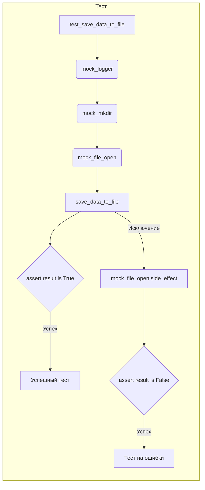

# Анализ кода Python тестов с использованием pytest

## <input code>

```python
import pytest
from unittest.mock import patch, mock_open

@patch('module_name.Path.open', new_callable=mock_open)
@patch('module_name.Path.mkdir')
@patch('module_name.logger')
def test_save_data_to_file(mock_logger, mock_mkdir, mock_file_open):
    """Test saving data to a file."""
    file_path = '/path/to/your/file.txt'
    data = 'Sample text'

    # Test saving a string
    result = save_data_to_file(data, file_path)
    mock_mkdir.assert_called_once_with(parents=True, exist_ok=True)
    mock_file_open.assert_called_once_with('w')
    mock_file_open().write.assert_called_once_with(data)
    assert result is True

    # Test exception handling
    mock_file_open.side_effect = Exception('Mocked exception')
    result = save_data_to_file(data, file_path)
    mock_logger.error.assert_called_once()
    assert result is False
```

## <algorithm>

```mermaid
graph TD
    A[Начало] --> B{Проверка сохранения данных};
    B --Успех--> C[Сохранение данных];
    C --Создание директории--> D[mkdir];
    C --Открытие файла--> E[open];
    C --Запись в файл--> F[write];
    F --> G[Проверка результата];
    G --Успех--> H[Возврат True];
    B --Ошибка--> I[Обработка исключений];
    I --Логгирование ошибки--> J[logger.error];
    I --> K[Возврат False];
    H --> L[Конец];
    K --> L;

    subgraph "Подробности сохранения данных"
        C --> M[Данные (data)];
        C --> N[Путь к файлу (file_path)];
        D --> O[parents=True, exist_ok=True];
        E --> P['w'];
        F --> Q[data];
    end
```

**Описание:**

1. **Начало (A):**  Выполнение теста.
2. **Проверка сохранения данных (B):** Вызов функции `save_data_to_file` с тестовыми данными.
3. **Сохранение данных (C):**  Выполнение внутренней логики функции `save_data_to_file`.
4. **mkdir (D):** Создание папок по пути `file_path` (с параметрами `parents=True`, `exist_ok=True`).
5. **open (E):** Открытие файла в режиме записи (`'w'`).
6. **write (F):** Запись данных (`data`) в файл.
7. **Проверка результата (G):** Проверка, что `result` имеет ожидаемое значение.
8. **Возврат True (H):** Если сохранение прошло успешно, возвращается `True`.
9. **Обработка исключений (I):** Если при сохранении возникла ошибка.
10. **Логгирование ошибки (J):** Логирование ошибки с помощью `mock_logger.error`.
11. **Возврат False (K):** Если сохранение не выполнилось, возвращается `False`.
12. **Конец (L):** Завершение теста.

**Переменные:**

* `data`: Строка 'Sample text' (тестовые данные).
* `file_path`: Строка '/path/to/your/file.txt' (путь к файлу).
* `result`: Булево значение, результат выполнения функции `save_data_to_file`.

## <mermaid>



## <explanation>

**Импорты:**

* `pytest`:  Библиотека для автоматизированного тестирования Python.
* `unittest.mock`: Модуль для создания mocks (заглушек) для тестирования.  `mock_open`, `patch`, `mock_open` используются для имитации функций открытия и записи в файл и создания директории.

**Классы:**

Код не содержит классов, только функции.  Однако, `patch` из `unittest.mock` позволяет «патчить» функции, относящиеся к модулю `module_name`, делая их «заглушками» для имитации поведения без реальных файловых операций.

**Функции:**

* `test_save_data_to_file`: Функция pytest, предназначенная для тестирования функции `save_data_to_file`. Она принимает mocks для логгера, функции создания директории и функции открытия файла.
* `save_data_to_file`:  Это функция, которую мы тестируем.  Код этой функции не приведён и предполагается, что она принимает путь к файлу и данные для сохранения.  В данном примере она используется только для проверки.

**Переменные:**

* `file_path`: Путь к файлу, который будет создан и заполнен.
* `data`: Строка данных, которая должна быть сохранена в файл.
* `result`: Результат выполнения функции `save_data_to_file`, используется для проверки ожидаемого поведения.

**Возможные ошибки/улучшения:**

* **Недостающий код:**  Код функции `save_data_to_file` не приведён.  Тестовый код предполагает, что функция существует и имеет конкретный способ обработки ошибок.
* **Отсутствие проверки ошибок:** Тесты не проверяют все сценарии ошибок, например, передачу неверных аргументов в `save_data_to_file`.
* **Невозможность проверки действий в файловой системе:**  Используется mock-объект `mock_open` для предотвращения реальных взаимодействий с файловой системой, что является хорошей практикой для тестирования.


**Взаимосвязи с другими частями проекта:**

Тестируемый код зависит от модуля `module_name`, а именно от функций `Path.open` и `Path.mkdir`.  Предполагается, что в модуле `module_name` определены соответствующие функции для работы с файлами, а также используется логгер.  Связь с этим модулем осуществляется через импорт.