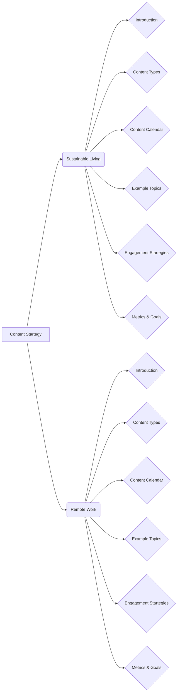

```MD
# Анализ кода

## <input code>

```
# Content Startegy Ideas

## 1. Sustainable Living Tips

### Introduction
In today's world, sustainability has become a crucial aspect of our daily lives. With increasing awareness about environmental issues, more and more people are looking for ways to live sustainably. This content Startegy aims to provide valuable tips and advice for sustainable living, helping individuals make eco-friendly choices and reduce their environmental footprint. By focusing on topics such as reducing waste, eco-friendly products, and sustainable lifestyle choices, we can engage an audience that is passionate about environmental issues and promote our brand's commitment to sustainability.

### Content Types
To effectively reach our audience, we will utilize a variety of content types, including:

1. **Articles**: In-depth articles that explore various aspects of sustainable living, such as the benefits of reducing waste, how to choose eco-friendly products, and tips for living a more sustainable lifestyle.
2. **Videos**: Engaging video content that demonStartes practical tips for sustainable living, such as DIY projects, eco-friendly product reviews, and interviews with sustainability experts.
3. **Social Media Posts**: Short, shareable posts on social media platforms that highlight key tips and advice for sustainable living, as well as promote our longer-form content.

### Content Calendar
To ensure a consistent flow of content, we will develop a content calendar that outlines our publishing schedule. This will include:

- **Weekly Articles**: Publish one in-depth article each week on a specific aspect of sustainable living.
- **Bi-weekly Videos**: Release a new video every two weeks that provides practical tips and advice for sustainable living.
- **Daily Social Media Posts**: Share daily tips and advice on social media platforms to keep our audience engaged and informed.

### Example Topics
Here are some example topics that we can cover in our content:

1. **Reducing Waste**:
   - How to reduce plastic waste in your daily life
   - Tips for composting at home
   - The benefits of using reusable products

2. **Eco-friendly Products**:
   - Reviews of eco-friendly household products
   - How to choose sustainable clothing
   - The benefits of using natural cleaning products

3. **Sustainable Lifestyle Choices**:
   - Tips for reducing your carbon footprint
   - How to create a sustainable home
   - The benefits of eating a plant-based diet

### Engagement Startegies
To maximize engagement with our content, we will implement the following Startegies:

1. **Interactive Content**: Create interactive content, such as quizzes and polls, to encourage audience participation and engagement.
2. **User-generated Content**: Encourage our audience to share their own tips and advice for sustainable living, and feature their contributions in our content.
3. **Collaborations**: Partner with sustainability influencers and experts to create co-branded content and reach a wider audience.

### Metrics and Goals
To measure the success of our content Startegy, we will track the following metrics:

1. **Website Traffic**: Monitor the number of visitors to our website and the engagement with our articles and videos.
2. **Social Media Engagement**: Track the number of likes, shares, and comments on our social media posts.
3. **Audience Growth**: Measure the growth of our audience on social media platforms and our email subscriber list.

Our goals for this content Startegy are to:

1. Increase website traffic by 25% within the first six months.
2. Grow our social media following by 50% within the first year.
3. Establish our brand as a thought leader in the sustainability space.

## 2. Remote Work Best Practices

### Introduction
The rise of remote work has transformed the way we work and live. As more professionals embrace remote work, there is a growing need for guidance on how to navigate this new work environment. This content Startegy aims to provide valuable advice on best practices for remote work, helping individuals improve their productivity, maintain work-life balance, and communicate effectively while working from home. By focusing on topics such as productivity tips, work-life balance Startegies, and effective communication techniques, we can support professionals who work remotely and position our brand as a thought leader in the remote work space.

### ... (rest of the code)
```

## <algorithm>

This code describes two content Startegies: one for sustainable living and one for remote work.  There's no specific algorithm *execution* as it's a plan, not a program.  Each Startegy outlines:

1. **Introduction**: States the purpose and target audience.
2. **Content Types**: Lists the formats of content to be created (e.g., articles, videos).
3. **Content Calendar**:  Provides a schedule for content release.
4. **Example Topics**: Gives specific subject areas to cover.
5. **Engagement Startegies**:  Describes how to encourage audience interaction.
6. **Metrics and Goals**:  Defines how success will be measured and what the targets are.

There is no dynamic execution here, only a plan. The flow is entirely sequential through the Startegy sections.


## <mermaid>



**Explanation of Mermaid Diagram:**

The diagram shows two main branches, one for "Sustainable Living" and one for "Remote Work". Each branch has several connected boxes (elements of the Startegy).  The boxes indicate the different steps in the content plan. The diagram effectively demonStartes that these are separate, independent plans. There are no dependencies between the two Startegies;  they are distinct.


## <explanation>

This code is not a program or a script; it's a **content Startegy document**. It outlines plans for creating content around two themes: sustainable living and remote work.  No actual code (in a programming language) is present.

* **Imports:** There are no imports.  This is a text document, not a program, so imports are not applicable.

* **Classes/Objects:**  There are no classes or objects.

* **Functions:**  No functions are present.

* **Variables:**  There are no variables in the traditional programming sense. Instead, there are topics, titles, sections, and lists of content types and goals.  These are textual descriptions, not data structures.


* **Possible Errors/Improvements:**  The document is well-structured but lacks a specific call to action for implementing the Startegies. It could benefit from:
    * **Target Audience:**  A more detailed description of the target audience for each Startegy.
    * **Content Formats:**  Examples of specific article titles, video ideas, or social media posts would enhance the Startegy.
    * **Budget and Resource Allocation:** A discussion of resources required for content creation (personnel, tools, etc.).
    * **Content Pillars:**  Clearly defined themes or ideas for each area of content that tie it together.
    * **Call to Action:**  A summary section to explain what the next steps are after this plan is approved.


* **Relationships to other parts of the project:**  The provided code only shows two separate content Startegies. There are no apparent dependencies or relationships to other parts of a larger project. The document assumes that the implementation of these content Startegies is independent of other systems or software.