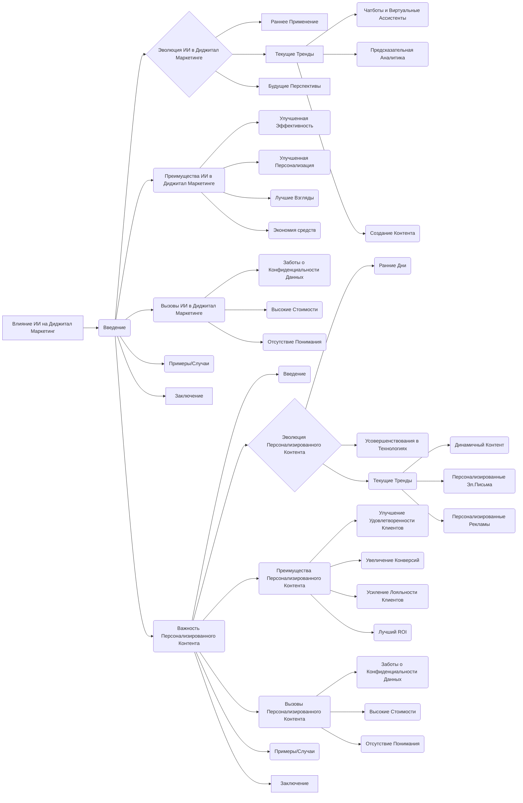

# Анализ кода: Тренды в Диджитал Маркетинге

## <input code>

```
# Impact of AI on Digital Marketing Startegies

## Introduction

Artificial Intelligence (AI) is revolutionizing the digital marketing landscape. From chatbots providing customer service to AI-driven analytics offering deep insights, the integration of AI in marketing Startegies is enhancing efficiency and personalization. Marketers can leverage AI to predict consumer behavior, optimize ad targeting, and create more engaging content.

## The Evolution of AI in Digital Marketing

### Early Adoption

The early adoption of AI in digital marketing was marked by the use of basic algorithms and data analysis tools. Initially, AI was primarily used for automating repetitive tasks such as email marketing and social media posting. These early applications laid the groundwork for more sophisticated AI tools that we see today.

### Current Trends

Today, AI is being used in a multitude of ways to enhance digital marketing Startegies. Some of the most notable trends include:

1. Chatbots and Virtual Assistants
2. Predictive Analytics
3. Content Creation

### Future Prospects

The future of AI in digital marketing looks promising. With advancements in machine learning and natural language processing, AI tools will become even more sophisticated. We can expect to see more personalized marketing campaigns, improved customer service, and more efficient use of marketing budgets.

## Benefits of AI in Digital Marketing

### Enhanced Efficiency
### Improved Personalization
### Better Insights
### Cost Savings

## Challenges of AI in Digital Marketing

### Data Privacy Concerns
### High Costs
### Lack of Understanding

## Case Studies

### Case Study 1: Chatbots in Customer Service
### Case Study 2: Predictive Analytics in Ad Targeting
### Case Study 3: AI in Content Creation

## Conclusion

AI is revolutionizing the digital marketing landscape.

# Importance of Personalized Content

## Introduction

## The Evolution of Personalized Content

### Early Days
### Advancements in Technology
### Current Trends

1. Dynamic Content
2. Personalized Emails
3. Personalized Ads

## Benefits of Personalized Content

### Improved Customer Satisfaction
### Increased Conversion Rates
### Enhanced Customer Loyalty
### Better ROI

## Challenges of Personalized Content

### Data Privacy Concerns
### High Costs
### Lack of Understanding

## Case Studies

### Case Study 1: Personalized Emails
### Case Study 2: Dynamic Content
### Case Study 3: Personalized Ads

## Conclusion

## Tables and Lists

### Table 1: Benefits of AI in Digital Marketing
### Table 2: Challenges of AI in Digital Marketing
### List 1: Current Trends in AI in Digital Marketing
### List 2: Current Trends in Personalized Content
```

## <algorithm>

Этот код представляет собой текстовый документ, описывающий влияние ИИ на стратегии цифрового маркетинга и важность персонализированного контента.  Он не содержит структурного кода для выполнения, поэтому пошаговая блок-схема не применима.  Этот документ скорее является аналитической статьей, а не алгоритмическим описанием.

## <mermaid>



## <explanation>

Код представляет собой текстовый документ, описывающий тренды в цифровом маркетинге, в частности влияние ИИ и важность персонализированного контента. Он не содержит кода программ или функций, поэтому его не может быть исполнен или анализирован так, как код на языке программирования.  Вместо этого он предоставляет текст, описывающий тему.

* **Импорты**: Нет импортов, поскольку это не программный код.
* **Классы**: Нет классов, так как это не код программного обеспечения.
* **Функции**: Нет функций.
* **Переменные**: Нет переменных.
* **Возможные ошибки или области для улучшения**: Документ хорошо структурирован, но его можно дополнить фактами, статистикой, конкретными примерами и ссылками на авторитетные источники для большей достоверности.

**Взаимосвязь с другими частями проекта**: Нет упоминания о других файлах или модулях проекта. Это самостоятельный документ, описывающий общие идеи.