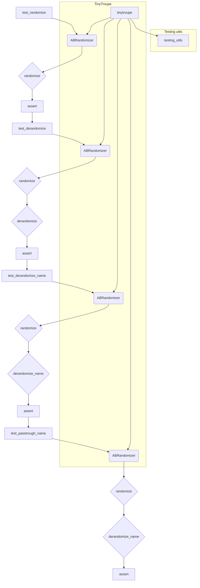

# <input code>

```python
import pytest
import sys
sys.path.append('../../tinytroupe/')
sys.path.append('../../')
sys.path.append('..')

from testing_utils import *

from tinytroupe.experimentation import ABRandomizer

def test_randomize():
    randomizer = ABRandomizer()
    # run multiple times to make sure the randomization is properly tested
    for i in range(20):
        a, b = randomizer.randomize(i, "option1", "option2")

        if randomizer.choices[i] == (0, 1):
            assert (a, b) == ("option1", "option2")
        elif randomizer.choices[i] == (1, 0):
            assert (a, b) == ("option2", "option1")
        else:
            raise Exception(f"No randomization found for item {i}")

def test_derandomize():
    randomizer = ABRandomizer()

    # run multiple times to make sure the randomization is properly tested
    for i in range(20):
        a, b = randomizer.randomize(i, "option1", "option2")
        c, d = randomizer.derandomize(i, a, b)

        assert (c, d) == ("option1", "option2")

def test_derandomize_name():
    randomizer = ABRandomizer()

    for i in range(20):
        a, b = randomizer.randomize(i, "A", "B")
        real_name = randomizer.derandomize_name(i, a)

        if randomizer.choices[i] == (0, 1):
            assert real_name == "control"
        elif randomizer.choices[i] == (1, 0):
            assert real_name == "treatment"
        else:
            raise Exception(f"No randomization found for item {i}")


def test_passtrough_name():
    randomizer = ABRandomizer(passtrough_name=["option3"])
    a, b = randomizer.randomize(0, "option1", "option2")
    real_name = randomizer.derandomize_name(0, "option3")

    assert real_name == "option3"

def test_intervention_1():
    pass # TODO
```

# <algorithm>

**Шаг 1:** Инициализация `ABRandomizer`. Создаётся экземпляр класса `ABRandomizer`.
**Пример:** `randomizer = ABRandomizer()`

**Шаг 2:** Вызов `randomize` для рандомизации. Метод `randomize` принимает индекс элемента `i`, два варианта (`"option1"`, `"option2"`). Метод генерирует случайный выбор между двумя опциями, сохраняя его в `choices[i]` и возвращает их.
**Пример:** `a, b = randomizer.randomize(i, "option1", "option2")`

**Шаг 3:** Проверка результатов рандомизации в `test_randomize`. Проверяет, соответствует ли возвращаемое значение `(a, b)` ожидаемому значению, базируясь на значении `choices[i]`.
**Пример:** `assert (a, b) == ("option1", "option2")` если `choices[i] == (0, 1)`

**Шаг 4:** Вызов `derandomize` для обратного преобразования. Метод `derandomize` принимает индекс элемента `i`, `a`, `b` (результаты рандомизации). Возвращает исходные значения.
**Пример:** `c, d = randomizer.derandomize(i, a, b)`

**Шаг 5:** Проверка результатов `derandomize` в `test_derandomize`. Проверяет, что возвращаемые значения соответствуют исходным.
**Пример:** `assert (c, d) == ("option1", "option2")`

**Шаг 6:** Проверка имени `derandomize_name`. Метод `derandomize_name` принимает индекс элемента `i`, рандомизированное значение `a`. Возвращает имя, соответствующее рандомизации (например, "control", "treatment").
**Пример:** `real_name = randomizer.derandomize_name(i, a)`

**Шаг 7:** Проверка имени `passtrough_name`. Метод обрабатывает отдельный случай, когда параметр `passtrough_name` задан.
**Пример:** `randomizer = ABRandomizer(passtrough_name=["option3"])`.


Данные передаются между функциями и методами через аргументы и возвращаемые значения.


# <mermaid>



# <explanation>

**Импорты:**

* `pytest`: Библиотека для написания тестов.
* `sys`: Модуль для работы с системными переменными, в частности для добавления путей в `sys.path`. Это важно, чтобы Python мог находить модули в проекте, особенно в подпапках.
* `testing_utils`: Возможно, пользовательский модуль, содержащий вспомогательные функции для тестирования.
* `tinytroupe.experimentation`: Модуль, содержащий класс `ABRandomizer`. Важно, что импортируется он из подпапки проекта, `src.tinytroupe.experimentation`.

**Классы:**

* `ABRandomizer`: Класс для реализации рандомизации A/B тестов. Он содержит атрибуты, хранящие результаты рандомизации (`choices`), и методы для рандомизации (`randomize`), обратного преобразования (`derandomize`) и получения имени варианта (`derandomize_name`).  Этот класс скорее всего определен в `tinytroupe/experimentation.py`.

**Функции:**

* `test_randomize`:  Функция тестирования метода `randomize` класса `ABRandomizer`.  Она многократно вызывает `randomize` и проверяет, что результаты соответствуют ожидаемым.
* `test_derandomize`:  Функция тестирования метода `derandomize`.  Проверяет, что обратное преобразование работает корректно.
* `test_derandomize_name`:  Функция тестирует метод `derandomize_name`,  направилено на проверку правильности присваивания имен вариантам в A/B тесте.
* `test_passtrough_name`:  Функция тестирования обработки исключительных случаев ("option3"), где  при помощи параметра  `passtrough_name`, элементы "проходят сквозь" процесс рандомизации.
* `test_intervention_1`:  Функция, предназначенная для тестирования функции `intervention_1`. Она не реализована (означено `pass`), что указывает на необходимость её разработки.

**Переменные:**

* `randomizer`: Экземпляр класса `ABRandomizer`.
* `i`: Целочисленная переменная, используемая как индекс в циклах.
* `a`, `b`, `c`, `d`: Переменные, хранящие результаты рандомизации и обратного преобразования.


**Возможные ошибки/улучшения:**

* Отсутствует явное описание того, как `ABRandomizer` генерирует случайные числа (подразумевается использование `random`). Нужно добавить генератор случайных чисел, чтобы код был воспроизводимым.
* Отсутствует документация для методов `randomize`, `derandomize` и `derandomize_name`.
* В `test_intervention_1` необходимо реализовать функцию `intervention_1`.
* В `testing_utils` нет информации, что это за модуль, он требует дополнительного анализа.
* Возможно, нужно добавить проверки на корректность входных данных в методы класса `ABRandomizer`.


**Взаимосвязи:**

Тесты в `test_experimentation.py` проверяют функциональность класса `ABRandomizer`, который, по всей видимости, находится в модуле `tinytroupe/experimentation.py` внутри проекта `hypotez`.  `testing_utils` используется для вспомогательных функций тестирования.