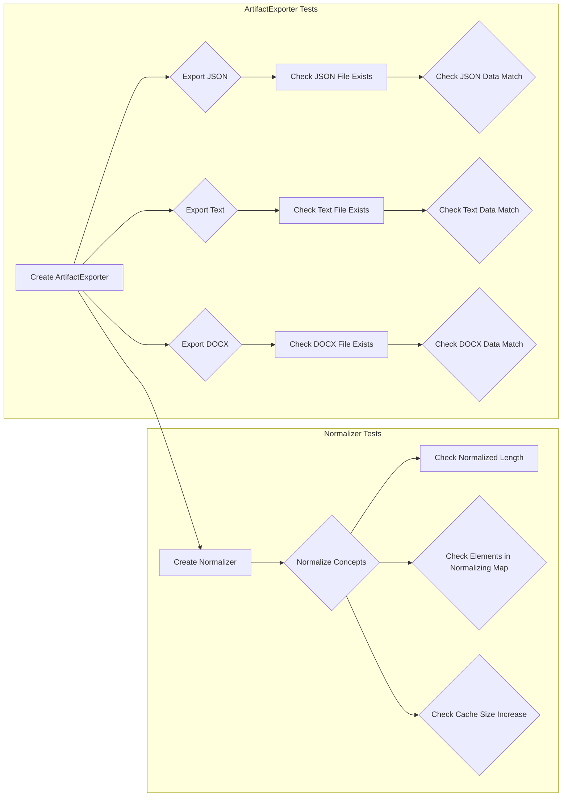

# <input code>

```python
import pytest
import os
import json
import random

import logging
logger = logging.getLogger("tinytroupe")

import sys
sys.path.append('../../tinytroupe/')
sys.path.append('../../')
sys.path.append('..')

from testing_utils import *
from tinytroupe.extraction import ArtifactExporter, Normalizer
from tinytroupe import utils

@pytest.fixture
def exporter():
    return ArtifactExporter(base_output_folder="./test_exports")

def test_export_json(exporter):
    # Define the artifact data
    artifact_data = {
        "name": "John Doe",
        "age": 30,
        "occupation": "Engineer",
        "content": "This is a sample JSON data."
    }
    
    # Export the artifact data as JSON
    exporter.export("test_artifact", artifact_data, content_type="record", target_format="json")
    
    #check if the JSON file was exported correctly
    assert os.path.exists("./test_exports/record/test_artifact.json"), "The JSON file should have been exported."

    # does it contain the data?
    with open("./test_exports/record/test_artifact.json", "r") as f:
        exported_data = json.load(f)
        assert exported_data == artifact_data, "The exported JSON data should match the original data."

def test_export_text(exporter):
    # Define the artifact data
    artifact_data = "This is a sample text."
    
    # Export the artifact data as text
    exporter.export("test_artifact", artifact_data, content_type="text", target_format="txt")
    
    # check if the text file was exported correctly
    assert os.path.exists("./test_exports/text/test_artifact.txt"), "The text file should have been exported."

    # does it contain the data?
    with open("./test_exports/text/test_artifact.txt", "r") as f:
        exported_data = f.read()
        assert exported_data == artifact_data, "The exported text data should match the original data."

def test_export_docx(exporter):
    # Define the artifact data. Include some fancy markdown formatting so we can test if it is preserved.
    artifact_data ="""
    # This is a sample markdown text
    This is a **bold** text.
    This is an *italic* text.
    This is a [link](https://www.example.com).
    """
    
    # Export the artifact data as a docx file
    exporter.export("test_artifact", artifact_data, content_type="Document", content_format="markdown", target_format="docx")
    
    # check if the docx file was exported correctly
    assert os.path.exists("./test_exports/Document/test_artifact.docx"), "The docx file should have been exported."

    # does it contain the data?
    from docx import Document
    doc = Document("./test_exports/Document/test_artifact.docx")
    exported_data = ""
    for para in doc.paragraphs:
        exported_data += para.text

    assert "This is a sample markdown text" in exported_data, "The exported docx data should contain some of the original content."
    assert "#" not in exported_data, "The exported docx data should not contain Markdown."


def test_normalizer():
    # Define the concepts to be normalized
    concepts = [...] # ... (long list of concepts)

    unique_concepts = list(set(concepts))

    normalizer = Normalizer(concepts, n=10, verbose=True)

    assert len(normalizer.normalized_elements) == 10, "The number of normalized elements should be equal to the specified value."

    # ... (rest of the test)
```

# <algorithm>

The code consists of tests for two classes: `ArtifactExporter` and `Normalizer`.

**`ArtifactExporter` tests:**
1. Create an `ArtifactExporter` object with a base output folder.
2. Define `artifact_data` (e.g., JSON, text, Markdown).
3. Call `exporter.export` with the `artifact_data`, `content_type`, and `target_format`.
4. Assert that the corresponding file exists in the specified location.
5. Read the exported file and compare its content with `artifact_data`.

**`Normalizer` tests:**
1. Create a `Normalizer` object with a list of concepts and `n` (number of elements to normalize).
2. Assert that `normalized_elements` has length `n`.
3. Create multiple buckets of random samples from the concepts.
4. Call `normalizer.normalize` on each bucket.
5. Assert that the returned `normalized_concept` is not None.
6. Assert that the length of `normalized_concept` matches the length of the input `bucket`.
7. Assert that all elements of `normalized_concept` are present in the `normalizer.normalizing_map` keys.
8. Assert that the size of the `normalizing_map` increases after each call to `normalize`.

Example data flow:

```
+-----------------+     +-----------------+     +-----------------+
|     Input       | --> | Normalizer obj  | --> | Normalized data |
+-----------------+     +-----------------+     +-----------------+
     (Concepts)        |     (Normalizing)      |      (output)
```


# <mermaid>



# <explanation>

**Imports:**

- `pytest`:  For writing and running unit tests.
- `os`: For interacting with the operating system (e.g., checking file existence).
- `json`: For handling JSON data.
- `random`: For generating random samples in the `Normalizer` tests.
- `logging`: For logging information.
- `sys`: Used to modify Python's search path, allowing the code to find modules in the 'tinytroupe' folder.  This is common practice for modular Python projects.
- `testing_utils`: Likely a custom utility module within the project (not shown), providing potentially helpful functions for testing.
- `tinytroupe.extraction`: Contains the `ArtifactExporter` and `Normalizer` classes.
- `tinytroupe`: A package likely containing other utility modules related to the tinytroupe project.
- `docx`:  Needed for handling the `.docx` files in `test_export_docx`.

**Classes:**

- **`ArtifactExporter`**:  Handles exporting artifacts (data) to various formats.  The `base_output_folder` is a crucial parameter to control where the exported files are written.
    - `export(filename, artifact_data, content_type, target_format)`: Method for exporting data. Takes the file name, data, type, and target format as arguments.
- **`Normalizer`**:  (Likely) Normalizes a list of concepts.
    - `__init__(concepts, n, verbose)`: Constructor, initializing with concepts to be normalized, `n` (number of normalized elements), and verbosity.
    - `normalize(concepts)`: Normalizes the concepts. This logic is critical to the project's functionality, but the specific implementation isn't fully visible in the provided snippet.


**Functions:**

- `test_export_json`, `test_export_text`, `test_export_docx`: These are test functions for the `ArtifactExporter` class. They define expected `artifact_data` in different formats (JSON, text, markdown), call the `exporter.export` method, and assert the correct output.
- `test_normalizer`: Test function for `Normalizer` that checks proper normalization logic by generating buckets of random concepts and testing for correct output size and normalization consistency


**Variables:**

- `artifact_data`: Holds the data to be exported. Its type depends on the specific export test.
- `concepts`: Contains a large list of concepts that `Normalizer` will process.
- `normalizer`: Object representing the normalization process.
- `exporter`: Object representing the export process.
- `unique_concepts`: list of concepts, but without duplicates.

**Possible Errors/Improvements:**

- The `concepts` list is very long. Consider whether this list could be loaded from a file to reduce code size and improve readability.
- The `Normalizer` class is not fully shown.  A more detailed look at its implementation is needed to fully understand the normalization process.
- The `testing_utils` module is not defined.
- The `export` method in `ArtifactExporter` does not have a clear error handling strategy if the export process fails.
- The `normalize` method could throw exceptions to provide more informative errors in case of unexpected situations.
- The tests for `ArtifactExporter` could be improved to assert specific details about the exported files' format (e.g., ensuring correct headers in the .docx file).

**Relationships:**

The code interacts with files and the filesystem. It relies on the `tinytroupe` package for utilities and possibly data storage, the `testing_utils` package for testing tools, and the `docx` library for handling `.docx` files.  There's an import hierarchy (a structure of nested packages) that is implied by the `sys.path` changes. This indicates a modular design, which is generally a good approach.