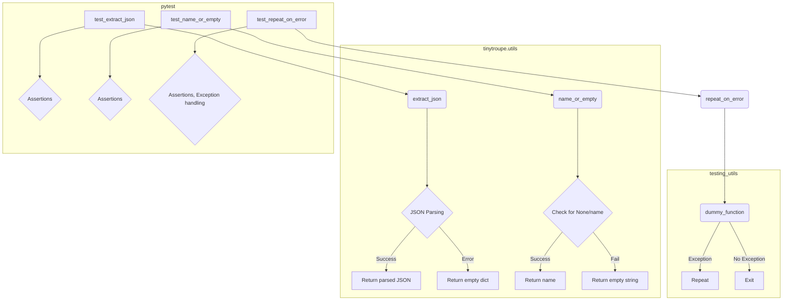

```MD
# <input code>

```python
import pytest
from unittest.mock import MagicMock

import sys
sys.path.append('../../tinytroupe/')
sys.path.append('../../')
sys.path.append('..')


from tinytroupe.utils import name_or_empty, extract_json, repeat_on_error
from testing_utils import *

def test_extract_json():
    # Test with a simple JSON string
    text = 'Some text before {"key": "value"} some text after'
    result = extract_json(text)
    assert result == {"key": "value"}

    # Test with a JSON array
    text = 'Some text before [{"key": "value"}, {"key2": "value2"}] some text after'
    result = extract_json(text)
    assert result == [{"key": "value"}, {"key2": "value2"}]

    # Test with escaped characters
    text = 'Some text before {"key": "\\\'value\\\'"} some text after'
    result = extract_json(text)
    assert result == {"key": "'value'"}

    # Test with invalid JSON
    text = 'Some text before {"key": "value",} some text after'
    result = extract_json(text)
    assert result == {}

    # Test with no JSON
    text = 'Some text with no JSON'
    result = extract_json(text)
    assert result == {}


def test_name_or_empty():
    class MockEntity:
        def __init__(self, name):
            self.name = name

    # Test with a named entity
    entity = MockEntity("Test")
    result = name_or_empty(entity)
    assert result == "Test"

    # Test with None
    result = name_or_empty(None)
    assert result == ""


def test_repeat_on_error():
    class DummyException(Exception):
        pass

    # Test with retries and an exception occurring
    retries = 3
    dummy_function = MagicMock(side_effect=DummyException())
    with pytest.raises(DummyException):
        @repeat_on_error(retries=retries, exceptions=[DummyException])
        def decorated_function():
            dummy_function()
        decorated_function()
    assert dummy_function.call_count == retries

    # Test without any exception occurring
    retries = 3
    dummy_function = MagicMock()  # no exception raised
    @repeat_on_error(retries=retries, exceptions=[DummyException])
    def decorated_function():
        dummy_function()
    decorated_function()
    assert dummy_function.call_count == 1

    # Test with an exception that is not specified in the exceptions list
    retries = 3
    dummy_function = MagicMock(side_effect=RuntimeError())
    with pytest.raises(RuntimeError):
        @repeat_on_error(retries=retries, exceptions=[DummyException])
        def decorated_function():
            dummy_function()
        decorated_function()
    assert dummy_function.call_count == 1


# TODO
#def test_json_serializer():
```

# <algorithm>

**Функция `extract_json`:**

1. Принимает строку `text`.
2. Использует регулярное выражение для поиска JSON в строке.
3. Если JSON найден, парсит его и возвращает результат.
4. Если JSON не найден или произошла ошибка парсинга, возвращает пустой словарь.


**Функция `name_or_empty`:**

1. Принимает объект `entity`.
2. Если объект `entity` не равен `None` и имеет атрибут `name`, возвращает значение этого атрибута.
3. Иначе возвращает пустую строку.


**Функция `repeat_on_error`:**

1. Принимает целое число `retries` (количество попыток) и список `exceptions` (список исключений, на которые нужно реагировать).
2. Декорирует функцию `decorated_function`.
3. Внутри декорированной функции, функция вызывается `retries` раз.
4. Если при вызове функции возникает исключение, которое присутствует в списке `exceptions`, попытка повторяется, пока не будет выполнено `retries` попыток или не произойдет исключение, которое не в `exceptions`.
5. Если исключение не в `exceptions`, функция `decorated_function` завершается, и исключение перебрасывается.


# <mermaid>



# <explanation>

**Импорты:**

- `pytest`: Библиотека для написания юнит-тестов.
- `unittest.mock`: Модуль для создания mock-объектов, необходимых для тестирования функций, которые взаимодействуют с другими компонентами.
- `sys`: Модуль для доступа к системным переменным, в данном случае, для изменения пути поиска модулей.  `sys.path.append` добавляет папки в список мест, где Python ищет импортируемые модули.  Важная часть проекта `tinytroupe`.
- `tinytroupe.utils`: Модуль, содержащий утилитарные функции `name_or_empty`, `extract_json`, `repeat_on_error`,  которые скорее всего являются частью проекта `tinytroupe`.
- `testing_utils`: Модуль, скорее всего, содержит вспомогательные функции или классы для тестирования.  Расположение указывает на его локализацию в текущем проекте (как и `tinytroupe`).

**Классы:**

- `MockEntity`: Вспомогательный класс, используется для имитации сущности, имеющей имя, нужен для тестирования функции `name_or_empty`.

**Функции:**

- `extract_json(text)`: Извлекает JSON из строки.  Аргумент `text`, возвращаемое значение – JSON или пустой словарь.  Позволяет извлечь JSON из текстовых данных.
- `name_or_empty(entity)`: Возвращает имя сущности или пустую строку, если сущность `None` или не имеет атрибута `name`.
- `repeat_on_error(retries, exceptions, decorated_function)`: Декорирует функцию, чтобы та повторяла попытки выполнения, если возникает исключение из списка `exceptions` до `retries` раз. `decorated_function` – функция, которую нужно декорировать.

**Переменные:**

- `text`, `result`, `entity`: Типы зависят от значения. Используются для передачи данных между функциями.

**Возможные ошибки и улучшения:**

- Тесты хорошо покрывают разные сценарии, но можно добавить тесты с более сложными JSON-строками и граничными случаями.
- Необходимо добавить документацию к функциям и классам для лучшей читаемости и понимания кода.
- Код, который изменяет `sys.path`, может вызывать проблемы, если эти пути не корректны или не существуют. Важно убедиться, что эти пути ведут к необходимым модулям.


**Взаимосвязи с другими частями проекта:**

Функции `extract_json`, `name_or_empty`, `repeat_on_error` – это утилиты. Вероятнее всего, они используются в других частях проекта `tinytroupe`.

- Вероятнее всего `testing_utils` содержит другие тестовые функции и данные, связанные с тестированием `tinytroupe`.


Общий вывод: код хорошо структурирован и тестируется с помощью pytest.  Он предоставляет важные утилитарные функции для обработки JSON и обработки ошибок.