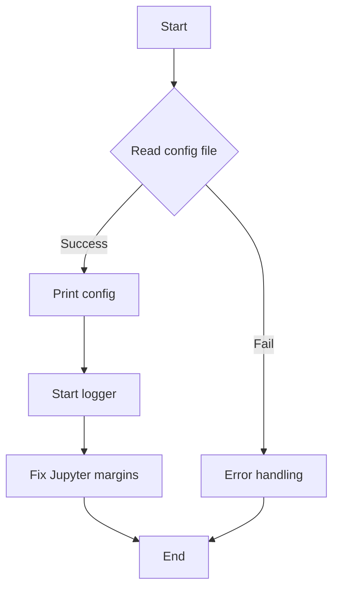
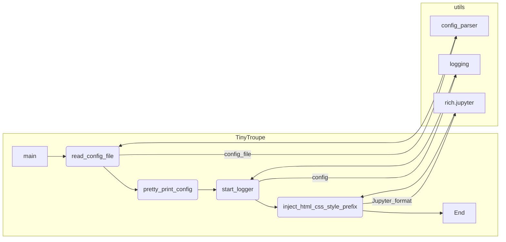

# <input code>

```python
import os
import logging
import configparser
import rich # for rich console output
import rich.jupyter

# add current path to sys.path
import sys
sys.path.append('.')
from tinytroupe import utils # now we can import our utils

# AI disclaimers
print(
"""
!!!!
DISCLAIMER: TinyTroupe relies on Artificial Intelligence (AI) models to generate content. 
The AI models are not perfect and may produce inappropriate or inacurate results. 
For any serious or consequential use, please review the generated content before using it.
!!!!
""")

config = utils.read_config_file()
utils.pretty_print_config(config)
utils.start_logger(config)

# fix an issue in the rich library: we don't want margins in Jupyter!
rich.jupyter.JUPYTER_HTML_FORMAT = \
    utils.inject_html_css_style_prefix(rich.jupyter.JUPYTER_HTML_FORMAT, "margin:0px;")
```

# <algorithm>



**Описание шагов:**

1. **`Start`**: Программа начинается.
2. **`Read config file`**: Вызывается функция `utils.read_config_file()`, которая считывает конфигурационный файл (предполагается, что он существует и содержит корректные данные).  
   * **Пример данных:**  `config.ini` с секциями `[API]` и `[OUTPUT]` и соответствующими параметрами.
3. **`Print config`**: Функция `utils.pretty_print_config()` выводит содержимое конфигурации в удобочитаемом формате (например, с использованием `rich`).
4. **`Start logger`**: Функция `utils.start_logger()` инициализирует систему логгирования, используя конфигурационные данные.
5. **`Fix Jupyter margins`**: Функция `utils.inject_html_css_style_prefix()` модифицирует формат вывода в Jupyter Notebook, удаляя отступы в выводе `rich`.
6. **`End`**: Программа завершает выполнение.

# <mermaid>



**Описание зависимостей:**

* `TinyTroupe.main` - главный модуль, использующий функции `utils`
* `utils` - вспомогательный модуль, содержащий функции для чтения конфигурации, красивого вывода и настройки логгирования.
* `configparser` - модуль для парсинга конфигурационных файлов.
* `logging` - модуль для работы с логгированием.
* `rich` и `rich.jupyter` - для красивой консольной визуализации, особенно в Jupyter.


# <explanation>

* **Импорты**:
    * `os`, `logging`, `configparser`: Стандартные библиотеки Python для работы с файловой системой, логгированием и чтением конфигурационных файлов.
    * `rich`, `rich.jupyter`: Библиотека `rich` для улучшенного форматирования вывода в консоль, а `rich.jupyter` – для адаптации к Jupyter Notebook.
    * `sys`:  Для добавления текущей директории в `sys.path`, что позволяет импортировать модули из текущей папки.
    * `utils`: Модуль из пакета `tinytroupe`, вероятно, содержащий функции для работы с конфигурацией, логгированием и форматированием вывода.

* **Классы**:  В данном коде нет явных определений классов. Все действия выполняются через функции.

* **Функции**:
    * `utils.read_config_file()`:  Считывает конфигурационный файл (например, `config.ini`), парсит его с помощью `configparser` и возвращает объект `configparser.ConfigParser`.
    * `utils.pretty_print_config(config)`: Принимает объект `config` и выводит его содержимое в красивом формате.
    * `utils.start_logger(config)`: Инициализирует систему логгирования с использованием конфигурационных параметров.
    * `utils.inject_html_css_style_prefix(Jupyter_html_format, style)`: Удаляет ненужные отступы (margin) из формата HTML, используемого библиотекой `rich` в Jupyter.

* **Переменные**:
    * `config`: Содержит объект `configparser.ConfigParser`, полученный из конфигурационного файла.
    * `JUPYTER_HTML_FORMAT`:  Содержит строку формата HTML, используемого `rich.jupyter`.

* **Возможные ошибки и улучшения**:
    * **Обработка ошибок:**  Код не содержит явной обработки ошибок при чтении конфигурационного файла (`config.ini`).  Важно добавить проверку на существование файла и корректность его структуры, чтобы избежать `FileNotFoundError` или ошибок парсинга.
    * **Документация:** Не хватает документации для функций из модуля `utils`.  Полноценная документация (docstrings) значительно повысит читаемость и понимание кода.
    * **Модульная структура:** Предполагается, что `utils` - самостоятельный модуль, содержащий функции для работы с конфигурацией. Если это так, то стоит добавить тесты для функций `utils`.
    * **Логирование:** Код использует logging.  Можно добавить больше логирования для отслеживания ошибок и этапов выполнения.


**Взаимосвязи с другими частями проекта**:

Функции из `utils` используются в главном модуле, предполагается, что они входят в более крупный проект TinyTroupe. Конфигурационные данные (`config.ini`) задают параметры работы программы.  Логирование позволяет отслеживать действия и ошибки в других частях приложения.