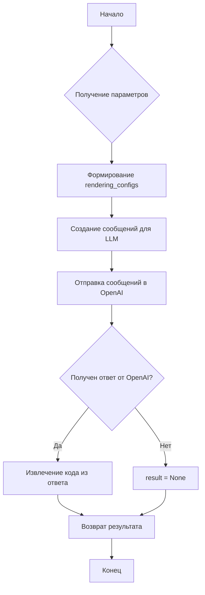

# Анализ кода файла tinytroupe/enrichment.py

## <input code>

```python
import os
import json
import chevron
import logging
logger = logging.getLogger("tinytroupe")
import pandas as pd

from tinytroupe.agent import TinyPerson
from tinytroupe.environment import TinyWorld
from tinytroupe.factory import TinyPersonFactory
from tinytroupe.utils import JsonSerializableRegistry

from tinytroupe import openai_utils
import tinytroupe.utils as utils

class TinyEnricher(JsonSerializableRegistry):

    def __init__(self, use_past_results_in_context=False) -> None:
        self.use_past_results_in_context = use_past_results_in_context

        self.context_cache = []
    
    def enrich_content(self, requirements: str, content:str, content_type:str =None, context_info:str ="", context_cache:list=None, verbose:bool=False):

        rendering_configs = {"requirements": requirements,
                             "content": content,
                             "content_type": content_type, 
                             "context_info": context_info,
                             "context_cache": context_cache}

        messages = utils.compose_initial_LLM_messages_with_templates("enricher.system.mustache", "enricher.user.mustache", rendering_configs)
        next_message = openai_utils.client().send_message(messages, temperature=0.4)
        
        debug_msg = f"Enrichment result message: {next_message}"
        logger.debug(debug_msg)
        if verbose:
            print(debug_msg)

        if next_message is not None:
            result = utils.extract_code_block(next_message["content"])
        else:
            result = None

        return result
```

## <algorithm>

**Блок-схема:**



**Примеры:**

* **B:** `requirements` = "Напишите код на Python для вычисления факториала", `content` = "Число для вычисления: 5"
* **C:** `rendering_configs` = {"requirements": "Напишите код на Python для вычисления факториала", "content": "Число для вычисления: 5", ...}
* **D:**  Создание сообщений для LLM (система и пользователь) с заполненными шаблонами.
* **E:** Отправка запроса в OpenAI API с данными `rendering_configs`.
* **F:** Проверка: ответ от OpenAI получен или нет.
* **G:** `result` содержит код на Python для вычисления факториала.
* **H:** `result` присваивается `None` если ответ от OpenAI отсутствует.

Данные передаются между функциями/классами в виде аргументов и возвращаемых значений.


## <mermaid>

```mermaid
graph LR
    subgraph TinyEnricher
        A[TinyEnricher.enrich_content] --> B(utils.compose_initial_LLM_messages_with_templates);
        B --> C(openai_utils.client().send_message);
        C --> D{Проверка на null};
        D -- Да --> E[utils.extract_code_block];
        D -- Нет --> F[result = null];
        E --> G[Возврат result];
        F --> G;
    end
    subgraph utils
        B --- utils.compose_initial_LLM_messages_with_templates
        E --- utils.extract_code_block
    end
    subgraph openai_utils
        C --- openai_utils.client().send_message
    end
```

## <explanation>

**Импорты:**

* `os`, `json`, `chevron`, `logging`, `pandas` - стандартные библиотеки Python или сторонние пакеты, используемые для работы с файлами, данными, логированием и обработкой данных.
* `from tinytroupe.agent import TinyPerson`, `from tinytroupe.environment import TinyWorld`, `from tinytroupe.factory import TinyPersonFactory`, `from tinytroupe.utils import JsonSerializableRegistry`, `from tinytroupe import openai_utils`, `import tinytroupe.utils as utils` - импорты из модулей и пакета `tinytroupe`. Предполагается, что `tinytroupe` это собственный пакет приложения.  Это части проекта `tinytroupe`, отвечающие, скорее всего, за взаимодействие с агентом, средой, фабрикой создания агентов, утилитами сериализации и взаимодействия с OpenAI.

**Классы:**

* `TinyEnricher(JsonSerializableRegistry)` - класс, производный от `JsonSerializableRegistry`, вероятно, отвечающий за обогащение контента с использованием модели OpenAI. Атрибуты `use_past_results_in_context`, `context_cache`  связаны с использованием контекста при запросе к модели.  `JsonSerializableRegistry`  вероятно,  обеспечивает сериализацию и десериализацию объектов этого класса в JSON.

**Функции:**

* `enrich_content`:  Функция для обогащения контента.
    * `requirements`, `content`, `content_type`, `context_info`, `context_cache`, `verbose`: аргументы, необходимые для работы с моделью OpenAI.
    * Возвращает `result` — результат выполнения запроса к OpenAI, либо `None`.  Если `next_message`  равен `None`, значит, запрос к OpenAI не удался.

**Переменные:**

* `logger = logging.getLogger("tinytroupe")` - экземпляр объекта логгера,  используется для записи сообщений об ошибках и отладки.


**Возможные ошибки и улучшения:**

* Отсутствует обработка исключений при работе с OpenAI API. Важно добавить обработку исключений, чтобы приложение не падало при сбоях.
* Нет проверки валидности входных данных (например, пустые строки, неверные типы).  Добавление валидации может улучшить стабильность.
* Можно улучшить логирование (добавить уровень детализации, дату/время).
*  Не указано, как именно `utils.extract_code_block`  обрабатывает полученные данные от OpenAI.
*  `temperature=0.4` — параметр для настройки случайности модели.  Это может влиять на результат. Стоит проанализировать, насколько это разумный параметр.

**Взаимосвязи с другими частями проекта:**

Функция `enrich_content` напрямую взаимодействует с функциями из модуля `tinytroupe.utils` и  `openai_utils`.  Класс `TinyEnricher` взаимодействует со `JsonSerializableRegistry` и, по всей видимости, используется другими частями проекта для обогащения контента.