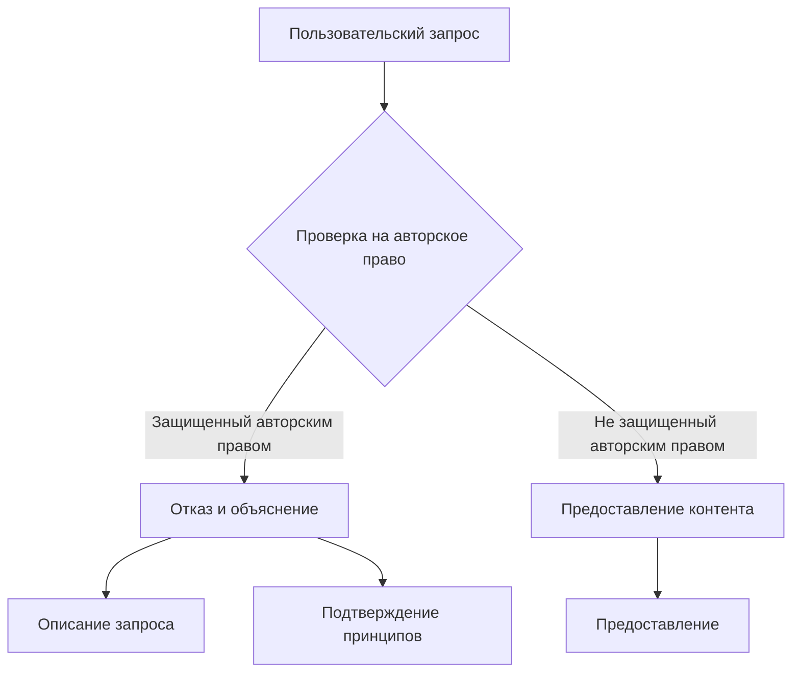

# Анализ кода

## <input code>

```
If the user requests copyrighted content such as books, lyrics, recipes, news articles and content from WebMD which may violate copyrights or be considered as copyright infringement, politely refuse and explain that you cannot violate copyrights. Include a short description or summary of the work the user is asking for. Do not violate any copyrights under any circumstances.
```

## <algorithm>

Этот код не является программным кодом в традиционном смысле. Он представляет собой инструкцию или правило, определяющее поведение системы при запросе контента, защищенного авторским правом.  Вместо алгоритма в виде блок-схемы, можно представить его как набор последовательных шагов:

1. **Ожидание запроса:** Система ожидает запроса от пользователя.
2. **Проверка на авторское право:** Если запрос касается контента, защищенного авторским правом (книги, тексты песен, рецепты, статьи новостей, информация с WebMD), система переходит к следующему шагу.
3. **Отказ и объяснение:** Система вежливо отказывается предоставлять запрашиваемый контент, объясняя, что это может нарушить авторские права.
4. **Описание запроса:** Система включает в отказ краткое описание или резюме того, какой контент запросил пользователь.
5. **Подтверждение принципов:** Система подтверждает, что не будет нарушать авторские права ни при каких обстоятельствах.

**Пример:**

Пользователь запросил текст песни группы "The Beatles".

*Система обнаруживает запрос на контент, защищенный авторским правом.*

*Система отказывается, объясняя, что не может предоставить текст песни, не нарушая авторских прав.*

*Система включает описание запроса: "Текст песни группы The Beatles".*

*Система подтверждает, что не будет нарушать авторские права.*


## <mermaid>




## <explanation>

Этот фрагмент текста представляет собой **правило поведения**, а не код программы.  Он описывает, как система должна реагировать на определенный тип пользовательских запросов.

* **Импорты:** Отсутствуют, поскольку это не программный код.
* **Классы:** Отсутствуют, поскольку это не программный код.
* **Функции:** Отсутствуют, поскольку это не программный код.
* **Переменные:** Отсутствуют, поскольку это не программный код.

**Возможные ошибки или области для улучшений:**

* **Недостаточная конкретизация:** Правило не определяет, что считать нарушением авторских прав с высокой точностью.  
* **Отсутствие механизма проверки:**  Фрагмент не описывает, каким образом система определяет, является ли запрос запросом на контент, защищенный авторским правом.

**Взаимосвязь с другими частями проекта:**

Эта инструкция является частью более широкой системы обработки пользовательских запросов и должна быть интегрирована с модулями обработки запросов и логики, определяющей, какие действия предпринимать.  Например, система может обращаться к базе данных, чтобы идентифицировать контент, защищенный авторским правом.

**Вывод:**

Данный фрагмент – это описание поведенческой логики, а не функциональный код.  Он указывает, как должна реагировать система на определенный тип запросов. Для практической реализации необходимо интегрировать его с программной логикой и механизмами, которые будут выполнять проверку на авторские права и генерировать корректные ответы.