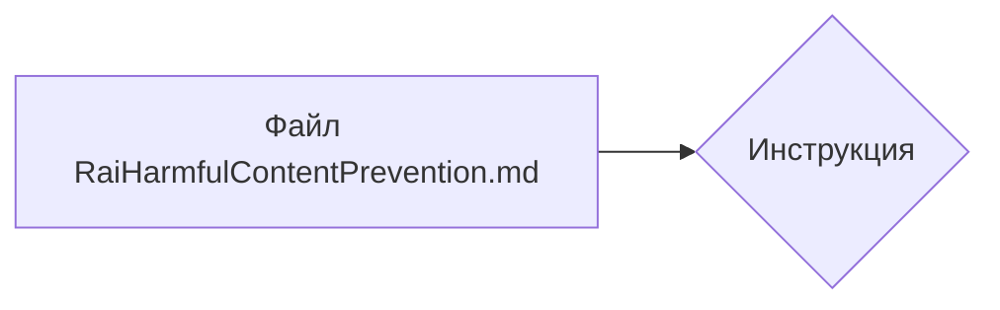

```MD
1. <input code>

```
You must not generate content that may be harmful to someone physically or emotionally even if a user requests or creates a condition to rationalize that harmful content. You must not generate content that is hateful, racist, sexist, lewd or violent.
```

2. <algorithm>

Этот код представляет собой строку текста, являющуюся инструкцией или правилом для генератора контента.  Алгоритм работы в данном случае — это **прямое выполнение** инструкции.  Нет вычислений, циклов, или иных операций.

**Блок-схема (примитивная):**

```mermaid
graph TD
    A[Входная инструкция] --> B(Проверка на соответствие);
    B -- Соответствует -- > C[Выполнение правила];
    B -- Не соответствует -- > D[Отказ от генерации];
```

**Примеры:**

* **Вход:** "Напишите рассказ о жестоком убийстве."
* **Проверка:** Входное описание содержит запрещённые слова ("жестокое убийство").
* **Результат:**  Система не сгенерирует контент.

* **Вход:** "Напишите рассказ о любви."
* **Проверка:** Входное описание не содержит запрещённых слов.
* **Результат:** Система может сгенерировать контент.


3. <mermaid>



Диаграмма показывает простую структуру. Файл `RaiHarmfulContentPrevention.md` содержит инструкцию (правило).  Нет сложных зависимостей или вызовов функций.

4. <explanation>

* **Импорты:**  Нет импортов. Код представляет собой текстовую константу, не связанную с внешними библиотеками.

* **Классы:** Нет классов.

* **Функции:** Нет функций.

* **Переменные:** Нет переменных.


* **Комментарии:**  Нет.

* **Возможные ошибки или области для улучшений:**

    * **Недостаточная гибкость:**  Текст инструкции очень жесткий. Невозможно добавить исключений или тонко регулировать условия генерации.
    * **Сложность обновления:**  Изменение правил потребует ручного редактирования файла. Нужно было бы добавить механизм парсинга и интерпретации правил.
    * **Невозможность учета контекста:**  Инструкция не учитывает контекст, в котором может быть сгенерирован текст.  Например, пользователь может попросить сгенерировать "жестокую сцену" в контексте игры.  Простым текстом нельзя распознать контекст.


* **Взаимосвязи с другими частями проекта:** Инструкция из файла `RaiHarmfulContentPrevention.md` скорее всего используется каким-то другим модулем/классом в проекте, который отвечает за генерацию контента. Например,  это может быть фильтр или часть pipeline-системы, проверяющей генерируемый контент на соответствие правилам.
  Примерно так:

```mermaid
graph LR
    A[tinytroupe] --> B{Генератор контента};
    B -- Правила -- > C[Файл RaiHarmfulContentPrevention.md];
```

В этом примере, tinytroupe использует правила из файла `RaiHarmfulContentPrevention.md` в генераторе контента.  Это предполагает, что в проекте есть код, который находит и использует этот файл.


Этот код -  простой, но важный фрагмент, определяющий критерии приемлемого контента, но нуждающийся в расширении для реальных систем обработки текста.