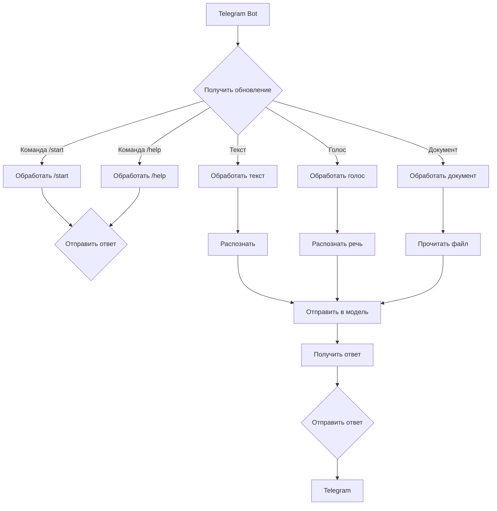

# <input code>

```python
## \file hypotez/src/bots/openai_bots/telegram_bot_trainger.py
# -*- coding: utf-8 -*-\
#! venv/Scripts/python.exe
#! venv/bin/python/python3.12

"""
.. module: src.bots.openai_bots 
	:platform: Windows, Unix
	:synopsis:

"""


""" This script creates a simple Telegram bot using the python-telegram-bot library."""

from pathlib import Path
import tempfile
import asyncio
from telegram import Update
from telegram.ext import Application, CommandHandler, MessageHandler, filters, CallbackContext

import header
from src import gs
from src.ai.openai.model.training import Model
from src.utils.jjson import j_loads_ns, j_loads_ns, j_dumps
from src.logger import logger
import speech_recognition as sr  # Библиотека для распознавания речи
import requests  # Для скачивания файлов
from pydub import AudioSegment  # Библиотека для конвертации аудио
from gtts import gTTS  # Библиотека для текстового воспроизведения
from src.utils.convertors.tts import recognizer, text_to_speech

model = Model()

# Replace 'YOUR_TOKEN_HERE' with your actual bot token
TELEGRAM_TOKEN = gs.credentials.telegram.bot_token

async def start(update: Update, context: CallbackContext) -> None:
    """ Handle the /start command."""
    await update.message.reply_text('Hello! I am your simple bot. Type /help to see available commands.')

async def help_command(update: Update, context: CallbackContext) -> None:
    """ Handle the /help command."""
    await update.message.reply_text('Available commands:\n/start - Start the bot\n/help - Show this help message')
    
async def handle_document(update: Update, context: CallbackContext):
    # Получаем файл
    file = await update.message.document.get_file()
    #tmp_file_path = f"{tempfile.gettempdir()}/received.txt"
    tmp_file_path = await file.download_to_drive()  # Сохраняем файл локально

    # Читаем содержимое файла
    with open(tmp_file_path, 'r') as f:
        file_content = f.read()

    response = model.send_message(f"Обучение модели на следующем содержимом:{file_content}")
    await update.message.reply_text(response)
    #tts_file_path = await text_to_speech (response)
    #await update.message.reply_audio(audio=open(tts_file_path, 'rb'))

async def handle_message(update: Update, context: CallbackContext) -> None:
    """ Handle any text message."""
    text_received = update.message.text
    response = model.send_message(text_received)
    await update.message.reply_text(response)
    #tts_file_path = await text_to_speech (response)
    #await update.message.reply_audio(audio=open(tts_file_path, 'rb'))

async def handle_voice(update: Update, context: CallbackContext) -> None:
    """ Handle voice messages."""
    voice_file = await update.message.voice.get_file()
    message = recognizer(audio_url=voice_file.file_path)
    response = model.send_message(message)
    await update.message.reply_text(response)
    tts_file_path = await text_to_speech (response)
    await update.message.reply_audio(audio=open(tts_file_path, 'rb'))

def main() -> None:
    """ Start the bot."""
    application = Application.builder().token(TELEGRAM_TOKEN).build()

    # Register command handlers
    application.add_handler(CommandHandler('start', start))
    application.add_handler(CommandHandler('help', help_command))

    # Register message handlers
    application.add_handler(MessageHandler(filters.TEXT & ~filters.COMMAND, handle_message))
    application.add_handler(MessageHandler(filters.VOICE, handle_voice))
    application.add_handler(MessageHandler(filters.Document.ALL, handle_document))
    # Start the bot
    application.run_polling()

if __name__ == '__main__':
    main()
```

# <algorithm>

**Блок-схема:**

1. **Инициализация:**
    * Создается экземпляр приложения `Application`.
    * Получается токен Telegram бота из `gs.credentials.telegram.bot_token`.
    * Создается экземпляр класса `Model`.
2. **Обработка команд:**
    * `/start`: Отправляется приветственное сообщение.
    * `/help`: Отправляется сообщение со списком доступных команд.
3. **Обработка сообщений:**
    * **Текстовое сообщение:**
        * Получается текст сообщения.
        * Отправляется сообщение на сервер `model.send_message()`.
        * Получается ответ от сервера.
        * Отправляется ответ пользователю.
    * **Голосовое сообщение:**
        * Загружается аудиофайл голосовой записи.
        * Используется `recognizer` для распознавания речи.
        * Отправляется распознанный текст на сервер `model.send_message()`.
        * Получается ответ от сервера.
        * Отправляется ответ пользователю.
        * Используется `text_to_speech` для преобразования ответа в аудиофайл.
        * Отправляется аудиофайл пользователю.
    * **Документ:**
        * Загружается файл документа.
        * Читается содержимое файла.
        * Отправляется содержимое файла на сервер `model.send_message()`.
        * Получается ответ от сервера.
        * Отправляется ответ пользователю.
4. **Запуск бота:**
    * `application.run_polling()` запускает цикл обработки сообщений.

**Примеры данных:**

* **Входные данные (текстовое сообщение):** "Привет, как дела?"
* **Обработка данных:** `model.send_message("Привет, как дела?")` -> ответ сервера (например, "Хорошо, спасибо!")
* **Выходные данные (текстовое сообщение):** Отправляется "Хорошо, спасибо!" пользователю.


# <mermaid>



**Объяснение диаграммы:**

Диаграмма показывает основные потоки данных и взаимодействия компонентов. Telegram Bot получает обновления (сообщения, команды). В зависимости от типа обновления, данные направляются на обработку в соответствующие блоки. `Распознать`, `Отправить в модель`, `Получить ответ` представляют собой этапы взаимодействия с моделью OpenAI.

**Зависимости:**

* `telegram`: библиотека для работы с Telegram API.
* `src.ai.openai.model.training`: класс `Model`, взаимодействующий с моделью OpenAI.
* `src.utils.convertors.tts`: функции `recognizer`, `text_to_speech` для распознавания и синтеза речи.
* `speech_recognition`, `pydub`, `gtts`, `requests`: библиотеки для распознавания речи, обработки аудио, синтеза речи и скачивания файлов.
* `asyncio`: для асинхронной работы бота.
* `header`, `gs`, `logger`, `jjson`: вероятно, модули, содержащие вспомогательные функции и настройки.


# <explanation>

**Импорты:**

* `from telegram import Update`: Импортирует класс `Update` из библиотеки `python-telegram-bot`.
* `from telegram.ext import Application, CommandHandler, MessageHandler, filters, CallbackContext`: Импортирует необходимые классы для создания и управления Telegram ботом.
* `from src import gs`: Импортирует модуль `gs`, вероятно, содержащий конфигурацию и настройки.
* `from src.ai.openai.model.training import Model`: Импортирует класс `Model` из модуля `src.ai.openai.model.training`, отвечающего за взаимодействие с моделью OpenAI.
* `from src.utils.jjson import j_loads_ns, j_loads_ns, j_dumps`:  Импортирует функции для работы с JSON.  Повторение `j_loads_ns` вызвало бы неоднозначность и требует проверки.
* `from src.logger import logger`: Импортирует логгер.
* `import speech_recognition as sr`:  Библиотека для распознавания речи.
* `import requests`: Библиотека для работы с HTTP запросами, вероятно для скачивания файлов.
* `from pydub import AudioSegment`: Библиотека для обработки аудиофайлов.
* `from gtts import gTTS`: Библиотека для синтеза речи.
* `from src.utils.convertors.tts import recognizer, text_to_speech`: Импортирует функции для распознавания и синтеза речи.
* `import asyncio`: Для асинхронной обработки сообщений.
* `import tempfile`: Для временных файлов.


**Классы:**

* `Model`:  Класс, взаимодействующий с моделью OpenAI.  В коде отсутствует его реализация, но по имени предполагается, что он содержит методы для отправки запросов и получения ответов.  Необходимо определить методы `send_message`.


**Функции:**

* `start()`: Обрабатывает команду `/start`.
* `help_command()`: Обрабатывает команду `/help`.
* `handle_message()`, `handle_voice()`, `handle_document()`: Обрабатывают входящие текстовые, голосовые и документ сообщения.  Они содержат логику взаимодействия с моделью OpenAI и отправки ответов пользователю.

**Возможные ошибки и улучшения:**

* **Обработка ошибок:**  В коде отсутствует обработка ошибок.  Необходимо добавить `try...except` блоки для перехвата потенциальных ошибок (например, при отсутствии файла, ошибках распознавания, ошибках в запросах к модели OpenAI).
* **Управление ресурсами:**  Обработка загруженных файлов должна включать освобождение ресурсов (удаление временных файлов).
* **Время ожидания:**  Взаимодействие с API должно содержать проверку на длительное выполнение.
* **Типы данных:**  Необходима верификация типов данных на входе и выходе функций и методов.
* **Обработка пустых ответов:** Необходимо проверить, что ответ от модели не пустой.


**Взаимосвязи с другими частями проекта:**

Код взаимодействует с другими частями проекта через импорты:

* `gs`: содержит данные для аутентификации и настройки бота.
* `src.ai.openai.model.training`: предоставляет механизм для работы с моделью OpenAI.
* `src.utils.convertors.tts`: обеспечивает конвертацию между различными форматами (текст, аудио).
* `src.logger`:  вероятно, предоставляет возможности логгирования.

Необходимо больше информации о других частях проекта (`header`, `jjson`) для более полного анализа связей.