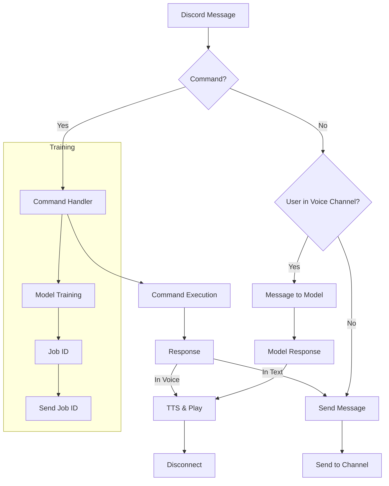

# <input code>

```python
## \file hypotez/src/bots/discord/discord_bot_trainger.py
# -*- coding: utf-8 -*-\
#! venv/Scripts/python.exe
#! venv/bin/python/python3.12

"""
.. module: src.bots.discord 
	:platform: Windows, Unix
	:synopsis:

"""


"""
	:platform: Windows, Unix
	:synopsis:

"""


"""
	:platform: Windows, Unix
	:synopsis:

"""


"""
  :platform: Windows, Unix

"""
"""
  :platform: Windows, Unix
  :platform: Windows, Unix
  :synopsis:
"""
  
""" module: src.bots.discord """


import discord
from discord.ext import commands
from pathlib import Path
import tempfile
import asyncio
import header
from src import gs
from src.ai.openai.model.training import Model
from src.utils.jjson import j_loads_ns, j_loads_ns, j_dumps
from src.logger import logger
import speech_recognition as sr  # Библиотека для распознавания речи
import requests  # Для скачивания файлов
from pydub import AudioSegment  # Библиотека для конвертации аудио
from gtts import gTTS  # Библиотека для текстового воспроизведения
from .chatterbox import *

# Указываем путь к ffmpeg
path_to_ffmpeg = str(fr"{gs.path.bin}\\ffmpeg\\bin\\ffmpeg.exe")
AudioSegment.converter = path_to_ffmpeg

# Command prefix for the bot
PREFIX = '!'

# Create bot object
intents = discord.Intents.default()
intents.message_content = True
intents.voice_states = True
bot = commands.Bot(command_prefix=PREFIX, intents=intents)

# Create model object
model = Model()

@bot.event
async def on_ready():
    """Called when the bot is ready."""
    logger.info(f'Logged in as {bot.user}')

@bot.command(name='hi')
async def hi(ctx):
    """Welcome message."""
    logger.info(f'hi({ctx})')
    await ctx.send('HI!')
    return True

# ... (other commands) ...

# ... (rest of the code) ...
```

# <algorithm>

**Описание алгоритма:**

Бот обрабатывает команды Discord.  При поступлении сообщения, проверяется, является ли оно командой. Если да, то выполняется соответствующая обработка. В противном случае, если пользователь находится в голосовом канале, сообщение отправляется на обработку модели, результат преобразуется в аудио и воспроизводится в канале. 

**Пошаговая блок-схема:**

1. **Инициализация бота:** 
   - Настройка `intents` для взаимодействия с Discord.
   - Создание объекта `bot` с заданным префиксом команд (`PREFIX`).
   - Инициализация модели `model`.
   - Логирование входа в систему.

2. **Обработка входящего сообщения (on_message):**
   - **Проверка на команды:** Если сообщение начинается с `PREFIX`, запускается обработка команд (`bot.process_commands(message)`).
   - **Проверка на аудио вложения:** Если сообщение содержит аудио вложение, оно загружается и распознаётся, результат отправляется на обработку модели.
   - **Обработка обычных сообщений:** Если нет команды и нет аудиовложения, сообщение отправляется на обработку модели.

3. **Обработка команд:**
   - Команды (`hi`, `join`, `leave`, `train`, `test`, `archive`, `select_dataset`, `instruction`, `correct`, `feedback`, `getfile`) вызывают соответствующие функции.
   - **train:** Запускает обучение модели с предоставленными данными.
   - **test:** Отправляет данные на тестирование модели.
   - **getfile:** отправляет файл по пути
   - **archive:** архивирует файлы
   - **select_dataset:** выбирает и архивирует набор данных
   - **instruction:** отправляет инструкцию из файла
   - **correct:** сохраняет исправление к сообщению
   - **feedback:** сохраняет отзыв
   - **join:** Подключение к голосовому каналу пользователя.
   - **leave:** Отключение от голосового канала.

4. **Обработка ответа модели:**
    - Если пользователь находится в голосовом канале, ответ модели воспроизводится в этом канале.
    - Иначе ответ отправляется в текстовый канал.


# <mermaid>



# <explanation>

**Импорты:**

- `discord`, `commands`: Для работы с Discord API. 
- `pathlib`: Для работы с файловыми путями.
- `tempfile`: Для временных файлов.
- `asyncio`: Для асинхронного программирования.
- `header`: Вероятно, для импорта каких-то вспомогательных функций или констант.
- `gs`:  Объект, содержащий глобальные настройки (например, пути, токен Discord).  Связь с другими частями проекта через `gs.credentials.discord.bot_token`.
- `Model`: Класс для работы с моделью обучения. Связь с пакетом `src.ai.openai.model.training`.
- `j_loads_ns`, `j_dumps`:  Функции для работы с JSON.  Связь с `src.utils.jjson`.
- `logger`: Для логирования. Связь с `src.logger`.
- `speech_recognition`, `requests`, `pydub`, `gtts`: Библиотеки для распознавания речи, скачивания файлов, обработки аудио.
- `.chatterbox`: Внутренний импорт, скорее всего, содержит дополнительные функции для бота.


**Классы:**

- `Model`:  Класс, отвечающий за обучение и использование модели.  Подробное описание его методов должно быть в файле `src/ai/openai/model/training.py`.
- `bot`: Объект бота Discord, управляемый с помощью `commands`.  Этот класс управляет подключением к серверу, обработкой сообщений и команд.

**Функции:**

- `on_ready()`: Вызывается при запуске бота. 
- `hi(ctx)`: Обрабатывает команду `!hi`.
- `join(ctx)`: Подключается к голосовому каналу.
- `leave(ctx)`: Отключается от голосового канала.
- `train(ctx, data, data_dir, positive, attachment)`: Запускает процесс обучения модели. Получает данные, директорию и флаги для обучения.
- `test(ctx, test_data)`: Тестирует модель.
- `archive(ctx, directory)`: Архивирует файлы в указанной директории.
- `select_dataset(ctx, path_to_dir_positive, positive)`: Выбирает набор данных для обучения.
- `instruction(ctx)`: Отправляет инструкцию из файла.
- `correct(ctx, message_id, correction)`:  Обрабатывает исправления.
- `store_correction(original_text, correction)`: Сохраняет исправление.
- `feedback(ctx, feedback_text)`: Обрабатывает отзыв.
- `text_to_speech_and_play(text, channel)`: Преобразует текст в аудио и воспроизводит его в указанном голосовом канале.
- `recognizer`: Удаляет этот метод, поскольку он не используется и является неэффективным по сравнению с современной обработкой аудио в Discord.
- `getfile(ctx, file_path)`: отправляет файл из локальной директории на discord

**Переменные:**

- `MODE`: Строковая переменная, содержащая режим работы (например, 'dev').
- `PREFIX`: Префикс команд бота.
- `intents`: Набор разрешений, которые необходимы боту.
- `bot`: Объект бота Discord.
- `model`: Объект модели машинного обучения.
- `path_to_ffmpeg`: Путь к исполняемому файлу ffmpeg.


**Возможные ошибки и улучшения:**

- **Обработка ошибок:** Необходимо более полная обработка ошибок при работе с файлами, сетью, запросами к модели. Нужно использовать `try...except` блоки для перехвата и обработки исключений.
- **Логирование:** Должно быть больше логирования для отладки и мониторинга работы бота.
- **Эффективность:**  В методе `recognizer` необходимо заменить скачивание и конвертацию аудио на использование имеющихся вложений от Discord. 
- **Безопасность:** Обработка вложений должна быть более безопасной, необходимо предотвращать выполнение произвольного кода.
- **Управление ресурсами:** В функции `text_to_speech_and_play` необходимо освобождать ресурсы, когда аудио воспроизведено.

**Цепочка взаимосвязей:**

Бот взаимодействует с различными частями проекта через импортируемые модули. `gs`  передает конфигурационные данные, `Model` предоставляет возможности работы с моделью обучения, `logger` используется для логирования, а `jjson` для работы с JSON.  `.chatterbox` содержит вспомогательные функции, специфичные для бота.  Возможно, существуют другие взаимосвязи между модулями проекта, которые не видны из данного файла.