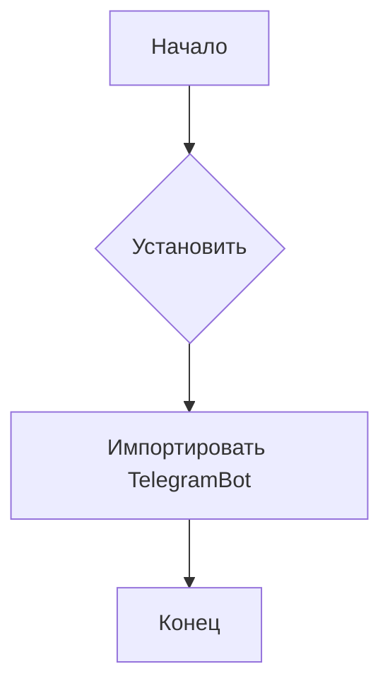
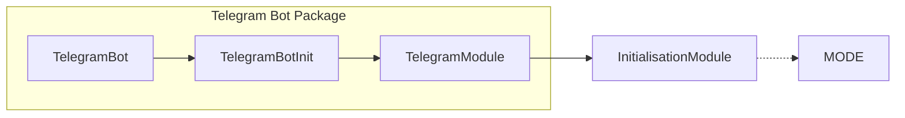

# <input code>

```python
## \file hypotez/src/bots/telegram/__init__.py
# -*- coding: utf-8 -*-\
#! venv/Scripts/python.exe
#! venv/bin/python/python3.12

"""
.. module: src.bots.telegram 
	:platform: Windows, Unix
	:synopsis:

"""


from .bot import TelegramBot
```

# <algorithm>

Этот код представляет собой модуль инициализации для пакета `src.bots.telegram`.  Он не содержит сложной логики, но устанавливает константу `MODE` и импортирует класс `TelegramBot`.  Блок-схема простая:



Пример:

1. **Начало:**  Выполнение скрипта.
2. **Установить :**  Присваивается строковое значение 'dev' переменной `MODE`.
3. **Импортировать TelegramBot:** Модуль `TelegramBot` импортируется из подпапки `.bot`.
4. **Конец:** Выполнение модуля завершено.

Данные в этом случае не перемещаются между функциями, а только устанавливаются как константа и импортируются в пространство имён.


# <mermaid>



# <explanation>

* **Импорты:**
    * `from .bot import TelegramBot`:  Импортирует класс `TelegramBot` из файла `bot.py`, который находится в той же директории (подпапке `telegram`) относительно файла `__init__.py`. Это типичная практика для организации кода по модулям и пакетам.

* **Классы:**
    * `TelegramBot`:  (Предполагается, что этот класс содержится в файле `hypotez/src/bots/telegram/bot.py`).  Этот класс, скорее всего, содержит  детали взаимодействия с Telegram API,  методы для обработки сообщений,  инициализации бота и т.д.  Без доступа к файлу `bot.py` мы не можем подробно описать его функциональность.

* **Функции:**
    * Нет функций в этом файле.  Всё сводится к импорту класса и константы.

* **Переменные:**
    * ``: Строковая константа, вероятно, используемая для выбора режима работы (например, режим разработки или production).  Это может повлиять на логику других модулей.  Значение 'dev' обычно указывает на тестовый или развивающийся режим.

* **Возможные ошибки или улучшения:**
    * Отсутствует явное docstring для переменной `MODE`. Добавление краткого описания сделало бы код более понятным.
    * Немного нестандартно использование `#!` в начале файла.  На Python обычно используется конструкция `# -*- coding: utf-8 -*-` для указания кодировки, а не `#!`. Это устаревший способ задания интерпретатора для запуска скрипта, и в современном Python практически не используется.


**Взаимосвязи с другими частями проекта:**

Этот модуль  `hypotez/src/bots/telegram/__init__.py` является частью более крупной структуры проекта, связанной с ботом Telegram.  Он служит точкой входа в логику взаимодействия с Telegram API. Скорее всего, в других частях проекта (например, в скриптах запуска или других модулях) будет импортироваться этот модуль, чтобы создать и запустить бота Telegram.