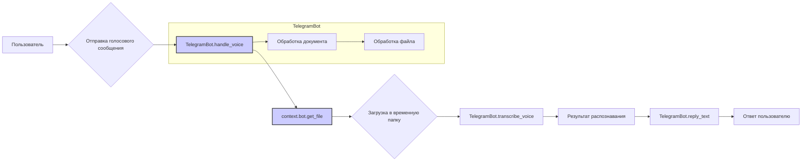

```MD
# <input code>

```python
## \file hypotez/src/bots/telegram/bot.py
# -*- coding: utf-8 -*-\

#! venv/bin/python/python3.12

"""
.. module: src.bots.telegram 
	:platform: Windows, Unix
	:synopsis:

"""


from pathlib import Path
import tempfile
import asyncio
from telegram import Update
from telegram.ext import Application, CommandHandler, MessageHandler, filters, CallbackContext

import header
from  src import gs
from src.utils.jjson import j_loads, j_loads_ns, j_dumps
from src.logger import logger
import requests  # For downloading files
from src.utils.convertors.tts import speech_recognizer, text2speech
from src.utils.file import read_text_file

class TelegramBot:
    """Telegram bot interface class."""

    application: Application

    def __init__(self, token: str):
        """Initialize the Telegram bot.

        Args:
            token (str): Telegram bot token, e.g., `gs.credentials.telegram.bot.kazarinov`.
        """
        self.application = Application.builder().token(token).build()
        self.register_handlers()

    def register_handlers(self):
        """Register bot commands and message handlers."""
        self.application.add_handler(CommandHandler('start', self.start))
        self.application.add_handler(CommandHandler('help', self.help_command))
        self.application.add_handler(MessageHandler(filters.TEXT & ~filters.COMMAND, self.handle_message))
        self.application.add_handler(MessageHandler(filters.VOICE, self.handle_voice))  # Новый обработчик голосовых сообщений
        self.application.add_handler(MessageHandler(filters.Document.ALL, self.handle_document))

    async def start(self, update: Update, context: CallbackContext) -> None:
        """Handle the /start command."""
        await update.message.reply_text('Hello! I am your simple bot. Type /help to see available commands.')

    async def help_command(self, update: Update, context: CallbackContext) -> None:
        """Handle the /help command."""
        await update.message.reply_text(
            'Available commands:\n'
            '/start - Start the bot\n'
            '/help - Show this help message'
        )

    async def handle_voice(self, update: Update, context: CallbackContext) -> None:
        """Handle voice messages and transcribe the audio."""
        try:
            voice = update.message.voice
            file = await context.bot.get_file(voice.file_id)
            file_path = gs.path.temp / f'{voice.file_id}.ogg'
            await file.download_to_drive(file_path)
            transcribed_text = self.transcribe_voice(file_path)
            await update.message.reply_text(f'Распознанный текст: {transcribed_text}')
        except Exception as ex:
            logger.error('Ошибка при обработке голосового сообщения: ', ex)
            await update.message.reply_text('Произошла ошибка при обработке голосового сообщения. Попробуй ещё раз.')

    def transcribe_voice(self, file_path: Path) -> str:
        """Transcribe voice message using a speech recognition service."""
        return 'Распознавание голоса ещё не реализовано.'

    async def handle_document(self, update: Update, context: CallbackContext) -> str:
        """Handle received documents."""
        file = await update.message.document.get_file()
        tmp_file_path = await file.download_to_drive()
        return read_text_file(tmp_file_path)

    async def handle_message(self, update: Update, context: CallbackContext) -> str:
        """Handle any text message."""
        return update.message.text

    async def handle_voice(self, update: Update, context: CallbackContext) -> str:
        """Handle voice messages."""
        voice_file = await update.message.voice.get_file()
        return speech_recognizer(audio_url=voice_file.file_path)

def main() -> None:
    """Start the bot."""
    token = gs.credentials.telegram.bot.kazarinov
    bot = TelegramBot(token)
    bot.application.add_handler(CommandHandler('start', bot.start))
    bot.application.add_handler(CommandHandler('help', bot.help_command))
    bot.application.add_handler(MessageHandler(filters.TEXT & ~filters.COMMAND, bot.handle_message))
    bot.application.add_handler(MessageHandler(filters.VOICE, bot.handle_voice))
    bot.application.add_handler(MessageHandler(filters.Document.ALL, bot.handle_document))
    bot.application.run_polling()

if __name__ == '__main__':
    main()
```

# <algorithm>

**Шаг 1:** Импортирует необходимые библиотеки: `pathlib`, `tempfile`, `asyncio`, `telegram`, `telegram.ext`, `header`, `gs`, `jjson`, `logger`, `requests`, `tts`, `file`.

**Шаг 2:** Определяет константу `MODE`.

**Шаг 3:** Определяет класс `TelegramBot`.
    * **__init__(self, token):** Инициализирует экземпляр бота с заданным токеном. Создаёт `Application`. Регистрирует обработчики событий.
    * **register_handlers():** Регистрирует обработчики команд `/start` и `/help`, а также обработчики сообщений произвольного типа (`TEXT`), голосовых (`VOICE`) и документов (`Document`).
    * **start(), help_command():** Обрабатывают команды `/start` и `/help`, соответственно.
    * **handle_voice():** Обрабатывает голосовые сообщения. Загружает голосовое сообщение в временную папку. Вызывает функцию `transcribe_voice` для распознавания речи. Отправляет распознанный текст пользователю.
    * **transcribe_voice(file_path):** Заглушка для распознавания речи. Пока возвращает строку 'Распознавание голоса ещё не реализовано'.
    * **handle_document():** Обрабатывает полученные документы. Загружает документ в временную папку, читает его текст с помощью функции `read_text_file` и возвращает содержимое.
    * **handle_message():** Обрабатывает текстовые сообщения. Возвращает текст сообщения.
    * **handle_voice():** Обрабатывает голосовые сообщения, вызывая `speech_recognizer`.

**Шаг 4:** Определяет функцию `main()`.
    * Получает токен бота из `gs.credentials`.
    * Создаёт экземпляр класса `TelegramBot`.
    * Заново регистрирует обработчики событий.
    * Запускает бота в режиме `polling`.


**Пример перемещения данных:**

Пользователь отправляет голосовое сообщение.
- Данные сообщения поступают в `handle_voice()`.
- `handle_voice()` загружает файл в временную папку.
- `handle_voice()` вызывает `transcribe_voice()`.
- `transcribe_voice()` возвращает текст.
- `handle_voice()` отвечает пользователю с распознанным текстом.


# <mermaid>




# <explanation>

**Импорты:**

* `from pathlib import Path`:  Импортирует класс `Path` для работы с путями к файлам.
* `import tempfile`:  Для временных файлов.
* `import asyncio`:  Для асинхронного кода, важного при работе с Telegram.
* `from telegram import Update`:  Объект, содержащий данные от Telegram.
* `from telegram.ext import Application, ...`:  Библиотека Telegram Bot API.
* `import header`:  Возможно, содержит общие функции или константы.
* `from src import gs`: Импортирует модуль `gs`, вероятно, содержащий конфигурацию, например, пути и данные для доступа к ресурсам.
* `from src.utils.jjson import ...`:  Функции для работы с JSON-данными.
* `from src.logger import logger`: Импортирует логгер, вероятно, из `src.logger`.
* `import requests`: Для загрузки файлов (если необходимо).
* `from src.utils.convertors.tts import ...`: Импортирует функции для работы с распознаванием и синтезом речи.
* `from src.utils.file import read_text_file`:  Функция для чтения текстовых файлов.

**Классы:**

* `TelegramBot`:  Представляет интерфейс телеграм-бота.
    * `application`: Объект `Application` из `telegram.ext`, который управляет ботом.
    * `__init__(self, token)`: Инициализирует бота с токеном.
    * `register_handlers()`: Регистрирует обработчики команд и сообщений.
    * `start()`, `help_command()`, `handle_message()`, `handle_voice()`, `handle_document()`: Методы для обработки различных типов сообщений.

**Функции:**

* `main()`: Точка входа для запуска бота.


**Возможные ошибки и улучшения:**

* **`transcribe_voice()`:**  Это заглушка.  Необходимо заменить ее на вызов реального сервиса распознавания речи (например, Google Cloud Speech-to-Text или аналогичного).
* **Обработка ошибок:**  В `handle_voice()` есть обработка ошибок, но можно добавить более подробную информацию об ошибке.
* **Обработка больших файлов:** Если ожидать большие файлы в качестве документов, стоит подумать об обработке на куски, чтобы избежать проблем с памятью.
* **Обработка других типов документов:** Пока бот обрабатывает только текстовые документы. Рассмотрим обработку других форматов (например, PDF).
* **`gs.path.temp`:** Необходимо понять, как создается и используется временный каталог `gs.path.temp`.

**Взаимосвязи:**

Класс `TelegramBot` использует модуль `gs` для получения токена.  Функции распознавания речи (`speech_recognizer`) и чтения файлов (`read_text_file`) находятся в других модулях `src.utils`.  Логирование происходит через `logger` из `src.logger`. Взаимодействие происходит через импорты.