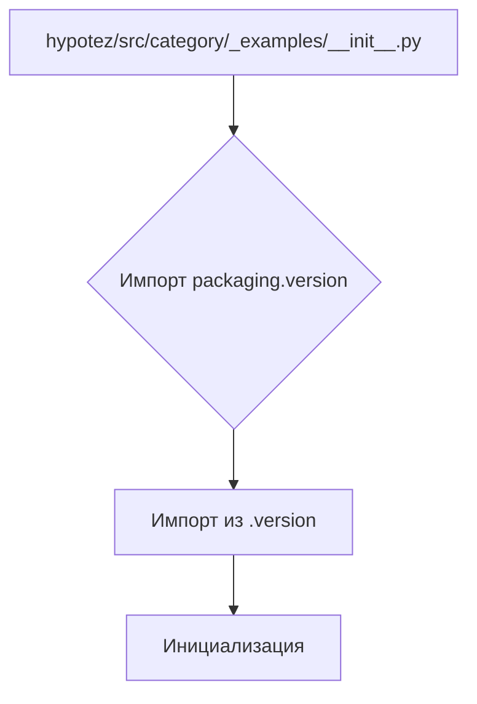

```MD
# Анализ кода из hypotez/src/category/_examples/__init__.py

**1. <input code>**

```python
## \file hypotez/src/category/_examples/__init__.py
# -*- coding: utf-8 -*-\

#! venv/bin/python/python3.12

"""
.. module: src.category._examples 
	:platform: Windows, Unix
	:synopsis:

"""


"""
	:platform: Windows, Unix
	:synopsis:

"""


"""
	:platform: Windows, Unix
	:synopsis:

"""


"""
  :platform: Windows, Unix

"""
"""
  :platform: Windows, Unix
  :platform: Windows, Unix
  :synopsis:
"""
  
""" module: src.category._examples """


""" @namespace src.category._examples """


""" """
...

from packaging.version import Version
from .version import __version__, __doc__, __details__
```

**2. <algorithm>**

Этот код представляет собой инициализационную часть модуля `src.category._examples`.  В нем нет циклов или сложных вычислений. Алгоритм сводится к импорту необходимых библиотек.  Пошаговая блок-схема крайне проста:

1. Импортировать библиотеку `packaging.version`.
2. Импортировать переменные `__version__`, `__doc__`, `__details__` из подмодуля `.version`.

**Пример:**  Данный код не содержит логики обработки данных, но устанавливает константу `MODE` в 'dev'.

**3. <mermaid>**



**4. <explanation>**

* **Импорты:**
    * `from packaging.version import Version`: Импортирует класс `Version` из пакета `packaging.version`.  Этот пакет предоставляет инструменты для работы с версиями пакетов. Связь с `src` - опосредованная, через пакет `packaging`.
    * `from .version import __version__, __doc__, __details__`: Импортирует переменные `__version__`, `__doc__` и `__details__` из модуля `.version` внутри того же пакета `src.category._examples`.  Это типичный способ организации метаданных (версии, документация) внутри проекта.

* **Классы:** В этом коде нет определений классов.

* **Функции:** Нет определений функций.

* **Переменные:**
    * ``:  Переменная глобального уровня, которая хранит строковое значение 'dev'. Ее роль, скорее всего, в конфигурации, например, для разных режимов работы (разработка, тестирование, производство).

* **Возможные ошибки и улучшения:**
    * Много комментариев, но не содержащие полезной информации, кроме описания документации. Необходимо удалить лишние комментарии.
    * Непонятно назначение переменной `MODE`, если она не используется в дальнейшем. Лучше добавить описание и/или использовать ее в других функциях и классах.
    * Нехватка документации внутри функций и классов, что снижает читабельность.

**Цепочка взаимосвязей:**

Этот модуль `hypotez/src/category/_examples/__init__.py` импортирует функциональность из модуля `.version` в том же каталоге, предполагая, что `.version` содержит информацию о версии, документации и дополнительных данных для модуля `_examples`.  Эта связь устанавливает зависимость модуля `_examples` от модуля `version`.  Дальнейшая логика использования `__version__`, `__doc__`, и `__details__` должна быть реализована в других частях проекта.  В конечном итоге `_examples` служит примером, и его конкретные назначения должны быть уточнены.