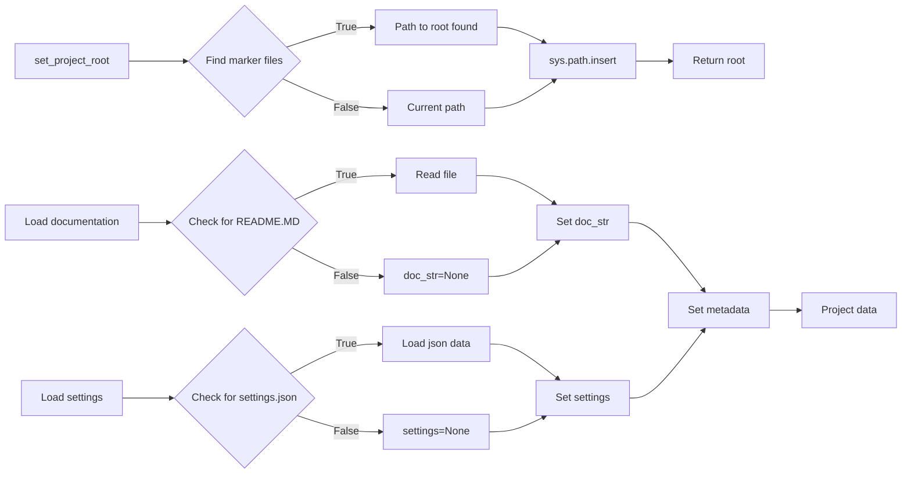

# <input code>

```python
## \file hypotez/src/category/header.py
# -*- coding: utf-8 -*-
#! venv/Scripts/python.exe
#! venv/bin/python/python3.12

"""
module: src.category 
	:platform: Windows, Unix
	:synopsis: Модуль определяющий корневой путь к проекту. Все импорты строятся относительно этого пути.
    :TODO: В дальнейшем перенести в системную переменную"""


import sys
import json
from packaging.version import Version

from pathlib import Path
def set_project_root(marker_files=('__root__')) -> Path:
    """
    Finds the root directory of the project starting from the current file's directory,
    searching upwards and stopping at the first directory containing any of the marker files.

    Args:
        marker_files (tuple): Filenames or directory names to identify the project root.
    
    Returns:
        Path: Path to the root directory if found, otherwise the directory where the script is located.
    """
    __root__:Path
    current_path:Path = Path(__file__).resolve().parent
    __root__ = current_path
    for parent in [current_path] + list(current_path.parents):
        if any((parent / marker).exists() for marker in marker_files):
            __root__ = parent
            break
    if __root__ not in sys.path:
        sys.path.insert(0, str(__root__))
    return __root__


# Get the root directory of the project
__root__ = set_project_root()
"""__root__ (Path): Path to the root directory of the project"""

from src import gs

settings:dict = None
try:
    with open(gs.path.root / 'src' /  'settings.json', 'r') as settings_file:
        settings = json.load(settings_file)
except (FileNotFoundError, json.JSONDecodeError):
    ...

doc_str:str = None
try:
    with open(gs.path.root / 'src' /  'README.MD', 'r') as settings_file:
        doc_str = settings_file.read()
except (FileNotFoundError, json.JSONDecodeError):
    ...


__project_name__ = settings.get("project_name", 'hypotez') if settings  else 'hypotez'
__version__: str = settings.get("version", '')  if settings  else ''
__doc__: str = doc_str if doc_str else ''
__details__: str = ''
__author__: str = settings.get("author", '')  if settings else ''
__copyright__: str = settings.get("copyrihgnt", '')  if settings else ''
__cofee__: str = settings.get("cofee", "Treat the developer to a cup of coffee for boosting enthusiasm in development: https://boosty.to/hypo69")  if settings else "Treat the developer to a cup of coffee for boosting enthusiasm in development: https://boosty.to/hypo69"
```

# <algorithm>

**Шаг 1:** Определение корневого каталога проекта (`set_project_root`).

*   Начинается с текущего каталога (`__file__`).
*   Проверяет наличие `marker_files` (pyproject.toml, requirements.txt, .git) в текущем и родительских каталогах.
*   Возвращает путь к корневому каталогу. Если не найден, возвращает текущий.

**Пример:**

Если текущий файл находится в `hypotez/src/category`, `set_project_root` будет искать pyproject.toml, requirements.txt, .git в `hypotez/src/category` , `hypotez/src`, `hypotez`. Если pyproject.toml найдено в `hypotez`, функция вернет путь к `hypotez`.


**Шаг 2:**  Получение настроек проекта (`settings`).

*   Используется модуль `gs.path.root` для получения корневого каталога.
*   Попытка открыть `src/settings.json` в корневом каталоге проекта.
*   Если файл существует и парсится корректно, загружает данные в переменную `settings`.
*   В случае ошибки (FileNotFoundError или json.JSONDecodeError) - пропускает.

**Пример:**

Если файл `src/settings.json` находится в `hypotez`, `settings` будет содержать данные из этого файла.

**Шаг 3:** Получение документации проекта (`__doc__`).

*   Попытка открыть `src/README.MD` в корневом каталоге проекта.
*   Если файл существует, загружает содержимое в `doc_str`.
*   В случае ошибки (FileNotFoundError или json.JSONDecodeError) - пропускает.


**Шаг 4:**  Получение метаданных проекта.

*   Используются функции `settings.get()` для получения значений из словаря `settings`, с использованием значения по умолчанию в случае отсутствия ключа.

**Пример:**

Если в `settings.json` присутствует `project_name: "MyProject"`, то `__project_name__` будет равно `MyProject`.


# <mermaid>



**Объяснение диаграммы:**

*   `set_project_root`: находит корневой каталог проекта и добавляет его в `sys.path`.
*   `Load settings`: загружает настройки из `settings.json`.
*   `Load documentation`: загружает документацию из `README.MD`.
*   `Set metadata`: устанавливает метаданные проекта (`__project_name__`, `__version__`, etc.) на основе полученных данных.
*   `Project data`:  результат работы функций для получения данных.


# <explanation>

**Импорты:**

* `sys`:  для управления переменными среды, в частности, добавлением пути к проекту в `sys.path`.
* `json`: для работы с файлами JSON (настройка проекта).
* `packaging.version`: для работы с версиями пакетов.
* `pathlib`: для работы с путями к файлам.


**Классы:**

Нет классов.


**Функции:**

* `set_project_root(marker_files)`: находит корневой каталог проекта, начиная с текущего файла и ищет вложенные каталоги вверх по иерархии, пока не найдет каталог с `marker_files`.  Возвращает путь к корневому каталогу.
   * Аргументы: `marker_files` (кортеж строк, по умолчанию `('pyproject.toml', 'requirements.txt', '.git')`) — список файлов, которые указывают на корень проекта.
   * Возвращаемое значение: `Path` — путь к корневому каталогу проекта.


**Переменные:**

* `MODE`: строковая переменная, хранит значение режима (например, 'dev', 'prod').
* `__root__`: путь к корню проекта (`Path`).
* `settings`: словарь настроек проекта (`dict`).
* `doc_str`: содержимое файла `README.MD` проекта (`str`).
* `__project_name__`, `__version__`, `__doc__`, `__details__`, `__author__`, `__copyright__`, `__cofee__`: метаданные проекта, полученные из `settings`.

**Возможные ошибки и улучшения:**

* **Обработка ошибок:** обработка исключений `FileNotFoundError` и `json.JSONDecodeError` в блоках `try...except` сделана, но может быть расширена для обработки других ситуаций (например, отсутствие необходимого ключа в `settings.json`).
* **Используйте `typing`:** Добавление аннотаций типов переменных и аргументов функции (например, `marker_files: tuple[str, ...]` ) улучшит читабельность и безопасность.
* **Проверка валидности данных:** добавление проверки на корректность загруженных данных (например, проверка типа значений в `settings`).
* **Логирование:** использование логирования (например, `logging`) для записи информации о ходе работы и обнаруженных ошибках.

**Взаимосвязи с другими частями проекта:**

Модуль `gs` явно используется для получения доступа к корневому каталогу.  Возможно, `gs` — это абстракция (модуль или класс), обеспечивающая доступ к ресурсам проекта (файлы, директории, конфигурации).


```