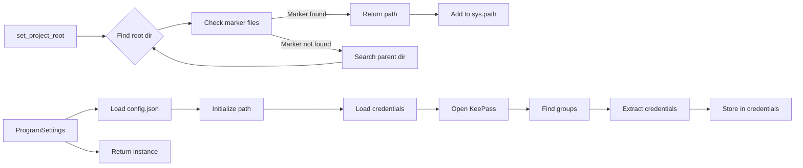

# <input code>

```python
## \file hypotez/src/credentials.py
# -*- coding: utf-8 -*-\
#! venv/Scripts/python.exe
#! venv/bin/python/python3.12

"""
.. module: src 
	:platform: Windows, Unix
	:synopsis: Global Project Settings: paths, passwords, logins, and API settings

"""


import datetime
from datetime import datetime
import getpass
import os
import sys
import json
import warnings
import socket
from dataclasses import dataclass, field
from pathlib import Path
from types import SimpleNamespace
from typing import Optional

from pydantic import BaseModel, Field
from pykeepass import PyKeePass

from src.check_release import check_latest_release
from src.logger.logger import logger
from src.logger.exceptions import (
    BinaryError,
    CredentialsError,
    DefaultSettingsException,
    HeaderChecksumError,
    KeePassException,
    PayloadChecksumError,
    UnableToSendToRecycleBin,
)
from src.utils.file import read_text_file
from src.utils.jjson import j_loads, j_loads_ns
from src.utils.printer import pprint

def set_project_root(marker_files=('__root__')) -> Path:
    """
    Finds the root directory of the project starting from the current file's directory,
    searching upwards and stopping at the first directory containing any of the marker files.


    Args:
        marker_files (tuple): Filenames or directory names to identify the project root.
    
    Returns:
        Path: Path to the root directory if found, otherwise the directory where the script is located.
    """
    __root__:Path
    current_path:Path = Path(__file__).resolve().parent
    __root__ = current_path
    for parent in [current_path] + list(current_path.parents):
        if any((parent / marker).exists() for marker in marker_files):
            __root__ = parent
            break
    if __root__ not in sys.path:
        sys.path.insert(0, str(__root__))
    return __root__

def singleton(cls):
    """Декоратор для реализации Singleton."""
    instances = {}

    def get_instance(*args, **kwargs):
        if cls not in instances:
            instances[cls] = cls(*args, **kwargs)
        return instances[cls]

    return get_instance

@singleton
class ProgramSettings(BaseModel):
    """ 
    `ProgramSettings` - класс настроек программы.

    Синглтон, хранящий основные параметры и настройки проекта.
    """

    class Config:
        arbitrary_types_allowed = True

    host_name:str = socket.gethostname()
    print(f'Имя машины: {host_name}')

    base_dir: Path = Field(default_factory=lambda: set_project_root())
    config: SimpleNamespace = Field(default_factory=lambda: SimpleNamespace())
    credentials: SimpleNamespace = field(default_factory=lambda: SimpleNamespace(
        aliexpress=SimpleNamespace(
            api_key=None,
            secret=None,
            tracking_id=None,
            username=None,
            email=None,
            password=None
        ),
        presta=SimpleNamespace(
            translations=SimpleNamespace(
                server=None,
                port=None,
                database=None,
                user=None,
                password=None,
            ),
            client=[SimpleNamespace(
                server=None,
                port=None,
                database=None,
                user=None,
                password=None,
            )]
        ),
        openai=SimpleNamespace(
            api_key=None, 
            assistant_id=SimpleNamespace(), 
            project_api=None
        ),
        gemini=SimpleNamespace(api_key=None),
        rev_com=SimpleNamespace(client_api=None,
                                user_api=None),
        shutter_stock=SimpleNamespace(token=None),
        discord=SimpleNamespace(
            application_id=None, 
            public_key=None, 
            bot_token=None
        ),
        telegram=SimpleNamespace(
            bot=SimpleNamespace()
        ),
        smtp=[],
        facebook=[],
        gapi={}
    ))
    MODE: str = Field(default='dev')
    path: SimpleNamespace = Field(default_factory=lambda: SimpleNamespace(
        root = None,
        src = None,
        bin = None,
        log = None,
        tmp = None,
        data = None,
        secrets = None,
        google_drive = None,
        external_storage = None,
        tools = None,
        dev_null ='nul' if sys.platform == 'win32' else '/dev/null'
    ))


    def __init__(self, **kwargs):
        super().__init__(**kwargs)
        # Ваш код для выполнения __post_init__

        self.config = j_loads_ns(self.base_dir / 'src' / 'config.json')
        if not self.config:
            logger.error('Ошибка при загрузке настроек')
            ...
            return

        self.config.project_name = self.base_dir.name

        self.path = SimpleNamespace(
            root = Path(self.base_dir),
            bin = Path(self.base_dir / 'bin'), # <- тут бинарники (chrome, firefox, ffmpeg, ...)
            src = Path(self.base_dir) / 'src', # <- тут весь код
            endpoints = Path(self.base_dir) / 'src' / 'endpoints', # <- тут все клиенты
            secrets = Path(self.base_dir / 'secrets'),  # <- это папка с паролями и базой данных ! Ей нельзя попадать в гит!!!
            toolbox = Path(self.base_dir / 'toolbox'), # <- служебные утилиты

            log = Path(getattr(self.config.path, 'log', self.base_dir / 'log')), 
            tmp = Path(getattr(self.config.path, 'tmp', self.base_dir / 'tmp')),
            data = Path(getattr(self.config.path, 'data', self.base_dir / 'data')), # <- данные от endpoints (hypo69, kazarinov, prestashop, etc ...)
            google_drive = Path(getattr(self.config.path, 'google_drive', self.base_dir / 'google_drive')), # <- GOOGLE DRIVE ЧЕРЕЗ ЛОКАЛЬНЫЙ ДИСК (NOT API) 
            external_storage = Path(getattr(self.config.path, 'external_storage',  self.base_dir / 'external_storage') ),
        )

        if check_latest_release(self.config.git_user, self.config.git):
            ...  # Логика что делать когда есть новая версия hypo69 на github 

        self.MODE = self.config.mode

        # ... (rest of the code)
```

# <algorithm>

**Шаг 1:** `set_project_root()`:
    - Находит корневую директорию проекта, начиная с текущей директории, ищет вверх по дереву директорий.
    - Проверяет наличие файлов/директорий (marker_files) в родительских директориях.
    - Возвращает Path к найденной корневой директории или текущей директории, если корневой не найдено.
    - Добавляет корневую директорию в sys.path для импорта модулей.
    **Пример:**
    `marker_files = ('pyproject.toml',)`
    Если `pyproject.toml` найдено в родительской директории, то возвращается Path к этой родительской директории.


**Шаг 2:** `singleton()`:
    - Декоратор для реализации паттерна Singleton.
    - Хранит один экземпляр класса внутри себя.


**Шаг 3:** `ProgramSettings`:
    - Класс настроек программы, использующий `pydantic`.
    - Содержит атрибуты для хранения путей, настроек, учетных данных.
    - Инициализирует себя с помощью JSON-файла `config.json` из `base_dir/src`.
    - Инициализирует переменные `path` с данными о путях к файлам и директориям, основываясь на `base_dir` и `config.json`.
    - Загружает учетные данные из KeePass (методы `_load_credentials` и вспомогательные методы).


**Шаг 4:** `_load_credentials()`:
    - Открывает базу данных KeePass.
    - Использует `kp.find_groups()` для поиска групп и `kp.entries` для извлечения соответствующих записей.
    - Загружает данные для каждого типа учетных данных (aliexpress, openai, etc).
    - Записывает данные в соответствующие поля `credentials`.


# <mermaid>



**Объяснение зависимостей:**

* `pydantic`: для валидации и сериализации данных.
* `pykeepass`: для работы с базой данных KeePass.
* `src.check_release`: проверка новых версий.
* `src.logger`: для логирования.
* `src.utils`: вспомогательные функции (file, jjson, printer).
* `Path`, `SimpleNamespace`, `datetime` и другие стандартные библиотеки Python.
* `logger`, `check_latest_release`, и др. - это компоненты из других модулей, которые находятся в папке `src`.

# <explanation>

**Импорты:**
Кодовая база импортирует необходимые модули для работы. Это, прежде всего, `pykeepass` для работы с хранилищем KeePass, `pydantic` для работы с настройками, `src.check_release`, `src.logger` и `src.utils` — модули из собственной кодовой базы, обеспечивающие функциональность приложения (логирование, проверка релизов и т.д.). 

**Классы:**

* `ProgramSettings`: основной класс для хранения и управления настройками программы. Он реализован как синглтон, что гарантирует, что будет только один экземпляр этого класса в течение всего выполнения программы.  `BaseModel` из `pydantic` упрощает работу с настройками. `host_name`, `base_dir` - это переменные для хранения имени машины и пути к корневой директории приложения соответственно. `credentials` - это структура данных, в которой хранятся учетные данные от различных сервисов.

**Функции:**

* `set_project_root()`: находит корневую директорию проекта, начиная с текущей директории и двигаясь вверх по дереву директорий, пока не найдёт директорию, содержащую маркерные файлы (`pyproject.toml`, `requirements.txt`, `.git`).  Важно, что `sys.path` обновляется, чтобы можно было импортировать модули из корневой директории. 
* `singleton()`: декоратор, позволяющий создать единственный экземпляр класса.


**Переменные:**

* `MODE`, `host_name`, `base_dir`: это переменные, которые хранят текущие данные о состоянии приложения.
* `credentials`: переменная, которая хранит сложную структуру данных типа `SimpleNamespace`, содержащую ключи и значения для различных сервисов.

**Возможные ошибки и улучшения:**

* **Обработка исключений:** При чтении данных из KeePass или `config.json` стоит добавить более подробную обработку исключений для повышения устойчивости приложения.
* **Безопасность:** Пароли из KeePass должны храниться в зашифрованном виде в коде, а не в виде текста. Файл с паролем (`password.txt`) должен быть защищен от несанкционированного доступа.
* **Более структурированные данные:** Вместо `SimpleNamespace` можно использовать более структурированные классы, которые обеспечат более сильную типизацию и валидацию данных.
* **Документация:** Необходимо добавить более подробные комментарии к коду и методам, особенно для методов `_load_*_credentials`.  Это сделает код более читаемым и понятным для других разработчиков, а также позволит избежать проблем с пониманием в будущем.


**Взаимосвязи с другими частями проекта:**

* Класс `ProgramSettings` является основным источником настроек для всей программы.  Он взаимодействует с `src.check_release`, `src.logger`, и `src.utils` для получения и использования данных из других модулей.  Особенно важны зависимости с модулями из `src`, которые используются для работы с файлами, логированием, проверкой версий.