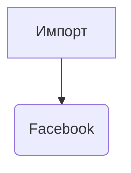
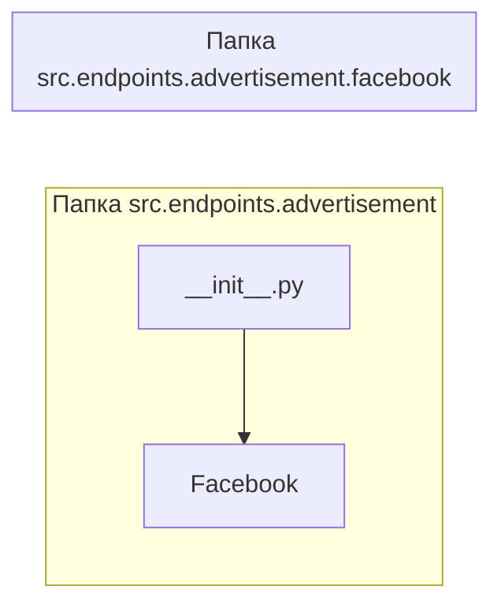

```MD
# Анализ кода hypotez/src/endpoints/advertisement/__init__.py

## <input code>

```python
## \file hypotez/src/endpoints/advertisement/__init__.py
# -*- coding: utf-8 -*-\
#! venv/Scripts/python.exe
#! venv/bin/python/python3.12

"""
.. module: src.endpoints.advertisement 
	:platform: Windows, Unix
	:synopsis:

"""


from .facebook import Facebook
```

## <algorithm>

Этот файл представляет собой инициализационный модуль для пакета `advertisement`.  Он не содержит собственных функций или классов, а только импортирует класс `Facebook` из подмодуля `facebook`.  Алгоритм прост: импорт.  Нет циклов, ветвлений или сложной логики.

**Блок-схема:**



**Пример:**

В случае обращения к `src.endpoints.advertisement`, этот файл предоставляет доступ к классу `Facebook`, позволяя использовать его методы и атрибуты в других частях проекта.

## <mermaid>



## <explanation>

**Импорты:**

- `from .facebook import Facebook`:  Этот импорт подключает класс `Facebook` из подпапки `facebook` внутри пакета `advertisement`.  Символ `.` указывает на то, что импортируемый модуль находится в текущей директории. Это типичный способ организации пакета Python.  `src.endpoints.advertisement.facebook` содержит реализацию конкретной рекламной платформы (Facebook).

**Классы:**

- Нет собственных классов в данном файле.  Он просто предоставляет доступ к классу `Facebook`, который должен быть определен в файле `facebook.py` внутри папки `src/endpoints/advertisement`.

**Функции:**

- Нет функций в данном файле.  Он выполняет только импорт.

**Переменные:**

- ``: Переменная, скорее всего, устанавливает режим работы (например, режим разработки или производства).  Эта переменная может использоваться в других частях проекта для конфигурации поведения.  Тип - строка.

**Возможные ошибки и улучшения:**

- Отсутствует описание поведения при отсутствии файла `facebook.py`.  Рекомендуется добавить проверку существования файла или использовать механизм обработки исключений `try...except`.
- Добавьте документацию к переменной `MODE`.  Нелишним будет описать назначение и возможные значения в docstring.
- Улучшить  идентификацию. Если этот файл нужен только для импорта, то он должен быть кратким и иметь самодокументирующий  имя, например `__init__.py`.


**Цепочка взаимосвязей:**

Этот модуль предоставляет входные точки для работы с рекламой на Facebook.  Он находится в иерархии пакета `src.endpoints.advertisement`. Код, использующий этот модуль, будет искать и использовать класс `Facebook` для взаимодействия с API Facebook.  В дальнейшем, этот код может взаимодействовать с другими модулями для обработки данных о рекламе (например, с модулем для обработки данных или аналитики рекламных кампаний).
```
src.endpoints.advertisement.facebook.Facebook -> src.endpoints.advertisement.__init__.py -> (коды, использующие advertisement)