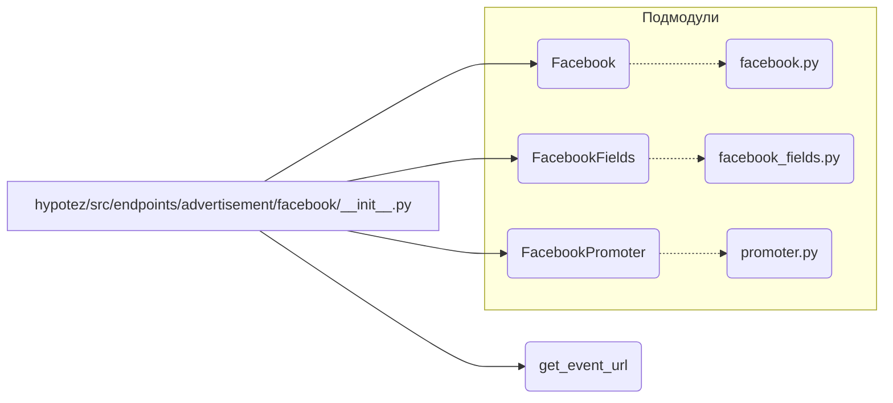

# <input code>

```python
## \file hypotez/src/endpoints/advertisement/facebook/__init__.py
# -*- coding: utf-8 -*-\
#! venv/Scripts/python.exe
#! venv/bin/python/python3.12

"""
.. module: src.endpoints.advertisement.facebook 
	:platform: Windows, Unix
	:synopsis:

"""


from .facebook import Facebook
from .facebook_fields import FacebookFields
from .promoter import FacebookPromoter, get_event_url
```

# <algorithm>

Этот код представляет собой инициализационный файл для модуля `src.endpoints.advertisement.facebook`. Он импортирует классы и функции из подмодулей `facebook`, `facebook_fields` и `promoter`.  Подробный алгоритм работы скрыт за пределами этого файла; он лишь импортирует необходимые компоненты для дальнейшего использования.  Нет явного алгоритма "работы" самого файла.

**Пример:** Если в другом модуле нужно будет использовать класс `Facebook`, он будет импортирован из этого файла.


# <mermaid>



**Объяснение диаграммы:**

Диаграмма показывает импорты из текущего файла (`__init__.py`) в другие модули проекта.  Файл `__init__.py` выступает как точка входа, обеспечивая доступ к классам `Facebook`, `FacebookFields`, `FacebookPromoter` и функции `get_event_url`, которые определены в соответствующих подмодулях (файлах `.py`).


# <explanation>

* **Импорты:**
    * `from .facebook import Facebook`: Импортирует класс `Facebook` из модуля `facebook.py` внутри текущей директории.
    * `from .facebook_fields import FacebookFields`: Импортирует класс `FacebookFields` из модуля `facebook_fields.py` внутри текущей директории.
    * `from .promoter import FacebookPromoter, get_event_url`: Импортирует класс `FacebookPromoter` и функцию `get_event_url` из модуля `promoter.py` внутри текущей директории.

    Связь с другими пакетами: Импорты указывают, что файлы `facebook.py`, `facebook_fields.py` и `promoter.py` являются частью структуры пакета `hypotez/src/endpoints/advertisement/facebook`.

* **Классы:**
    * `Facebook`, `FacebookFields`, `FacebookPromoter`: Эти классы, вероятно, представляют собой сущности, связанные с рекламой на Facebook.  Их точное назначение и структура не видны без кода соответствующих файлов.

* **Функции:**
    * `get_event_url`:  Возвращает URL-адрес для какого-то события, скорее всего, связанного с рекламой.  Подробности ее реализации не известны без кода функции.

* **Переменные:**
    * ``:  Эта переменная, скорее всего, используется для определения режима работы (например, 'dev', 'prod') и последующей конфигурации.


* **Возможные ошибки или области для улучшений:**
    * Отсутствует документация внутри кода, что усложняет понимание назначения классов и функций.
    * Не определено, как и где используются импортированные компоненты.


**Цепочка взаимосвязей:**

Файл `__init__.py` служит посредником между текущей директорией и другими модулями, обеспечивая доступ к функциональности, определенной в подмодулях (`.facebook.py`, `.facebook_fields.py`, `.promoter.py`).  Эти подмодули, вероятно, содержат логику для работы с API Facebook, обработки данных рекламы и других операций, связанных с платформами социального взаимодействия.