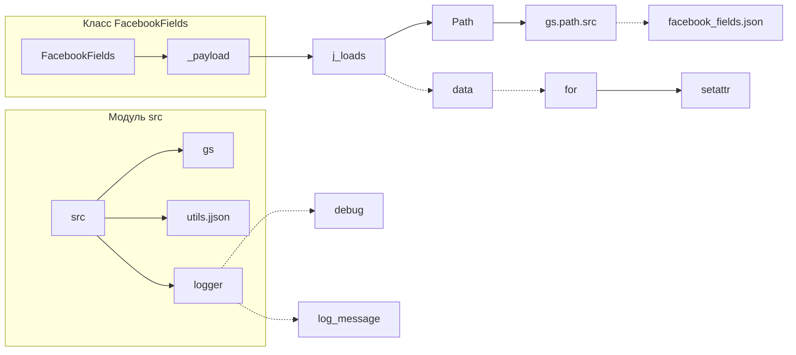

```MD
# Анализ кода файла `hypotez/src/endpoints/advertisement/facebook/facebook_fields.py`

## <input code>

```python
## \file hypotez/src/endpoints/advertisement/facebook/facebook_fields.py
# -*- coding: utf-8 -*-\
#! venv/Scripts/python.exe
#! venv/bin/python/python3.12

"""
.. module: src.endpoints.advertisement.facebook 
	:platform: Windows, Unix
	:synopsis:

"""


from pathlib import Path
from src import gs
from src.utils.jjson import j_loads, j_loads_ns
from src.logger import logger

class FacebookFields:
    """Поля для `объявлний` и `эвентов` """

    def __init__(self):
        """"""
        ...
        self._payload()

    def _payload(self):
        """"""
        ...
        data = j_loads (Path (gs.path.src, 'advertisement', 'facebok', 'facebook_feilds.json'))
        if not data:
            logger.debug(f"Ошибка загрузки полей из файла {gs.path.src}/advertisement/facebok/facebook_feilds.json")
            return 
        for name, value in data.items():
            setattr(self, f'{name}', value)
        return True
```

## <algorithm>

**Блок-схема:**

```mermaid
graph TD
    A[__init__()] --> B{_payload()};
    B --> C{Загрузка данных из файла};
    C --Успешно-- > D[Обработка данных];
    C --Ошибка-- > E[Логгирование ошибки];
    D --> F[Установка атрибутов];
    F --> G[Возврат True];
    E --> G;
```

**Пример:**

Предположим, файл `facebook_feilds.json` содержит:

```json
{
  "ad_name": "Реклама",
  "target_audience": "Молодежь"
}
```

После вызова `__init__()`:

1. Вызывается метод `_payload()`.
2. Метод `_payload()` загружает данные из файла `facebook_feilds.json` с помощью `j_loads()`.
3. `data` получает значения из json.
4. Цикл `for` проходит по парам ключ-значение в `data`.
5. Для каждой пары, `setattr()` создает атрибут `self.ad_name` со значением `Реклама` и `self.target_audience` со значением `Молодежь` в экземпляре класса.
6. Возвращается `True`.


## <mermaid>



**Объяснение диаграммы:**

Диаграмма показывает взаимосвязи между классами и модулями. `FacebookFields` использует `j_loads` из модуля `src.utils.jjson`, `Path` из `pathlib`, значения из `gs` (вероятно, объект конфигурации) и `logger` из `src.logger` для работы с файлом данных.

## <explanation>

**Импорты:**

* `from pathlib import Path`: Импортирует класс `Path` для работы с путями к файлам.  Связь: `Path` нужна для корректного построения пути к файлу `facebook_feilds.json`.
* `from src import gs`: Импортирует модуль `gs` (вероятно, содержащий константы и переменные для пути к ресурсам). Связь: `gs` предоставляет путь к папке проекта.
* `from src.utils.jjson import j_loads, j_loads_ns`: Импортирует функции `j_loads` и `j_loads_ns` для парсинга JSON. Связь: `utils.jjson` предоставляет инструменты для работы с JSON.
* `from src.logger import logger`: Импортирует объект `logger` для ведения журнала. Связь: `src.logger` предоставляет логгирование.

**Классы:**

* `FacebookFields`: Класс, хранящий поля объявлений и событий из файла `facebook_feilds.json`.
    * `__init__(self)`: Инициализирует экземпляр класса. Вызывает метод `_payload()` для загрузки и установки полей.
    * `_payload(self)`: Загружает данные из файла JSON, устанавливает атрибуты объекта класса и возвращает `True` при успехе.

**Функции:**

* `j_loads(path)`: Функция для загрузки данных из файла JSON по пути.  Необходим анализ реализации этой функции, так как  она использует не стандартные импорты, а скорее предоставляет пользовательский JSON парсер.
* `setattr(self, f'{name}', value)`: Устанавливает атрибут объекта с именем `name` со значением `value`.

**Переменные:**

* `MODE`: Переменная, вероятно, для определения режима работы (например, 'dev', 'prod').
* `data`: Словарь, полученный из файла `facebook_feilds.json`, содержащий поля объявлений и событий.

**Возможные ошибки и улучшения:**

* **Обработка ошибок:**  Код проверяет, существует ли `data`, но не обрабатывает другие потенциальные ошибки при чтении файла или парсинге JSON (`ValueError`, `FileNotFoundError`).
* **Обработка пустых данных:** Если файл JSON пустой, то цикл не выполнится, и атрибуты не будут созданы.  Добавление проверки на пустой файл улучшило бы код.
* **Тип данных:** Код не проверяет, соответствуют ли значения `value` ожидаемому типу. В идеале должна быть валидация типов данных при парсинге, а не просто принять их.
* **`j_loads`:** Необходимо документация или пояснения к этой функции. Что она делает? Обрабатывает ли она валидацию данных?
* **Имена файлов:** Имя файла (`facebook_feilds.json`) должно быть более описательным.


**Цепочка взаимосвязей:**

`FacebookFields` использует `gs` для определения пути к файлу, `j_loads` для обработки JSON, и `logger` для логгирования.  `gs` вероятно, управляет другими константами, важными для всей системы, и встраивается в более крупную архитектуру.