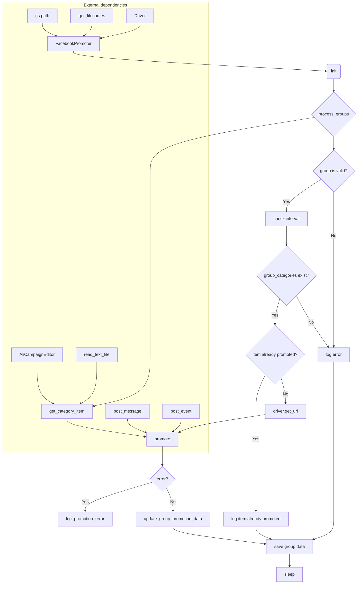

```MD
# <input code>

```python
## \file hypotez/src/endpoints/advertisement/facebook/promoter.py
# -*- coding: utf-8 -*-\
#! venv/Scripts/python.exe
#! venv/bin/python/python3.12

"""
.. module: src.endpoints.advertisement.facebook 
    :platform: Windows, Unix
    :synopsis: module handles the promotion of messages and events in Facebook groups.
It processes campaigns and events, posting them to Facebook groups while avoiding duplicate promotions.
"""


import random
from datetime import datetime, timedelta
from pathlib import Path
from urllib.parse import urlencode
from types import SimpleNamespace
from typing import Optional

from src import gs
from src.endpoints.advertisement import facebook
from src.webdriver.driver import Driver
from src.suppliers.aliexpress.campaign import AliCampaignEditor
from src.endpoints.advertisement.facebook.scenarios import (post_message, 
                                                   post_event, 
                                                   post_message_title, 
                                                   upload_post_media,
                                                   message_publish,
                                                   post_ad,
                                                   )

from src.utils.file import (read_text_file,
                        get_filenames,
                        get_directory_names,
                        )
from src.utils.jjson import j_loads_ns, j_dumps
from src.utils.cursor_spinner import spinning_cursor
from src.logger import logger
import time

def get_event_url(group_url: str) -> str:
    """
    Returns the modified URL for creating an event on Facebook, replacing `group_id` with the value from the input URL.

    Args:
        group_url (str): Facebook group URL containing `group_id`.

    Returns:
        str: Modified URL for creating the event.
    """
    group_id = group_url.rstrip('/').split('/')[-1]
    base_url = "https://www.facebook.com/events/create/"
    params = {
        "acontext": '{"event_action_history":[{"surface":"group"},{"mechanism":"upcoming_events_for_group","surface":"group"}],"ref_notif_type":null}',
        "dialog_entry_point": "group_events_tab",
        "group_id": group_id
    }

    query_string = urlencode(params)
    return f"{base_url}?{query_string}"

class FacebookPromoter:
    """ Class for promoting AliExpress products and events in Facebook groups.

    This class automates the posting of promotions to Facebook groups using a WebDriver instance,
    ensuring that categories and events are promoted while avoiding duplicates.
    """
    d: Driver = None
    group_file_paths: str | Path = None
    no_video: bool = False
    promoter: str

    def __init__(self, d: Driver, promoter: str, group_file_paths: Optional[list[str | Path] | str | Path] = None, no_video: bool = False):
        """ Initializes the promoter for Facebook groups.

        Args:
            d (Driver): WebDriver instance for browser automation.
            group_file_paths (list[str | Path] | str | Path): List of file paths containing group data.
            no_video (bool, optional): Flag to disable videos in posts. Defaults to False.
        """
        self.promoter = promoter
        self.d = d
        self.group_file_paths = group_file_paths if group_file_paths else get_filenames(gs.path.google_drive / 'facebook' / 'groups')
        self.no_video = no_video
        self.spinner = spinning_cursor()

    # ... (other methods)
```

# <algorithm>

**Алгоритм работы класса FacebookPromoter**

1. **Инициализация (init):**
   - Принимает экземпляр Driver, имя промоутера, опционально пути к файлам с данными о группах.
   - Устанавливает `self.d`, `self.promoter`.
   - Если `group_file_paths` не указан, считывает пути к файлам групп из каталога `gs.path.google_drive / 'facebook' / 'groups'`.
   - Инициализирует `self.no_video` и `self.spinner`.

2. **promote:**
   - Проверяет соответствие языка и валюты группы и заданным параметрам.
   - Идентифицирует, нужно ли публиковать сообщение или событие.
   - Заполняет необходимые атрибуты объекта (start, end, link) для события.
   - Вызывает соответствующие функции публикации (post_message или post_event).
   - Если произошла ошибка публикации, логгирует ошибку.
   - Обновляет данные группы в файле (last_promo_sended, promoted_events/categories).
   - Возвращает `True` в случае успешной публикации.

3. **log_promotion_error:**
   - Логгирует ошибку публикации.

4. **update_group_promotion_data:**
   - Обновляет данные группы в файле, добавляя информацию о последней публикации и продвигаемых категориях/событиях.

5. **process_groups:**
   - Обрабатывает список файлов с группами.
   - Для каждой группы:
     - Считывает данные из файла.
     - Если нет кампании или событий для продвижения - возвращает.
     - Проверяет время с последней публикации.
     - Если группа не активна или не содержит нужных категорий, пропускает.
     - Получает нужный предмет для продвижения (категория или событие).
     - Если предмет уже продвигался, пропускает.
     - Проверяет язык и валюту.
     - Открывает URL группы.
     - Вызывает метод `promote`, чтобы продвинуть предмет.
     - Если продвижение прошло успешно, сохраняет обновлённые данные группы в файл.
     - Ждёт случайный промежуток времени.

6. **get_category_item:**
   - Загружает категорию для продвижения, в зависимости от промоутера.

7. **check_interval:**
   - Проверяет интервал времени с последней публикации для группы.

8. **validate_group:**
   - Проверяет корректность данных группы.


# <mermaid>



**Объяснение диаграммы:**

* **FacebookPromoter:** Главный класс, управляющий процессом продвижения.
* **init:** Инициализация класса.
* **process_groups:** Обработка списка файлов групп.
* **get_category_item:** Получение категории или события для продвижения.
* **promote:** Продвигает категорию или событие в группе.
* **log_promotion_error:** Логирование ошибок.
* **update_group_promotion_data:** Обновление данных группы.
* **save group data:** Сохранение обновлённых данных группы в файл.
* **sleep:** Задержка перед следующей публикацией.
* **External dependencies:**  Подключаемые модули и классы: `gs.path`, `get_filenames`, `Driver`, `AliCampaignEditor`, `post_message`, `post_event`, `read_text_file`.  Эти зависимости нужны для работы FacebookPromoter и показаны в виде внешних блоков.

# <explanation>

**Импорты:**

- `import random`, `datetime`, `pathlib`, `urllib.parse`, `types`, `typing`: Стандартные библиотеки Python, необходимые для работы с случайными числами, датами, путями, URL-адресами, типами данных и т.д.
- `from src import gs`: Импортирует модуль `gs` из пакета `src`.  Скорее всего, `gs` содержит глобальные настройки, конфигурацию и/или вспомогательные функции.
- `from src.endpoints.advertisement import facebook`: Импортирует модуль `facebook` из подпакета `src.endpoints.advertisement`. Возможно, этот модуль содержит дополнительные функции или константы, относящиеся к рекламе.
- `from src.webdriver.driver import Driver`: Импортирует класс `Driver` из пакета `src.webdriver.driver`. Предположительно, `Driver` отвечает за взаимодействие с браузером (например, с помощью Selenium).
- `from src.suppliers.aliexpress.campaign import AliCampaignEditor`: Импортирует класс `AliCampaignEditor` из пакета `src.suppliers.aliexpress.campaign`. Предположительно, этот класс нужен для работы с данными кампаний AliExpress.
- `from src.endpoints.advertisement.facebook.scenarios import ...`: Импортирует функции для публикации сообщений и событий в Facebook.
- `from src.utils.file import ...`: Импортирует функции для работы с файлами (чтение, получение файлов, названий каталогов).
- `from src.utils.jjson import j_loads_ns, j_dumps`: Импортирует функции для работы с JSON-файлами (загрузка, сохранение данных в формате SimpleNamespace).
- `from src.utils.cursor_spinner import spinning_cursor`: Импортирует функцию для отображения индикатора загрузки.
- `from src.logger import logger`: Импортирует объект `logger` для ведения журналов.
- `import time`: Импортирует модуль `time`, который используется для приостановки выполнения программы.


**Классы:**

- `FacebookPromoter`:  Класс для автоматизации продвижения товаров и событий в группах Facebook.  Использует `Driver` для работы с браузером, обрабатывает группы из файлов, следит за дубликатами и интервалами между публикациями.
- `Driver`: Класс, представляющий драйвер для веб-драйвера.


**Функции:**

- `get_event_url`: Формирует URL для создания события на Facebook в группе.
- `__init__`: Инициализирует класс `FacebookPromoter`, устанавливает параметры и загружает данные о группах.
- `promote`: Продвигает предмет (категорию или событие) в группе Facebook.
- `log_promotion_error`: Логирует ошибку публикации.
- `update_group_promotion_data`: Обновляет данные о группе после успешной публикации.
- `process_groups`: Обрабатывает все группы для текущей кампании или события.
- `get_category_item`: Загружает категорию для продвижения.
- `check_interval`: Проверяет интервал времени.
- `validate_group`: Проверяет корректность данных группы.

**Переменные:**

- `MODE`: Строковая переменная, вероятно, определяющая режим работы (например, 'dev' или 'prod').
- `group_file_paths`: Список путей к файлам с данными о группах.
- `no_video`: Флаг, определяющий, нужно ли запретить видео в постах.
- `promoter`: Имя промоутера.
- `d`: Экземпляр класса `Driver`.
- `spinner`: Экземпляр класса `spinning_cursor`, используемый для индикатора загрузки.

**Возможные ошибки и улучшения:**

- **Обработка ошибок:** Код содержит проверку на существование данных в файле групп, но обработка других потенциальных ошибок (например, проблемы с подключением к браузеру, ошибки в формате данных файла) неполная.
- **Управление временем:** Время ожидания между операциями (с помощью `time.sleep`) задаётся случайным образом, что может привести к нестабильному поведению. Для оптимальной работы нужно учесть больше факторов (например, скорость ответа сервера Facebook).
- **Логирование:** Логирование содержит только базовые сообщения об ошибках и успехах. Добавление информации о конкретной группе, событии или категории улучшит отладку.
- **Управление памятью:** В некоторых участках кода можно улучшить чтение и работу с данными (например, использовать генераторы при работе с большими списками данных).
- **Модульность:** Добавление дополнительных функций (например, проверки дубликатов) в отдельные модули повысит структурированность кода.


**Взаимосвязи с другими частями проекта:**

Код взаимодействует с другими частями проекта через импорты. `gs` вероятно управляет хранением и доступом к данным. `Driver` — для взаимодействия с браузером.  `AliCampaignEditor`, `post_message`, `post_event` и др. — выполняют конкретные действия, необходимые для продвижения.  `get_filenames`, `j_loads_ns`, `j_dumps`, и `logger` —  функции и классы из вспомогательных модулей, помогающие обрабатывать данные, логгировать события и работать с файлами.