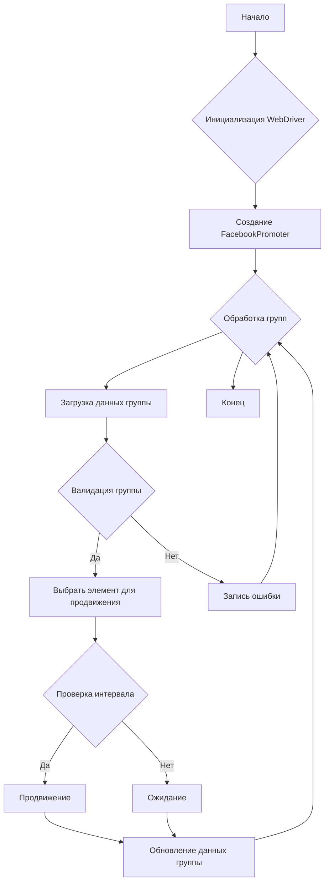

```MD
# Документация модуля Facebook Promoter

## <input code>

```python
from src.endpoints.advertisement.facebook.promoter import FacebookPromoter
from src.webdriver.driver import Driver
from src.utils.jjson import j_loads_ns

# Настройка экземпляра WebDriver (замените на реальный WebDriver)
d = Driver()

# Создание экземпляра FacebookPromoter
promoter = FacebookPromoter(
    d=d,
    promoter="aliexpress",
    group_file_paths=["path/to/group/file1.json", "path/to/group/file2.json"]
)

# Начало продвижения товаров или мероприятий
promoter.process_groups(
    campaign_name="Campaign1",
    events=[],
    group_categories_to_adv=["sales"],
    language="en",
    currency="USD"
)
```

## <algorithm>

**Алгоритм работы класса FacebookPromoter:**

1. **Инициализация:**
   - При создании объекта `FacebookPromoter`, происходит инициализация `WebDriver` (d), установка имени промоутера (promoter) и путей к файлам с данными групп (group_file_paths).
   - Пример: `promoter = FacebookPromoter(d=d, promoter="aliexpress", group_file_paths=["path/to/group/file1.json"])`.

2. **Обработка групп:**
   - Вызов метода `process_groups` запускает цикл обработки групп.
   - Пример: `promoter.process_groups(campaign_name="Campaign1", events=[], group_categories_to_adv=["sales"], language="en", currency="USD")`.

3. **Получение данных группы:**
   - Для каждой группы из group_file_paths, получаются данные.
   - Пример: Данные группы из файла `file1.json` загружаются и парсятся.

4. **Валидация данных группы:**
   - Проверка корректности данных группы (метод `validate_group`).
   - Пример: Проверка наличия необходимых полей в данных группы. Если данные некорректны, записывается ошибка и переходит к следующей группе.

5. **Выбор элемента категории для продвижения:**
   - Вызывается метод `get_category_item` для получения элемента для продвижения.
   - Пример: Выбирается элемент "sales" для продвижения.

6. **Проверка возможности продвижения:**
   - Проверка интервала между продвижениями (метод `check_interval`).
   - Пример: Проверяется, прошло ли не менее 10 минут с момента последнего продвижения.

7. **Продвижение:**
   - Если группа может быть продвинута и валидна, вызывается метод `promote` для продвижения категории или мероприятия.
   - Пример: Запускается процесс продвижения элемента "sales" в группе.

8. **Обработка ошибок:**
   - Если продвижение не удалось, записывается ошибка (метод `log_promotion_error`).
   - Пример: Если Facebook вернул ошибку, сохраняется информация об ошибке.

9. **Обновление данных о группе:**
   - Обновление данных о продвигаемом элементе в данных группы (метод `update_group_promotion_data`).
   - Пример: Добавление "sales" в список продвигаемых категорий.

10. **Завершение:**
    - Процесс обработки групп завершается.


## <mermaid>



**Описание диаграммы:**

Диаграмма иллюстрирует циклическую обработку групп, включая валидацию данных, выбор элементов, продвижение и обновление данных. Зависимости: `FacebookPromoter` использует `Driver` (из `src.webdriver.driver`) и `j_loads_ns` (из `src.utils.jjson`) для работы с данными групп и WebDriver.  Основные функции (`process_groups`, `promote`, `validate_group` и др.) внутри класса `FacebookPromoter`.

## <explanation>

**Импорты:**

- `from src.endpoints.advertisement.facebook.promoter import FacebookPromoter`: Импортирует класс `FacebookPromoter` из собственного модуля.
- `from src.webdriver.driver import Driver`: Импортирует класс `Driver` для управления WebDriver, вероятно, из модуля для работы с браузерами (вероятно, используется Selenium или аналогичная библиотека).
- `from src.utils.jjson import j_loads_ns`: Импортирует функцию `j_loads_ns` для обработки JSON данных. Скорее всего, это утилитарная функция для парсинга JSON в объекты `SimpleNamespace`.

**Классы:**

- **`FacebookPromoter`**: Этот класс отвечает за весь процесс продвижения на Facebook.  Атрибуты хранят конфигурацию (WebDriver, имя промоутера, пути к файлам групп, флаг отключения видео). Методы обеспечивают взаимодействие с Facebook (продвижение, обработку ошибок, проверку данных и т.д.).

- **`Driver`**:  Предположительно класс для управления веб-драйвером (например, Selenium WebDriver).  Необходим для взаимодействия с браузером Facebook.

**Функции:**

- **`__init__`**: Инициализирует объект `FacebookPromoter`, настраивает его параметры и устанавливает соединение с WebDriver.
- **`process_groups`**: Основной метод, обрабатывающий списки групп для продвижения.
- **`promote`**: Продвигает конкретный элемент в группе Facebook.
- **`log_promotion_error`**: Записывает информацию об ошибках при продвижении.
- **`update_group_promotion_data`**: Обновляет данные о продвинутых элементах в группе.
- **`get_category_item`**: Выбирает элемент для продвижения (например, товар/мероприятие).
- **`check_interval`**: Проверяет, прошло ли достаточное время для следующей попытки продвижения.
- **`validate_group`**: Проверяет, что данные о группе корректны.

**Переменные:**

Переменные содержат конфигурационные данные (пути к файлам, имя промоутера), значения для продвижения (название кампании, список товаров/мероприятий, язык, валюта) и данные о группах Facebook.

**Возможные ошибки и улучшения:**

- **Обработка исключений:** Важно добавить обработку исключений (например, `try...except` блоки) для таких действий как чтение файлов, взаимодействие с WebDriver и отправка запросов на Facebook, чтобы программа не аварийно завершалась при проблемах.
- **Логирование:**  Добавление логирования улучшило бы отладку и мониторинг процесса продвижения.
- **Тестирование:** Тестирование отдельных методов (единичные тесты) и всего процесса продвижения необходимо для проверки работоспособности кода.
- **Управление состоянием:** Если в коде есть состояние (например, список уже обработанных групп), необходимо обеспечить его сохранность между запуском скрипта.
- **Константы:** Использование констант для значений, например, интервалов ожидания, вместо магических чисел, повысит читаемость кода.


**Взаимосвязи с другими частями проекта:**

- Модуль `FacebookPromoter` напрямую зависит от `Driver` (из `src.webdriver.driver`) для взаимодействия с браузером.
-  `j_loads_ns` из `src.utils.jjson` необходим для корректной обработки данных JSON из файлов конфигурации.
- Модуль предполагает наличие файлов с данными групп Facebook.  Необходимы процессы подготовки этих файлов.