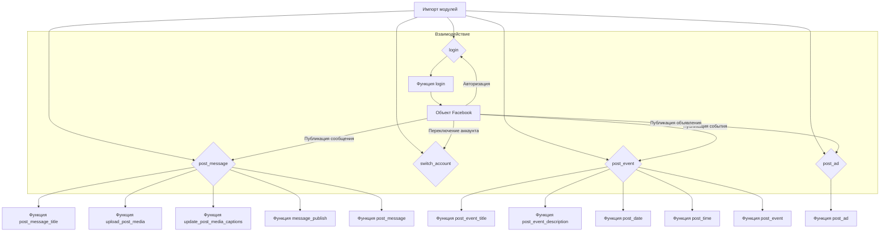
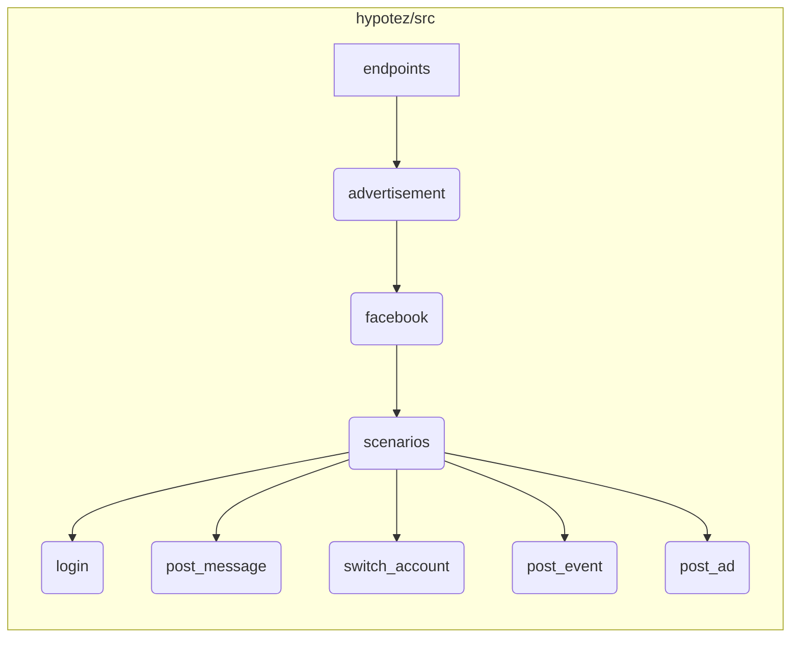

# <input code>

```python
## \file hypotez/src/endpoints/advertisement/facebook/scenarios/__init__.py
# -*- coding: utf-8 -*-
#! venv/Scripts/python.exe
#! venv/bin/python/python3.12

"""
.. module: src.endpoints.advertisement.facebook.scenarios 
	:platform: Windows, Unix
	:synopsis:

"""
MODE = 'dev'

from .login import login
from .post_message  import *
from .switch_account import switch_account
from .post_message import (post_title as post_message_title,   # <- заголовок
                           upload_media as upload_post_media, # <- изображения 
                           update_images_captions as update_post_media_captions, # <- подписи к изображениям 
                           publish as message_publish,
                           post_message,
                           )

from .post_event import (post_title as post_event_title,
                         post_description as post_event_description,
                         post_date,
                         post_time,
                         #send,
                         post_event
                         )

from .post_ad import post_ad
```

# <algorithm>



Пример:

Пользователь хочет опубликовать сообщение на Facebook. Алгоритм будет импортировать функции из модулей `.login`, `.post_message`, и т.д.
Затем, `login` будет аутентифицировать пользователя. 
После авторизации, `post_message` будет принимать необходимые параметры (заголовок, медиа, подписи), обрабатывать их и публиковать сообщение на Facebook через соответствующий API.


# <mermaid>



# <explanation>

**Импорты:**

Файл `__init__.py` в папке `scenarios` предоставляет доступ к функциям и классам, определенным в подпапках (`login`, `post_message`, `switch_account`, `post_event`, `post_ad`).  Это позволяет импортировать нужные функции в других частях проекта. Импорты `from .login import login`, `from .post_message import *` и т.д. указывают на то, что функции находятся в подпапках `login`, `post_message` и так далее, внутри директории `scenarios`.

**Переменные:**

- `MODE = 'dev'`: Эта переменная задает режим работы. Скорее всего, используется для выбора разных настроек при разработке (например, для подключения к тестовым API или реальным аккаунтам).


**Функции:**

- Функции из подмодулей (например, `login`, `post_message`, `post_event`)  предположительно представляют собой методы взаимодействия с Facebook API для выполнения соответствующих действий (логин, публикация сообщений, событий, рекламных объявлений).  Анализ этих функций требует изучения их реализации в отдельных файлах.

**Классы:**

Файл не определяет классы.  

**Возможные ошибки и улучшения:**

- Нет проверки ошибок.  Функции не проверяют валидность входных данных, что может привести к ошибкам.
- Отсутствие ясности относительно взаимодействия с Facebook API.  Необходимы подробности о том, как функции `login`, `post_message` и т.д. взаимодействуют с API.
- Отсутствие документации внутри функций.  Добавление документации к функциям с описанием их аргументов и возвращаемых значений улучшит читабельность и поддержку кода.
- `#! venv/Scripts/python.exe` и `#! venv/bin/python/python3.12`: эти строки в начале файла являются директивами интерпретатора Python и, скорее всего, предназначены для специфической настройки окружения.  Это не влияет на функциональность кода, но необходимо разобраться, какой интерпретатор Python нужно использовать.


**Взаимосвязь с другими частями проекта:**

Этот модуль (`hypotez/src/endpoints/advertisement/facebook/scenarios`) вероятно взаимодействует с другими частями приложения для управления рекламой на Facebook.  Например, возможно, существуют функции, которые собирают данные для публикации (`data fetching`), или модули для обработки ответов от Facebook API.  Без доступа к остальному коду проекта, сложно дать точное описание.  Для полного анализа нужно изучить вызывающие функции и передаваемые данные.