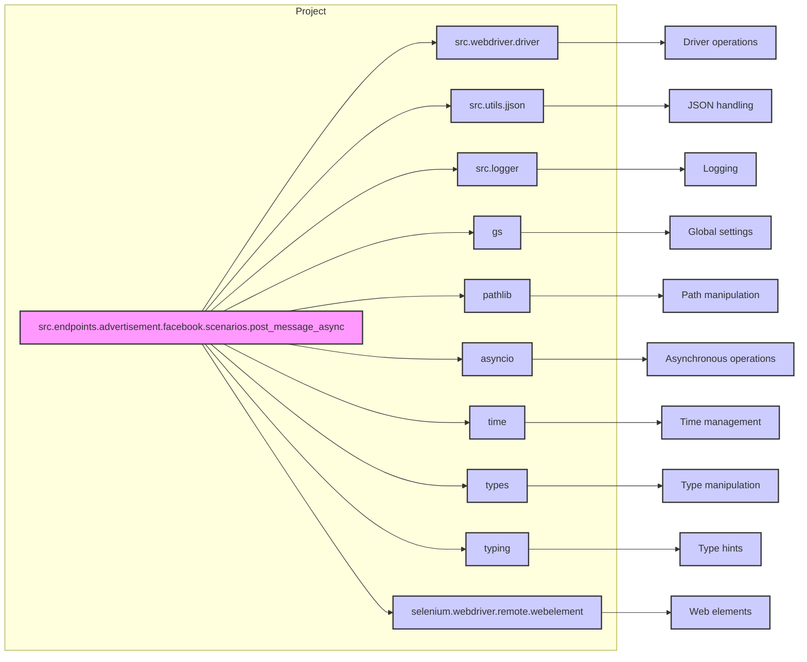

# <input code>

```python
## \file hypotez/src/endpoints/advertisement/facebook/scenarios/post_message_async.py
# -*- coding: utf-8 -*-\

#! venv/bin/python/python3.12

"""
.. module: src.endpoints.advertisement.facebook.scenarios 
	:platform: Windows, Unix
	:synopsis: Публикация сообщения из `aliexpress` промо

"""


import time
import asyncio
from pathlib import Path
from types import SimpleNamespace
from typing import Dict, List
from selenium.webdriver.remote.webelement import WebElement
from src import gs
from src.webdriver.driver import Driver
from src.utils.jjson import j_loads_ns, pprint
from src.logger import logger

# Load locators from JSON file.
locator: SimpleNamespace = j_loads_ns(
    Path(gs.path.src / 'endpoints' / 'advertisement' / 'facebook' / 'locators' / 'post_message.json')
)


def post_title(d: Driver, category: SimpleNamespace) -> bool:
    """ Sends the title and description of a campaign to the post message box.

    Args:
        d (Driver): The driver instance used for interacting with the webpage.
        category (SimpleNamespace): The category containing the title and description to be sent.

    Returns:
        bool: `True` if the title and description were sent successfully, otherwise `None`.

    Examples:
        >>> driver = Driver(...)
        >>> category = SimpleNamespace(title="Campaign Title", description="Campaign Description")
        >>> post_title(driver, category)
        True
    """
    # Scroll backward in the page
    if not d.scroll(1, 1200, 'backward'):
        logger.error("Scroll failed during post title", exc_info=False)
        return
    # Open the 'add post' box
    if not d.execute_locator(locator.open_add_post_box):
        logger.error("Failed to open 'add post' box", exc_info=False)
        return
    # Construct the message
    message = f"{category.title}; {category.description};"
    # Add the message to the post box
    if not d.execute_locator(locator.add_message, message):
        logger.error(f"Failed to add message to post box: {message=}", exc_info=False)
        return
    return True


async def upload_media(d: Driver, products: List[SimpleNamespace], no_video: bool = False) -> bool:
    """ Uploads media files to the images section and updates captions.
    """
    # ... (rest of the upload_media function)
    return True


async def update_images_captions(d: Driver, products: List[SimpleNamespace], textarea_list: List[WebElement]) -> None:
    """ Adds descriptions to uploaded media files asynchronously.
    """
    # ... (rest of the update_images_captions function)


async def promote_post(d: Driver, category: SimpleNamespace, products: List[SimpleNamespace], no_video: bool = False) -> bool:
    """ Manages the process of promoting a post with a title, description, and media files.
    """
    # ... (rest of the promote_post function)
    return True
```

# <algorithm>

```mermaid
graph TD
    A[Driver instance] --> B{post_title(d, category)};
    B --Success--> C[upload_media(d, products)];
    B --Failure--> D[Error];
    C --Success--> E[promote_post(d, category, products)];
    C --Failure--> D;
    E --> F[Success];
    D --> G[Error Handling];

    subgraph Post Title
        B1[Scroll backward] --> B2[Open 'add post' box];
        B2 --> B3[Construct message];
        B3 --> B4[Add message];
        B4 --> B5[Success Return True];
    end

    subgraph Upload Media
        C1[Open 'add media' form] --> C2[Iterate over products];
        C2 --> C3[Upload media];
        C3 --> C4[Update captions];
        C4 --> C5[Success Return True];

    end

    subgraph Promote Post
        E1[Post Title] --> E2[Upload Media];
        E2 --> E3[Finish Editing];
        E3 --> E4[Publish Post];
        E4 --> E5[Success Return True];
    end

```

# <mermaid>



# <explanation>

**Импорты:**

- `time`, `asyncio`, `pathlib`, `types`, `typing`: Стандартные библиотеки Python, используемые для управления временем, асинхронными операциями, обработкой путей, типами данных и наборами.
- `selenium.webdriver.remote.webelement`: Библиотека Selenium для взаимодействия с веб-элементами.
- `gs`:  `gs` –  скорее всего, собственный модуль проекта (из пакета `src`), содержащий глобальные настройки или конфигурацию.  Важно понять, что это, чтобы понять его использование.
- `Driver`: Класс, вероятно, из `src.webdriver.driver`, для управления веб-драйвером.
- `j_loads_ns`, `pprint`:  `j_loads_ns` вероятно из `src.utils.jjson` – для загрузки данных из JSON, `pprint`  –  для форматированного вывода (возможно, тоже из `src.utils`).
- `logger`:  Модуль для логгирования (вероятно, из `src.logger`) – он используется для вывода сообщений об ошибках и других событий.

**Классы:**

- `Driver`:  Этот класс предоставляет методы для взаимодействия с веб-драйвером, таких как `scroll`, `execute_locator`.  Необходимо изучить этот класс в `src.webdriver.driver` для понимания его функциональности и доступных методов.

**Функции:**

- `post_title`: Отправляет заголовок и описание кампании в поле сообщения. Принимает экземпляр класса `Driver` и `SimpleNamespace` с данными. Возвращает `True` при успешной отправке, иначе `None`.  Обратите внимание на обработку ошибок, использующую `logger`.
- `upload_media`: Асинхронная функция для загрузки медиафайлов и обновления подписей. Принимает экземпляр `Driver` и список объектов `SimpleNamespace` с данными о продуктах (с путями к изображениям/видео). Возвращает `True` при успешной загрузке. Имеет обработку ошибок, используя `logger` и `try...except`. Важно, что она асинхронная, используя `asyncio.to_thread` для обработки подписей.
- `update_images_captions`: Асинхронная функция для добавления подписей к изображениям. Принимает `Driver`, список продуктов и список веб-элементов-полей ввода. Обрабатывает подписи в зависимости от направления текста ("LTR" или "RTL"). Использует локализацию, загружаемую из JSON.
- `promote_post`: Функция, которая управляет общим процессом публикации поста.  Вызывает функции `post_title` и `upload_media`, а также проверяет успешность их выполнения.

**Переменные:**

- `locator`: Объект `SimpleNamespace`, содержащий локэйтеры (информацию о расположении элементов на веб-странице), загруженные из файла `post_message.json`.
- `products`: Список объектов `SimpleNamespace` (вероятно, содержащих информацию о продуктах).
- `no_video`: Флаг, устанавливается в `True`, чтобы исключить загрузку видео (используется в `upload_media`).
- `message`: Строка, содержащая текст сообщения, составленная из заголовка и описания кампании.
- `local_units`: Объект `SimpleNamespace`, содержащий данные для локализации, загруженный из `translations.json`.

**Возможные ошибки и улучшения:**

- **Обработка ошибок:**  Функции содержат обработку ошибок (`try...except`) в `upload_media`, но она не всегда полная (например, в `update_images_captions`). Необходимо добавить более полную обработку ошибок во всех функциях, чтобы приложение не падало при возникновении проблем.
- **Многократные `return`:**  Повторение `return None` несколько раз в `post_title` и `upload_media` – возможно, следует переписать код, чтобы уменьшить количество возвратов.
- **Локализация:** Локализация (`local_units`) может быть улучшена, если в `translations.json` будут отдельные ключи для каждого поля, а не просто язык.
- **Тестирование:** Необходимо более полное тестирование, особенно асинхронных операций.
- **Документация:** Документация (`docstrings`) хорошая, но можно добавить примеры использования в различных сценариях.
- **Потокобезопасность:** В асинхронных операциях следует обратить внимание на потокобезопасность, особенно при работе с общими ресурсами.


**Взаимосвязи с другими частями проекта:**

- `gs` (глобальные настройки) – связывает сценарий с другими частями проекта, определяя необходимые пути и конфигурационные параметры.
- `src.webdriver.driver` – предоставляет инфраструктуру для взаимодействия с веб-драйвером.
- `src.utils.jjson` –  обеспечивает загрузку данных из JSON.
- `src.logger` – обеспечивает логгирование, что критически важно для отладки.
- `translations.json` –  файл локализации, показывающий, как переводить строки на разные языки.

Этот код, вероятно, часть более крупного приложения для автоматизации рекламных кампаний в Facebook.  Для более глубокого анализа требуются дополнительные контекст и информация о проекте.