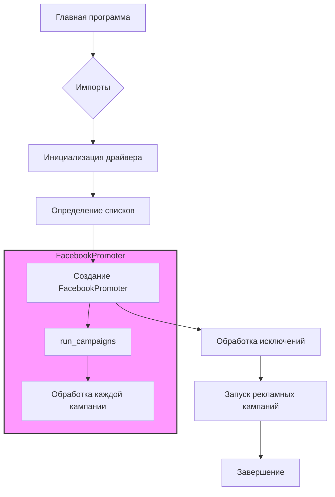

# <input code>

```python
## \file hypotez/src/endpoints/advertisement/facebook/start_posting_katia.py
# -*- coding: utf-8 -*-

#! venv/bin/python/python3.12

"""
.. module: src.endpoints.advertisement.facebook 
	:platform: Windows, Unix
	:synopsis: Отправка рекламных объявлений в группы фейсбук (Katia?)

"""


import header 
from src.webdriver.driver import Driver, Chrome
from src.endpoints.advertisement.facebook.promoter import FacebookPromoter
from src.logger import logger

d = Driver(Chrome)
d.get_url(r"https://facebook.com")

filenames:list = ['katia_homepage.json',]
campaigns:list = [ 'sport_and_activity',
                  'bags_backpacks_suitcases',
                    'pain',
                    'brands',
                    'mom_and_baby',
                    'house',
                ]
promoter = FacebookPromoter(d, group_file_paths = filenames, no_video = False)

try:
    promoter.run_campaigns(campaigns)
except KeyboardInterrupt:
    logger.info("Campaign promotion interrupted.")
```

# <algorithm>

**Шаг 1:** Импортируются необходимые модули.
* `header`: Предположительно, содержит конфигурационные настройки или дополнительные импорты.
* `src.webdriver.driver`: Классы для управления браузером (вероятно, Selenium).
* `src.endpoints.advertisement.facebook.promoter`: Класс для запуска рекламных кампаний на Facebook.
* `src.logger`: Модуль для логирования.

**Шаг 2:** Инициализируется драйвер браузера.
* Создается экземпляр класса `Driver` с типом `Chrome`.
* Открывается URL `https://facebook.com`.


**Шаг 3:** Определяются списки.
* `filenames`: Список путей к файлам с данными о целевых группах.
* `campaigns`: Список названий рекламных кампаний.

**Шаг 4:** Создается экземпляр `FacebookPromoter`.
* Передаются в конструктор драйвер (`d`), пути к файлам (`filenames`), и параметр для отключения видео (`no_video`).


**Шаг 5:** Обработка исключений.
* `try...except KeyboardInterrupt`: Блок обработки прерывания программы при нажатии Ctrl+C.  В случае прерывания, выводится сообщение в лог.

**Шаг 6:** Запуск рекламных кампаний.
* Вызывается метод `run_campaigns` объекта `promoter`, передавая список `campaigns`. Метод `run_campaigns` внутри класса `FacebookPromoter` обрабатывает каждый элемент списка `campaigns` и выполняет соответствующую рекламную кампанию, используя данные из `filenames`.


**Пример:**

Если `filenames` содержит путь к файлу `katia_homepage.json`, то `run_campaigns` получит данные о группах из этого файла и запустит кампании.  Например, для кампании `sport_and_activity` будут использоваться соответствующие данные из JSON.


# <mermaid>



**Объяснение диаграммы:**
* **Главная программа** инициирует выполнение.
* **Импорты:** Подключаются необходимые библиотеки.
* **Инициализация драйвера:** Создается и запускается браузер.
* **Определение списков:**  Задаются пути к файлам и список кампаний.
* **Создание FacebookPromoter:** Создается экземпляр класса, который отвечает за рекламные кампании.
* **Обработка исключений:** Блок обработки прерываний.
* **Запуск рекламных кампаний:** Вызов метода `run_campaigns` в `FacebookPromoter` для выполнения операций с рекламными кампаниями.
* **FacebookPromoter (подграфик):**  Внутри класса `FacebookPromoter` происходит обработка каждой отдельной кампании из списка.


# <explanation>

**Импорты:**

* `header`:  Неизвестный модуль, но предположительно содержит конфигурацию или другие импорты, необходимые для работы скрипта.
* `src.webdriver.driver`: Содержит классы для управления браузером, вероятно, с использованием Selenium. `Driver` - абстрактный класс, `Chrome` - реализация для Chrome.
* `src.endpoints.advertisement.facebook.promoter`:  Этот модуль содержит класс `FacebookPromoter`, отвечающий за запуск рекламных кампаний в Facebook.
* `src.logger`: Модуль для логирования событий.

**Классы:**

* `Driver`: Абстрактный класс, вероятно, для управления браузером.  Необходим для взаимодействия с веб-сайтом Facebook.
* `Chrome`: Конкретная реализация класса `Driver` для работы с браузером Chrome.
* `FacebookPromoter`: Класс для реализации рекламной кампании.  Он, вероятно, имеет методы для авторизации в аккаунте, парсинга файлов JSON с данными о группах, и создания/настройки рекламных объявлений.

**Функции:**

* `get_url(url)`: Получение URL.

**Переменные:**

* `MODE`: Строковая переменная, вероятно, для выбора режима работы (например, 'dev', 'prod').
* `filenames`: Список строк, содержащий пути к файлам JSON с данными о группах для рекламы.
* `campaigns`: Список строк, содержащий названия рекламных кампаний.
* `d`: Экземпляр класса `Driver` (или `Chrome`), используемый для взаимодействия с браузером.
* `promoter`: Экземпляр класса `FacebookPromoter`, который отвечает за выполнение рекламных кампаний.
* `no_video`: Логический параметр для указания необходимости пропуска видео в рекламных кампаниях.


**Возможные ошибки и улучшения:**

* **Отсутствие обработки ошибок:** Если файлы в `filenames` не найдены или имеют неверный формат, скрипт может упасть. Необходимо добавить обработку исключений (try-except) внутри цикла обработки кампаний в методе `run_campaigns` класса `FacebookPromoter`.
* **Проверка соединения:** Необходимо добавить проверку соединения с Facebook и обработку случаев ошибки (например, если страница не загружается или произошла ошибка авторизации).
* **Тестирование:** Необходимо добавить тесты для проверки корректной работы скрипта и обработки различных сценариев.
* **Детали реализации FacebookPromoter:** Неизвестна внутренняя логика `FacebookPromoter`, что затрудняет более глубокий анализ.


**Взаимосвязи с другими частями проекта:**

* Скрипт использует модули из `src`, что указывает на то, что он интегрирован в более крупный проект.
* Необходимо ознакомиться с реализацией `FacebookPromoter` и `src.logger`, чтобы понять, как скрипт взаимодействует с другими частями проекта.