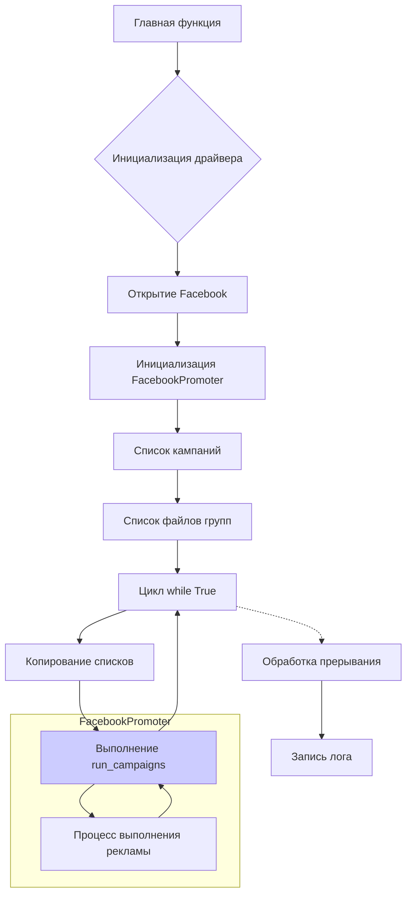

# <input code>

```python
## \file hypotez/src/endpoints/advertisement/facebook/start_posting_my_groups.py
# -*- coding: utf-8 -*-

#! venv/bin/python/python3.12

"""
.. module: src.endpoints.advertisement.facebook 
	:platform: Windows, Unix
	:synopsis: Отправка рекламных объявлений в группы фейсбук (my groups?)

"""


import header
import copy
from src.webdriver.driver import Driver, Chrome
from src.endpoints.advertisement.facebook.promoter import FacebookPromoter
from src.logger import logger

d = Driver(Chrome)
d.get_url(r"https://facebook.com")

filenames:list = ['my_managed_groups.json',]  

campaigns:list = ['brands',
                  'mom_and_baby',
                  'pain',
                  'sport_and_activity',
                  'house',
                  'bags_backpacks_suitcases',
                  'man']

promoter = FacebookPromoter(d, group_file_paths = filenames, no_video = True)

try:
    while True:
        
        promoter.run_campaigns(campaigns = copy.copy(campaigns), group_file_paths = filenames)
        ...

        
except KeyboardInterrupt:
    logger.info("Campaign promotion interrupted.")
```

# <algorithm>

**Шаг 1:** Импортируются необходимые модули.
    - `header`: Вероятно, содержит настройки и константы.
    - `copy`: Для создания копий списков, чтобы избежать побочных эффектов.
    - `Driver`, `Chrome` из `src.webdriver.driver`: Для управления браузером.
    - `FacebookPromoter` из `src.endpoints.advertisement.facebook.promoter`: Для выполнения рекламных кампаний.
    - `logger` из `src.logger`: Для логирования.

**Шаг 2:** Инициализация драйвера браузера:
   - Создается экземпляр класса `Driver` с типом браузера `Chrome`.
   - Открывается веб-сайт Facebook.

**Шаг 3:** Определение переменных:
   - `filenames`: Список путей к файлам с данными о группах.
   - `campaigns`: Список названий рекламных кампаний.

**Шаг 4:** Создание экземпляра `FacebookPromoter`:
   - Передаются данные о драйвере `d`, путях к файлам (`filenames`) и флаге `no_video`.
   - Пример: `promoter = FacebookPromoter(d, group_file_paths = filenames, no_video = True)`

**Шаг 5:** Цикл `while True`:
   - Внутри цикла, функция `promoter.run_campaigns` выполняет рекламную кампанию.
   -  `campaigns` и `group_file_paths` копируются, чтобы не изменять исходные переменные. Это предотвращает возможные ошибки и побочные эффекты.
   - Пример: `promoter.run_campaigns(campaigns = copy.copy(campaigns), group_file_paths = filenames)`

**Шаг 6:** Обработка исключения `KeyboardInterrupt`:
   - При прерывании пользователем (например, с помощью Ctrl+C), выполняется обработчик `except KeyboardInterrupt`.
   - Выводится сообщение о прерывании в лог.


# <mermaid>



# <explanation>

**Импорты:**
- `header`: Вероятно, содержит константы, настройки или вспомогательные функции для проекта.
- `copy`: Используется для создания копий списков, предотвращая изменение исходных данных при работе с методами, которые могут модифицировать аргументы.
- `Driver`, `Chrome` из `src.webdriver.driver`: Обеспечивают взаимодействие с браузером (вероятно, с использованием Selenium или аналогичной библиотеки).
- `FacebookPromoter` из `src.endpoints.advertisement.facebook.promoter`: Содержит логику для работы с рекламными объявлениями на Facebook.
- `logger` из `src.logger`: Обеспечивает логирование событий.

**Классы:**
- `Driver`: Предполагаемый класс для управления браузером (вероятно, в нём используются методы для навигации по страницам, поиска элементов и т.п.).
- `FacebookPromoter`: Класс для выполнения рекламных кампаний на Facebook. Он, вероятно, содержит методы для входа, публикации объявлений, выбора групп и других действий.


**Функции:**
- `get_url` в классе `Driver`:  Устанавливает URL браузера.
- `run_campaigns` в классе `FacebookPromoter`:  Центральная функция, запускающая процесс публикации рекламных объявлений.


**Переменные:**
- `MODE`: Строковая переменная, вероятно, хранит режим работы (например, 'dev', 'prod').
- `filenames`: Список путей к файлам с данными о группах.
- `campaigns`: Список названий рекламных кампаний.
- `d`: Экземпляр класса `Driver`, представляющий драйвер браузера.
- `promoter`: Экземпляр класса `FacebookPromoter`, отвечающий за публикацию рекламы.


**Возможные ошибки или улучшения:**
- Нет проверки ошибок в процессе запуска.  Важно добавить обработку исключений (например, если страница не загрузилась, если не найден элемент, и т.д.).
- Отсутствуют комментарии внутри кода, которые могут помочь понять логику. Добавление docstrings к функциям и классам улучшит читаемость и поддержку.
- Нет ясности, как именно `my_managed_groups.json` используется в `FacebookPromoter`. Потенциально требуется обработка данных из этого файла.
- Не хватает информации о том, что делает `...` внутри цикла `while True`. Очень важно дополнить код.
- Сложно определить, как используются `no_video` и `group_file_paths`.


**Взаимосвязи с другими частями проекта:**
- Код явно зависит от классов и функций в `src.webdriver.driver`, `src.endpoints.advertisement.facebook.promoter`, и `src.logger`. Эти модули предоставляют необходимые инструменты и инфраструктуру.
- Очевидно, что `my_managed_groups.json` содержит информацию о группах Facebook, используемых для таргетинга рекламных кампаний.  Возможно, этот файл формируется другой частью проекта.

```