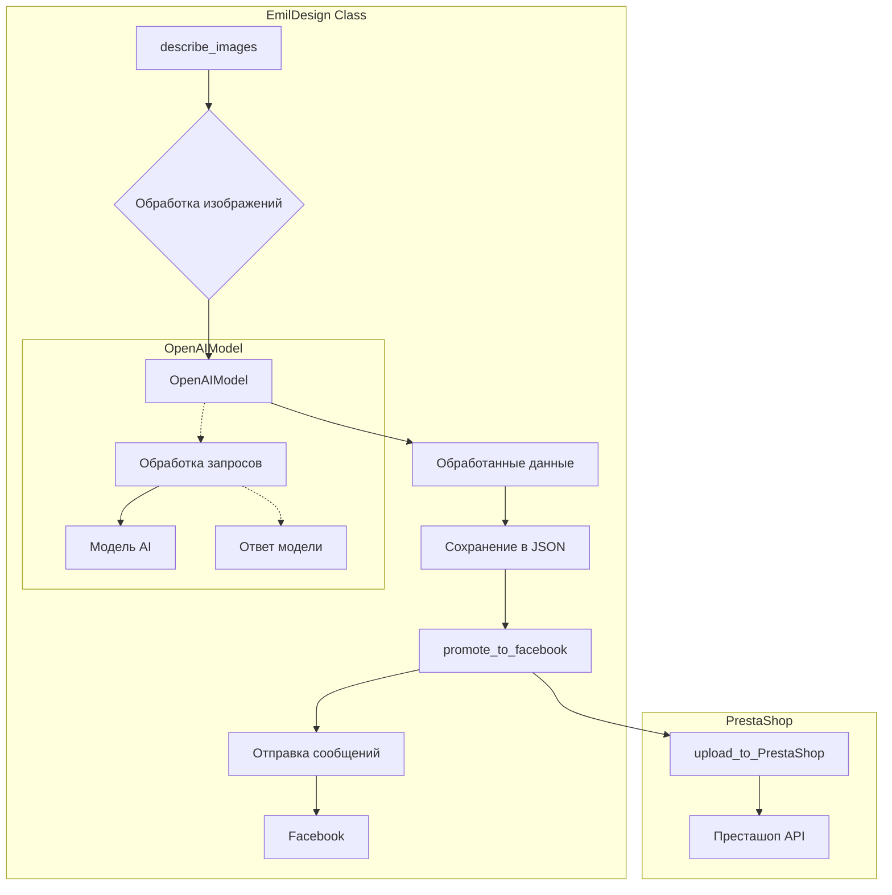

```MD
# <input code>

```python
## \file hypotez/src/endpoints/emil/emil_design.py
# -*- coding: utf-8 -*-

#! venv/bin/python/python3.12

"""
.. module: src.endpoints.emil 
	:platform: Windows, Unix
	:synopsis:

"""


"""
	:platform: Windows, Unix
	:synopsis:

"""


"""
	:platform: Windows, Unix
	:synopsis:

"""


"""
  :platform: Windows, Unix

"""
"""
  :platform: Windows, Unix
  :platform: Windows, Unix
  :synopsis:
"""
  
""" module: src.endpoints.emil """


""" Module for managing and processing images and promoting to Facebook and PrestaShop. """

import header
from pathlib import Path
from types import SimpleNamespace
import time

from src import gs, logger
from src.endpoints.PrestaShop.api.api import PrestaShop
from src.webdriver.driver import Driver, Chrome
from src.ai.gemini import GoogleGenerativeAI
from src.ai.openai.model import OpenAIModel
from src.product import Product
from src.endpoints.advertisement.facebook.scenarios.post_message import post_message, post_title, upload_media
from src.utils.file import read_text_file, save_text_file, get_filenames
from src.utils.jjson import j_loads_ns, j_dumps
from src.logger import logger

class EmilDesign:
    """ Class for designing and promoting images through various platforms. """

    # Base path for the module data
    base_path: Path = (
        gs.path.google_drive
        / "emil"
    )

    def __init__(self):
        """ Initialize the EmilDesign class. """
        ...

    def describe_images(self, from_url: str = False):
        """ Describe images based on the provided instruction and examples.

        Args:
            from_url (str, optional): If True, uses URL to describe images. Defaults to False.
        """
        ...

        # Define paths for system instructions, examples, images directory, and output file
        system_instruction_path: Path = (
            self.base_path 
            / 'instructions'
            / 'hand_made_furniture_he.txt'
        )

        examples_path: Path = ( 
            self.base_path 
            / 'instructions'
            / "examples_he.txt"
        )

        images_dir: Path = (
            self.base_path
            / "images"
        )

        output_file: Path = (
            self.base_path
            /  "images_descritions_he.json"
        )
        
        base_url: str = r'https://emil-design.com/img/images_emil/'
        trainig_data = read_text_file(system_instruction_path)

        updated_images_path: Path = self.base_path / 'updated_images.txt'
        
        system_instruction = read_text_file(system_instruction_path)
        examples = read_text_file(examples_path)
        
        # Prompt for the AI model
        prompt: str = "איזה רהיטים מוצגים כאן?"
        
        # Initialize the AI model with the system instructions
        model = OpenAIModel(system_instruction=system_instruction, assistant_id='asst_uDr5aVY3qRByRwt5qFiMDk43')
        
        # Ask the model to categorize examples
        response = model.ask(examples, "this is example for build categories")
        logger.info(response)

        updated_images_list: list = read_text_file(updated_images_path, as_list=True) or []

        images_path_list: list = get_filenames(images_dir)
        data: list = []
        
        for image_path in images_path_list:
            if image_path in updated_images_list:
                continue

            # Describe the image either from URL or local file
            if from_url:
                response = model.describe_image(str(base_url + image_path), prompt, system_instruction)  # <- url
            else:
                response = model.describe_image(images_dir / image_path, prompt, system_instruction)  # <- local file

            if not response:
                continue

            # Process the response into a structured format
            res_ns: SimpleNamespace = j_loads_ns(response)
            setattr(res_ns, 'local_image_path', str(Path(images_dir / image_path)))
            data.append(res_ns)
            j_dumps(data, output_file)
            updated_images_list.append(image_path)
            save_text_file(updated_images_list, updated_images_path)
            logger.info(response)
            # ...

    def promote_to_facebook(self):
        """ Promote images and their descriptions to Facebook.

        This function logs into Facebook and posts messages derived from the image descriptions.
        """
        d = Driver(Chrome)
        d.get_url(r'https://www.facebook.com/groups/1080630957030546')
        messages: SimpleNamespace | list = j_loads_ns(self.base_path / "images_descritions_he.json")
        
        for m in messages:
            message: SimpleNamespace = SimpleNamespace() 
            setattr(message, 'title', f"{m.parent}\n{m.category}")
            setattr(message, 'description', m.description)
            message.products = SimpleNamespace()
            setattr(message.products, 'local_image_path', [m.local_image_path])
           
            post_message(d, message, without_captions=True)
            ...

    def upload_to_PrestaShop(self):
        """ Upload product information to PrestaShop.

        This function initializes a product and PrestaShop instance for uploading data.
        """
        p = Product()
        presta = PrestaShop()
        

if __name__ == "__main__":
    e = EmilDesign()
    # e.describe_images()
    # e.promote_to_facebook()
```

# <algorithm>

**Алгоритм работы класса `EmilDesign`:**

1. **`describe_images(from_url=False)`:**
    - Читает системные инструкции и примеры из файлов.
    - Инициализирует модель `OpenAIModel` с указанными инструкциями.
    - Запрашивает у модели описание изображений, используя  `model.ask` и `model.describe_image`.
    - Обрабатывает ответы модели, сохраняет результаты в структурированный формат JSON (`j_dumps`).
    - Обновляет список обработанных изображений (`updated_images_list`) и сохраняет его в файл.
    - Повторяет шаги 4-7 для каждого изображения.

2. **`promote_to_facebook()`:**
    - Инициализирует драйвер для авторизации на Facebook.
    - Загружает описания изображений из файла JSON.
    - Для каждого описания формирует сообщение для Facebook, используя данные из файла JSON.
    - Отправляет сообщение на Facebook с помощью `post_message`.

3. **`upload_to_PrestaShop()`:**
    - Инициализирует объекты `Product` и `PrestaShop` для работы с PrestaShop API.
    - (В данном примере реализация отсутствует.)


**Пример данных, перемещаемых между функциями:**

- `describe_images`:  Обрабатывает путь к изображениям, системные инструкции, примеры, получая из них  данные для `OpenAIModel`, записывает результаты в json, который используется `promote_to_facebook` .
- `promote_to_facebook`: Использует данные из файла `images_descritions_he.json`, сгенерированного в `describe_images`,  формирует сообщения и отправляет их на Facebook.


# <mermaid>



**Объяснение диаграммы:**

* **`EmilDesign`**: Основной класс, содержащий методы для работы с изображениями и платформами.
* **`describe_images`**: Обрабатывает изображения с помощью `OpenAIModel`.
* **`OpenAIModel`**: Использует модель AI для описания изображений.
* **`promote_to_facebook`**: Отправляет сообщения на Facebook, используя данные из файла JSON.
* **`PrestaShop`**: Метод для работы с API PrestaShop.
* **Стрелки** показывают направление передачи данных между методами и классами.
* **Файлы JSON** хранят обработанные данные, которые служат связующим звеном между методами.

# <explanation>

**Импорты:**

- `header`: Вероятно, импортирует заголовки или константы, специфичные для проекта, но не раскрывается в предоставленном коде.
- `pathlib`, `SimpleNamespace`, `time`: Стандартные модули Python для работы с путями, пространствами имен и времени соответственно.
- `gs`, `logger`: Локальные импорты, вероятно, из пакета `src`. Предполагается, что `gs` предоставляет доступ к ресурсам Google Drive, а `logger` - к системе логирования.
- Остальные импорты относятся к компонентам проекта `src`: API для PrestaShop, драйверы веб-драйверов, модели AI, классы для работы с продуктами и файлами, инструменты для работы с JSON.
-  Они образуют иерархию модулей проекта `src`.


**Классы:**

- `EmilDesign`: Центральный класс, управляющий обработкой изображений, отправкой сообщений в Facebook и загрузкой данных в PrestaShop.
    - `base_path`: Базовая директория для хранения данных модуля.
    - `describe_images`: Описывает изображения с помощью `OpenAIModel`, сохраняя результаты в json-файл.
    - `promote_to_facebook`: Отправляет сообщения на Facebook, используя описания изображений.
    - `upload_to_PrestaShop`: Загружает информацию о продуктах в PrestaShop.


**Функции:**

- Функции `read_text_file`, `save_text_file`, `get_filenames` из модуля `src.utils.file` служат для работы с файлами.
- Функции `j_loads_ns`, `j_dumps` из `src.utils.jjson` для работы с JSON в `SimpleNamespace` форматах.
- `post_message`, `post_title`, `upload_media` из `src.endpoints.advertisement.facebook.scenarios.post_message`: Вероятно, функции для отправки сообщений на Facebook.
- `describe_image` (внутри `OpenAIModel`):  Метод для описания изображений с помощью модели AI.
- `ask` (внутри `OpenAIModel`):  Метод для выполнения запросов к модели AI.


**Переменные:**

- `MODE`: Переменная, вероятно, для выбора режима работы (например, `dev`, `prod`).
- Пути к файлам: `system_instruction_path`, `examples_path`, `images_dir`, `output_file`, `updated_images_path`: Хранят пути к файлам с инструкциями, примерами, изображениями и промежуточными данными.
- `prompt`, `system_instruction`, `examples`: Хранят данные для запросов к модели AI.
- `updated_images_list`: Список обработанных изображений.
- `data`: Список результатов описаний изображений.
- `base_url`: Базовый URL для доступа к изображениям.


**Возможные ошибки и улучшения:**

- Отсутствие обработки исключений:  Обработка ошибок при чтении файлов, работе с API или вызовах к модели AI была бы очень важна.
- Неясная структура данных:  Использование `SimpleNamespace` может привести к трудностям в дальнейшем использовании данных,  если не определена ясная структура объектов.
- Недостаточная детализация кода: Необходимо подробнейшее документирование, включая использование локальных паттернов проекта.
- Недостаточная валидация данных: Проверки входных данных (пути к файлам, корректность ответов модели и т.д.) улучшат надежность кода.
- Повышенное время ожидания: В коде присутствует `time.sleep(20)`,  что может быть проблематично при большом количестве изображений.  Важно использовать асинхронность или оптимизацию, чтобы избежать блокировки потока.

**Связи с другими частями проекта:**

Код взаимодействует с различными частями проекта `src` через импорты: с системами логирования, хранением данных, AI-моделями, обработкой изображений, веб-драйверами и т.д.  Описанные компоненты образуют общую цепочку, где обработка изображений `EmilDesign`  использует `OpenAIModel`, а результаты отправляются на `Facebook` и  в `PrestaShop`.