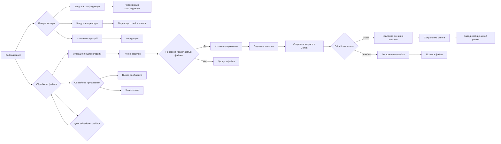

```MD
# <input code>

```python
## \file hypotez/src/endpoints/hypo69/code_assistant/assistant.py
# -*- coding: utf-8 -*-\
#! venv/Scripts/python.exe
#! venv/bin/python/python3.12
"""
Модуль для работы ассистента программиста
=========================================================================================

:class:`CodeAssistant`, читает файлы кода, отдает код в модели, модель обрабатывет код и возвращает его в класс, класс сохраняет результат
в директории `docs/gemini` В зависимости от роли файлы сохраняются в 
...
"""

# ... (imports)

MODE = "dev"

class CodeAssistant:
    """ 
    .. :class:`CodeAssistant`
        :synopsis: Класс для работы ассистента программиста с моделями ИИ
    """
    # ... (attributes)

    def __init__(self, **kwargs):
        # ... (initialization)
    # ... (methods)
```

# <algorithm>

Алгоритм работы `CodeAssistant` можно представить в виде следующей блок-схемы:

1. **Инициализация:**
   - Принимает аргументы (`role`, `lang`, `model`, `start_dirs`, `start_file_number`)
   - Инициализирует атрибуты класса `CodeAssistant`
   - Инициализирует модели ИИ (`gemini`, `openai` если есть в `model`)
   - Загружает конфигурацию из `code_assistant.json`
   - Загружает переводы из `translations.json`
   - Читает инструкции из файлов `prompts/developer/{role}_{lang}.md` и `instructions/instruction_{role}_{lang}.md`.
   - **Пример:** `CodeAssistant(role='code_checker', lang='ru', model=['gemini'])`

2. **Обработка файлов:**
   - Цикл итерируется по файлам в указанных директориях (`start_dirs`)
   - **Условие 1:** Пропускает файлы, имена которых совпадают с шаблонами в `exclude_files` или `exclude_file_patterns`
   - **Условие 2:** Пропускает файлы, если их порядковый номер меньше `start_file_number`
   - **Условие 3:** Пропускает файлы, если файл не найден или содержимое не загружено.
   - **Пример:** `start_dirs = [".."]`, `start_file_number = 2`
   - Для каждого файла:
     - **Создание запроса:** Функция `_create_request` формирует запрос для модели ИИ. Запрос включает имя файла, его содержимое, роль, язык и инструкцию.
     - **Запрос к модели:**  Отправляет запрос к модели (`gemini_model.ask`) и получает ответ.
     - **Обработка ответа:** Функция `_remove_outer_quotes` удаляет лишние кавычки.
     - **Сохранение ответа:** Функция `_save_response` сохраняет ответ в директорию `docs/gemini`. Путь формируется исходя из роли, языка и модели.
     - **Обработка ошибок:** Логирует ошибки при чтении файлов, отправке запросов и сохранении ответа.
     - **Задержка:** Добавляет задержку в 20 секунд (для отладки).
     - **Пример:** Обработка файла `src/main.py` (используя `gemini`)


3. **Запуск и обработка прерывания:**
   - Функция `run` запускает процесс обработки файлов с использованием обработчика прерывания `signal.SIGINT`


# <mermaid>



# <explanation>

**1. Импорты:**

- `asyncio`: Для асинхронных операций (включая задержки в `process_files`).
- `argparse`: Для разбора аргументов командной строки.
- `sys`: Для управления потоком выполнения, например, при выходе из программы.
- `pathlib`: Для работы с путями к файлам.
- `typing`: Для указания типов данных.
- `types`: Для работы со `SimpleNamespace`.
- `signal`: Для обработки прерывания (Ctrl+C).
- `time`: (используется, но не показан в коде, возможно для задержек).
- `re`: Для регулярных выражений в фильтрации файлов.
- `fnmatch`: Для соответствия шаблонам файлов.
- `header`: Похоже на вспомогательный модуль для работы с заголовками файлов.
- `gs`:  Непосредственно связан с GS-системой (скорее всего для взаимодействия с хранилищем).
- `jjson`: Для загрузки JSON-данных в `SimpleNamespace`-объекты.
- `GoogleGenerativeAI`, `OpenAIModel`: Модели ИИ, вероятно, из сторонних библиотек для работы с Gemini и OpenAI.
- `printer`: Для вывода сообщений (в консоль).
- `path`: Для работы с относительными путями.
- `logger`: Для ведения журналов (логирование).
- `make_summary`: Возможно для создания сводных документов (из `docs`).

**2. Классы:**

- `CodeAssistant`: Основной класс для работы ассистента. Он отвечает за инициализацию моделей, обработку файлов, создание запросов к моделям и сохранение ответов. Атрибуты содержат параметры (роль, язык, модели, директории), экземпляры моделей и конфигурацию.

**3. Функции:**

- `__init__`: Инициализирует объект `CodeAssistant` с заданными параметрами.
- `_initialize_models`: Инициализирует модели ИИ (`gemini`, `openai`) на основе конфигурации.
- `parse_args`: Парсит аргументы командной строки и возвращает словарь параметров.
- `system_instruction`, `code_instruction`: Загружает инструкции из файлов.
- `translations`: Загружает переводы для ролей и языков из файла `translations.json`.
- `process_files`: Основной метод для обработки файлов. Циклически итерируется по файлам, создает запросы, отправляет их в модель, сохраняет результат и обрабатывает ошибки.
- `_create_request`: Собирает запрос к модели, используя переводы и путь к файлу.
- `_yield_files_content`: Генератор для получения пути к файлу и его содержимого.  Фильтрация по `exclude_files`, `exclude_file_patterns`, `include_files` и `exclude_dirs`.
- `_save_response`: Сохраняет ответ модели в файл. Обрабатывает путь и формирует путь к целевому файлу.
- `_remove_outer_quotes`: Удаляет внешние кавычки из ответа модели.
- `run`: Запускает обработку файлов и обработчик прерывания `signal.SIGINT`.
- `_signal_handler`: Обрабатывает прерывание выполнения программы.

**4. Переменные:**

- `MODE`: Строковая переменная, вероятно, для обозначения режима работы (в данном случае `"dev"`).


**Возможные ошибки и улучшения:**

- **Обработка ошибок:** Обработка ошибок при чтении файлов, отправке запросов и сохранении ответа могли бы быть более подробными и гибкими.
- **Задержка:**  20-секундная задержка может быть слишком большой или неактуальной в современных реалиях. Нужно оценить ее целесообразность.
- **Управление потоками:** Для большого числа файлов, обработка может занять значительное время. Вместо  `asyncio.sleep`  можно рассмотреть использование многопоточности или асинхронных операций для параллельной обработки.
- **Модульность:** Код может быть еще более модульным, например, отдельные функции для обработки запросов к разным моделям.
- **Документация:**  Некоторые функции не имеют достаточной документации (например, `send_file`).
- **Логирование:**  В коде используется `pprint` для вывода информации. Возможно, для более серьезных систем лучше использовать стандартный логгер Python.


**Взаимосвязи с другими частями проекта:**

- `gs`: `gs.path` и `gs.credentials` указывают на взаимодействие с сервисом, хранящим конфигурацию и данные.
- `header`:  Предполагается, что этот модуль связан с заголовками исходных файлов.
- `utils`: (`jjson`, `path`, `printer`) – вспомогательные библиотеки.


```