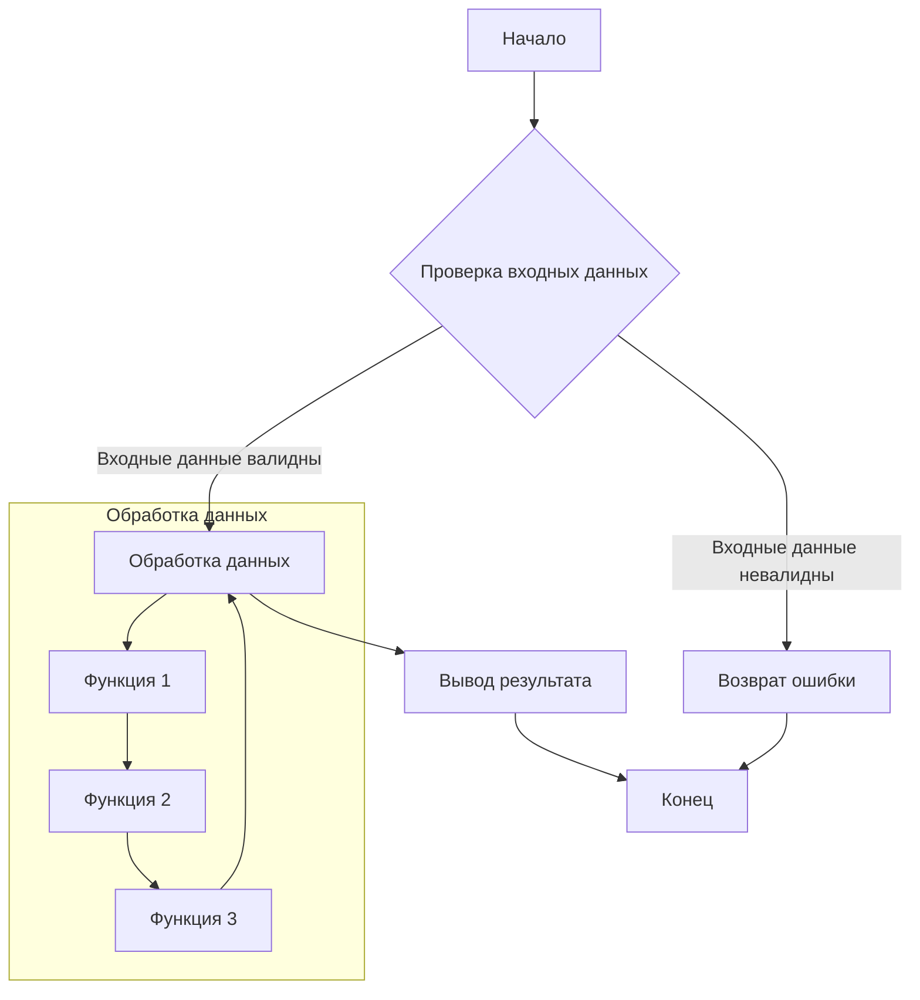
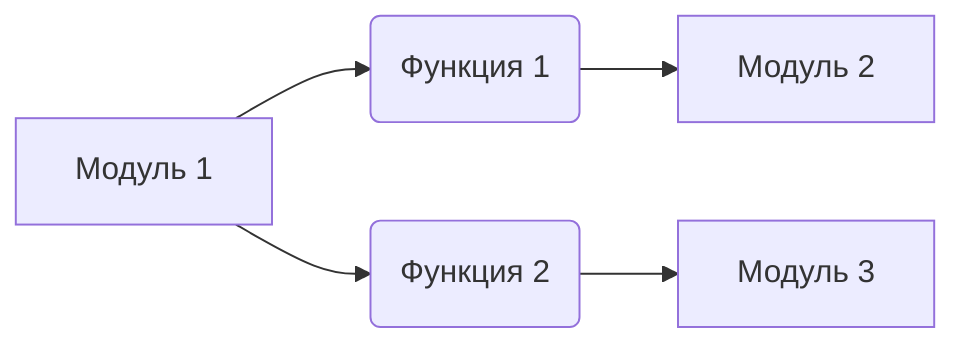

# Анализ кода

**<input code>**

```python
# Код для анализа здесь
```

**<algorithm>**

(Здесь должна быть блок-схема алгоритма работы кода в формате, поддерживаемом инструментом генерации блок-схем, например, mermaid.  Так же необходимо описание каждого шага и примеры, иллюстрирующие данные и их передачу между функциями и методами.)

**Пример:**



**Описание шагов:**

1. **Шаг A:** Начало выполнения программы.
2. **Шаг B:** Проверка корректности входных данных.  Пример: Проверка на пустоту, тип данных.
3. **Шаг C:** Обработка данных (блок-схема внутри показывает вызовы функций).  Пример: преобразование формата, фильтрация.
4. **Шаг D:** Возврат ошибки, если данные невалидны.  Пример: сообщение об ошибке.
5. **Шаг E:** Вывод результата.  Пример: печать на консоль или запись в файл.
6. **Шаг F:** Завершение работы программы.

**<mermaid>**

(Здесь должен быть код mermaid, описывающий зависимость между частями кода.  Так же необходимо подробное описание каждой зависимости.)

**Пример:**



**Описание зависимостей:**

Модуль 1 зависит от модуля 2 через функцию 1 и от модуля 3 через функцию 2.

**<explanation>**

(Здесь должно быть подробное объяснение импортов, классов, функций и переменных.  Необходимо указать тип каждой переменной и ее назначение.  Так же следует выделить потенциальные ошибки или области для улучшения.)

**Пример:**

**Импорты:**

* `import module1`: Используется для доступа к функциям и классам из модуля `module1`.
* `from src.module2 import functionX`: Импортирует функцию `functionX` из пакета `src.module2`.

**Классы:**

* `MyClass`:  Предназначен для ... Описание атрибутов и методов класса.  Примеры использования.

**Функции:**

* `my_function(arg1, arg2)`:  Описание аргументов, возвращаемого значения, назначения и примеров использования.

**Переменные:**

* `my_variable`: Тип переменной и ее назначение.


**Возможные ошибки и улучшения:**

* Недостаточная проверка входных данных.
* Отсутствие документации для функций и классов.
* Неэффективное использование памяти (если это необходимо).

**Взаимосвязи с другими частями проекта:**

(Описание связи с другими частями приложения, например, API, базами данных, конфигурационными файлами.)


**Важно:**  Для качественного анализа необходимо заменить примеры кода и блок-схем на реальный код.  Без кода невозможно выполнить анализ.