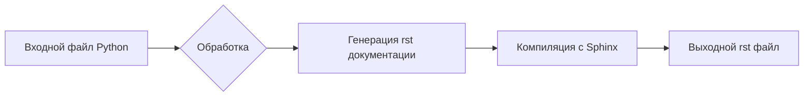

# ИНСТРУКЦИЯ по написанию документации в формате reStructuredText (rst) для файлов Python

## <input code>

```plaintext
# הוראות
לכל קובץ Python קלט, צרו תיעוד בפורמט `rst` לצורך קומפילציה לאחר מכן עם Sphinx. התיעוד צריך לעמוד בדרישות הבאות:

1. **פורמט התיעוד**:
   - השתמשו בסטנדרט `reStructuredText (rst)`.
   - כל קובץ צריך להתחיל בכותרת ובתיאור קצר של התוכן שלו.
   - עבור כל המחלקות והפונקציות, השתמשו בפורמט ההערות הבא:
     ```python
     def function(param: str, param1: Optional[str | dict | str] = None) -> dict | None:
         """
         ארגומנטים:
             param (str): תיאור הפרמטר `param`.
             param1 (Optional[str | dict | str], optional): תיאור הפרמטר `param1`. ברירת המחדל היא `None`.

         ערך מוחזר:
             dict | None: תיאור הערך המוחזר. מחזיר מילון או `None`.

         יוצאים:
             SomeError: תיאור המצב שבו מתרחש החריג `SomeError`.
         """
     ```
   - השתמשו ב-`ex` במקום `e` בחסימות טיפול בחריגים.

2. **עץ תוכן (TOC)**:
   - כללו פרקים בתיעוד באמצעות `.. toctree::`.
   - מבנה הקובץ `index.rst` צריך לכלול קישורים לכל התיאורים של המודולים.

3. **עיצוב התיעוד**:
   - כל כותרות המחלקות, הפונקציות והשיטות צריכות להיות מתועדות באמצעות פקודות Sphinx (`autoclass`, `autofunction`).
   - דוגמה:
     ```rst
     .. automodule:: module_name
         :members:
         :undoc-members:
         :show-inheritance:
     ```

4. **כותרות פרקים**:
   - השתמשו בכותרות ברמה 1 (`=`), רמה 2 (`-`), רמה 3 (`~`) ורמה 4 (`^`).

5. **דוגמת קובץ**:
   ```rst
   שם המודול
   ===========\n
   .. automodule:: module_name
       :members:
       :undoc-members:
       :show-inheritance:

   פונקציות
   --------

   .. autofunction:: module_name.function_name
   ```

צור את התיעוד המתאים לכל קובץ Python קלט בפורמט `rst`.
# -------------------- סיום ההוראות -------------------------
```

## <algorithm>

(Блок-схема отсутствует, так как инструкция описывает алгоритм создания документации, а не выполнения кода)


## <mermaid>



## <explanation>

**1. Импорты:**  
В данном случае нет импортируемых модулей, так как это инструкция, а не код.  Инструкция описывает правила написания документации для кода Python.


**2. Классы и функции:**  
Инструкция описывает правила форматирования документации для классов и функций Python.  Она предоставляет примеры использования `reStructuredText` (rst) для создания документации, которая может быть использована с Sphinx для генерации HTML и других форматов.  Важно, что инструкция описывает требуемые  форматы для аннотации функций и классов, а не сам код.


**3. Переменные:**  
Переменные не используются в данном контексте. Инструкция фокусируется на структурировании и написании документации.


**4. Возможные ошибки и улучшения:**  
Возможная ошибка — несоблюдение инструкций по написанию rst файла.  Возможное улучшение — предоставление дополнительных примеров, таких как структура проекта и взаимодействие с другими файлами.


**Цепочка взаимосвязей:**
Инструкция предполагает, что у вас есть файлы Python, которые нуждаются в документировании. После создания rst файла, он будет обработан Sphinx, который сгенерирует HTML (или другой формат) документации.  В дальнейшем эта документация может быть интегрирована в ваш проект или веб-сайт.