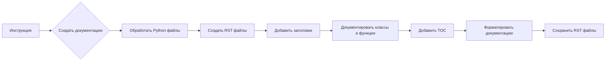

# <input code>

```python
# ИНСТРУКЦИЯ
Для каждого входного Python файла создайте документацию в формате `rst` для последующей компиляции с Sphinx. Документация должна соответствовать следующим требованиям:

1. **Формат документации**:
   - Используйте стандарт `reStructuredText (rst)`.
   - Каждый файл должен начинаться с заголовка и краткого описания его содержимого.
   - Для всех классов и функций используйте следующий формат комментариев:
     ```python
     def function(param: str, param1: Optional[str | dict | str] = None) -> dict | None:
         """
         Аргументы:
             param (str): Описание параметра `param`.
             param1 (Optional[str | dict | str], optional): Описание параметра `param1`. По умолчанию равно `None`.

         Возвращаемое значение:
             dict | None: Описание возвращаемого значения. Возвращает словарь или `None`.

         Исключения:
             SomeError: Описание ситуации, в которой возникает исключение `SomeError`.
         """
     ```
   - Используйте `ex` вместо `e` в блоках обработки исключений.

2. **Дерево оглавлений (TOC)**:
   - Включите разделы в документации с использованием `.. toctree::`.
   - Структура файла `index.rst` должна содержать ссылки на все описания модулей.

3. **Форматирование документации**:
   - Все заголовки классов, функций и методов должны быть задокументированы с использованием директив Sphinx (`autoclass`, `autofunction`).
   - Пример:
     ```rst
     .. automodule:: module_name
         :members:
         :undoc-members:
         :show-inheritance:
     ```

4. **Заголовки разделов**:
   - Используйте заголовки первого уровня (`=`), второго уровня (`-`), третьего уровня (`~`) и четвертого уровня (`^`).

5. **Пример файла**:
   ```rst
   Название модуля
   ===============\n

   .. automodule:: module_name
       :members:
       :undoc-members:
       :show-inheritance:

   Функции
   --------

   .. autofunction:: module_name.function_name
   ```

Сгенерируйте соответствующую документацию для каждого входного Python файла в формате `rst`.
```

# <algorithm>

Описание алгоритма отсутствует, так как предоставленный код является инструкцией, а не кодом для выполнения.  Инструкция описывает, как создавать файлы документации, но не содержит алгоритм для их создания.


# <mermaid>



# <explanation>

**Импорты**:  В коде нет импортов. Инструкция описывает процесс, который не требует импорта каких-либо библиотек.  Она скорее является шаблоном или спецификацией для создания файлов документации.


**Классы**:  Инструкция описывает, как документировать классы, но не создаёт их.  Инструкция задаёт стиль и формат комментариев, которые должны быть в классах.


**Функции**: Инструкция описывает формат комментариев для функций, что, в свою очередь, предполагает наличие функций. Она задает стандарт для описания аргументов, возвращаемых значений и исключений.


**Переменные**:  В коде нет переменных.  Инструкция определяет формат документации, а не описывает код, который бы их использовал.


**Возможные ошибки или области для улучшений**:  В инструкции не указаны проверки корректности вводимых Python-файлов, которые могут быть необходимы в реальной реализации. В инструкции не указано, каким образом обрабатываются файлы, которые не соответствуют требованиям. Также не указано, как обрабатываются ошибки во время обработки файлов.


**Цепочка взаимосвязей**:  Инструкция описывает процедуру, которую, вероятно, будет выполнять инструмент или script для генерации документации. Непосредственные зависимости с другими частями проекта в инструкции не показаны.  Эта инструкция действует как руководство для создания инструмента/скрипта, который будет взаимодействовать с Python-файлами для генерации documentation.