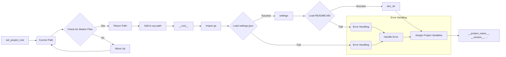

# <input code>

```python
## \file hypotez/src/endpoints/hypo69/header.py
# -*- coding: utf-8 -*-\
#! venv/Scripts/python.exe
#! venv/bin/python/python3.12

"""
.. module: src.endpoints.hypo69 
	:platform: Windows, Unix
	:synopsis:

"""
MODE = 'dev'

import sys
import json
from packaging.version import Version

from pathlib import Path
def set_project_root(marker_files=('__root__')) -> Path:
    """
    Finds the root directory of the project starting from the current file's directory,
    searching upwards and stopping at the first directory containing any of the marker files.

    Args:
        marker_files (tuple): Filenames or directory names to identify the project root.
    
    Returns:
        Path: Path to the root directory if found, otherwise the directory where the script is located.
    """
    __root__:Path
    current_path:Path = Path(__file__).resolve().parent
    __root__ = current_path
    for parent in [current_path] + list(current_path.parents):
        if any((parent / marker).exists() for marker in marker_files):
            __root__ = parent
            break
    if __root__ not in sys.path:
        sys.path.insert(0, str(__root__))
    return __root__


# Get the root directory of the project
__root__ = set_project_root()
"""__root__ (Path): Path to the root directory of the project"""

from src import gs

settings:dict = None
try:
    with open(gs.path.root / 'src' /  'settings.json', 'r') as settings_file:
        settings = json.load(settings_file)
except (FileNotFoundError, json.JSONDecodeError):
    ...

doc_str:str = None
try:
    with open(gs.path.root / 'src' /  'README.MD', 'r') as settings_file:
        doc_str = settings_file.read()
except (FileNotFoundError, json.JSONDecodeError):
    ...


__project_name__ = settings.get("project_name", 'hypotez') if settings  else 'hypotez'
__version__: str = settings.get("version", '')  if settings  else ''
__doc__: str = doc_str if doc_str else ''
__details__: str = ''
__author__: str = settings.get("author", '')  if settings  else ''
__copyright__: str = settings.get("copyrihgnt", '')  if settings  else ''
__cofee__: str = settings.get("cofee", "Treat the developer to a cup of coffee for boosting enthusiasm in development: https://boosty.to/hypo69")  if settings else "Treat the developer to a cup of coffee for boosting enthusiasm in development: https://boosty.to/hypo69"
```

# <algorithm>

**Шаг 1:**  Функция `set_project_root` ищет корневую директорию проекта.

*   **Вход:** Кортеж `marker_files` с файлами/директориями, указывающими на корневую директорию.
*   **Пример:** `marker_files = ('pyproject.toml', 'requirements.txt', '.git')`
*   **Действие:** Начинает поиск с текущей директории (`__file__`) и поднимается вверх по иерархии директорий.
*   **Логика:** Проверяет, существует ли какой-либо файл из `marker_files` в текущей директории. Если да, то возвращает эту директорию. Иначе, переходит к родительской директории и повторяет поиск.
*   **Пример:** Если файл `pyproject.toml` найден в директории /user/project/src/endpoints/hypo69, то функция вернет эту директорию.
*   **Возвращаемое значение:** `Path` к корневой директории проекта. Если корневая директория не найдена, возвращается текущая директория, где находится скрипт.  Если корневая директория не находится в `sys.path`, она добавляется в начало.


**Шаг 2:**  Переменная `__root__` получает значение, возвращаемое функцией `set_project_root`.

*   **Вход:** Результат поиска корневой директории.
*   **Пример:** `/user/project`
*   **Действие:** Сохраняет полученное значение.
*   **Результат:** Корневой путь проекта.

**Шаг 3:** Импортируется модуль `gs` из пакета `src`.

* **Вход**: Нет
* **Действие**:  Происходит импорт.
* **Пример**:  Импортируется модуль, содержащий пути к файлам проекта
* **Результат**:  Модуль `gs` доступен для использования.

**Шаг 4:**  Попытка загрузить настройки из файла `settings.json` в переменную `settings`.

*   **Вход:** Путь к файлу `settings.json`.
*   **Пример:** `/user/project/src/settings.json`.
*   **Действие:** Чтение файла `settings.json` и декодирование его содержимого в словарь Python.
*   **Возможные исключения:** `FileNotFoundError` или `json.JSONDecodeError`. В случае возникновения ошибки, переменная `settings` остаётся `None`.
* **Результат**: Переменная `settings` содержит словарь с настройками или `None`, если файл не найден или содержит некорректный JSON.


**Шаг 5:**  Аналогично, загружаются данные из файла `README.MD`.

*   **Вход:** Путь к файлу `README.MD`.
*   **Пример:** `/user/project/src/README.MD`.
*   **Действие:** Чтение файла `README.MD`.
*   **Возможные исключения:** `FileNotFoundError` или `json.JSONDecodeError`. В случае возникновения ошибки, переменная `doc_str` остаётся `None`.
* **Результат**: Переменная `doc_str` содержит строку содержимого файла `README.MD` или `None`, если файл не найден или содержит ошибку.

**Шаг 6:** Присваиваются значения переменным проекта.

*   **Вход**: Значения из словаря `settings`.
*   **Действие**: Получение значений из словаря `settings` по ключам или использование значений по умолчанию.
* **Пример**: `__project_name__` получает значение из `settings` или `'hypotez'` по умолчанию.
* **Результат**: Переменные `__project_name__`, `__version__`, `__doc__`, `__details__`, `__author__`, `__copyright__`, `__cofee__` содержат значения из файла настроек или значения по умолчанию.


# <mermaid>



# <explanation>

**Импорты:**

*   `sys`: Модуль `sys` используется для доступа к системным переменным, в частности, к пути `sys.path`, что важно для импорта модулей из других директорий.
*   `json`: Модуль для работы с файлами JSON. Используется для загрузки настроек проекта из файла `settings.json`.
*   `packaging.version`:  Модуль для работы с версиями пакетов.  Используется (хотя и не используется напрямую в этом фрагменте) для корректного сравнения версий в проекте.
*   `pathlib`: Модуль для работы с путями к файлам.  Важный элемент для построения путей к `settings.json` и `README.MD`, а также для поиска корневого каталога проекта.
*   `src.gs`: Модуль, вероятно, определён в другом месте проекта (внутри `src`) и содержит  функции или классы для работы с путями проекта.  Отмечается как зависимость для корректной работы.

**Классы:**

Код не содержит классов.

**Функции:**

*   `set_project_root(marker_files)`:  Функция находит корневую директорию проекта, начиная от текущего файла и поднимаясь по дереву директорий.  Её цель - найти директорию, содержащую файлы `marker_files`.  Аргумент `marker_files` позволяет указать специфические файлы для определения корневого каталога.  Возвращаемое значение - `Path` к корневой директории проекта. Если корень не найден, возвращает директорию, содержащую текущий файл. Важно, чтобы файлы, указанные в `marker_files`,  существовали в корневом каталоге проекта.  Функция также добавляет корневую директорию в `sys.path`, что позволяет импортировать модули из пакета.


**Переменные:**

*   `__root__`: Переменная, содержащая `Path` к корневому каталогу проекта.
*   `settings`: Словарь с настройками проекта, загруженный из `settings.json`.
*   `doc_str`: Строка с текстом документации из `README.MD`.
*   `MODE`: Переменная, содержащая значение 'dev'.  Возможно, предназначена для определения режима работы (например, 'dev', 'prod').
*   `__project_name__`, `__version__`, `__doc__`, `__details__`, `__author__`, `__copyright__`, `__cofee__`:  Переменные, содержащие метаданные о проекте (имя, версия, описание, автор и т.д.). Заполняются из словаря `settings` или принимают значения по умолчанию.

**Возможные ошибки или области для улучшений:**

*   **Обработка ошибок:** Используются `try...except` блоки для обработки `FileNotFoundError` и `json.JSONDecodeError`, но могут возникнуть и другие ошибки, связанные с доступом к файлам (например, отсутствие прав доступа), которые не обрабатываются. Нужно расширить `try...except` на случай других ошибок.
*   **Типы данных:** Возможно, стоит использовать аннотации типов более последовательно.
*   **Документация:**  Документация к коду `set_project_root` и функциям, использующим `gs.path`, неполна.  Необходимо добавить дополнительную документацию, чтобы пользователи понимали, как их использовать.
*   **Зависимости:** Необходимо определить, что представляют из себя классы или модули в `gs` и какие зависимости от других частей проекта существуют.


**Взаимосвязи с другими частями проекта:**

Этот файл является частью проекта `hypotez`.  Зависимость от модуля `gs` указывает на существование других модулей/файлов в проекте `hypotez`, которые предоставляют информацию о путях к файлам.  Этот файл подготавливает общую информацию о проекте, которая, вероятно, используется другими частями проекта (например, для инициализации).