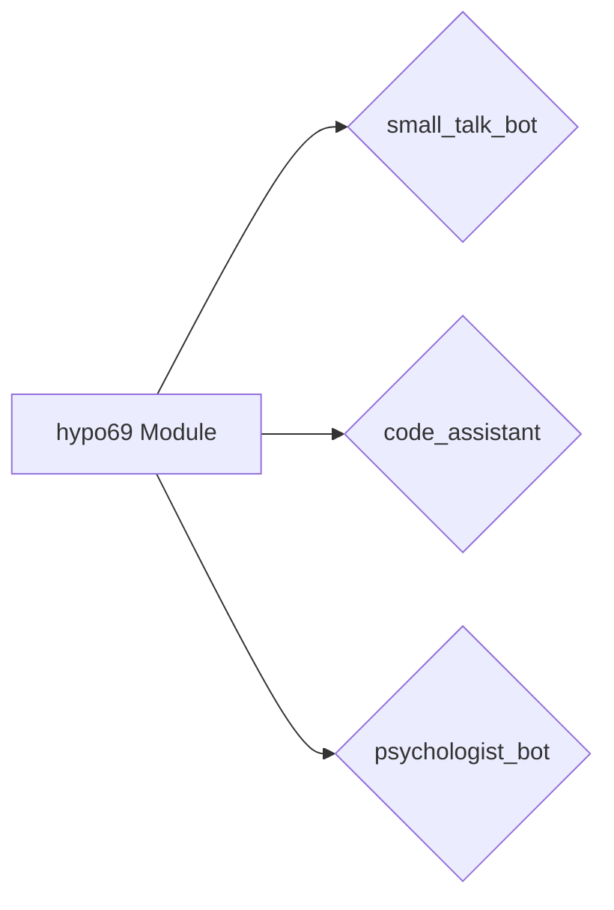

```MD
# Анализ модуля src.endpoints.hypo69

## <input code>

```rst
.. module: src.endpoints.hypo69
	.. synopsys: эндпоинты для разработчика 
```

### **hypo69 Module**: эндпоинты для разработчика
**small_talk_bot** - бот с чатом модели ии
**code_assistant** - модуль обучения модели коду проекта
**psychologist_bot** - ранняя разработка модуля парсинга диалогов


## <algorithm>

К сожалению, предоставленный код не содержит исполняемого кода, а только описание модуля.  Поэтому построить блок-схему и примеры работы алгоритма невозможно.  Отсутствует информация о классах, функциях и переменных, которые составляют этот модуль.

## <mermaid>



Эта диаграмма представляет только взаимосвязи между компонентами модуля. Без кода нельзя определить точное поведение и взаимодействия.


## <explanation>

Предоставленный фрагмент документации описывает модуль `src.endpoints.hypo69`, но не содержит самого кода.  Он лишь определяет три компонента, относящиеся к разработке эндпоинтов для взаимодействия с разработчиками:

* **small_talk_bot:** Бот, взаимодействующий с моделью ИИ в режиме чата.
* **code_assistant:** Модуль, используемый для обучения модели ИИ работе с кодом проекта.
* **psychologist_bot:**  Модуль, находящийся на ранней стадии разработки, предназначенный для парсинга диалогов.

**Импорты:**
Так как код не приведен, то невозможно проанализировать импорты и их связь с другими пакетами.  Обычно в этом модуле будут импортироваться классы и функции из других частей проекта (например, из модулей для работы с базами данных, API, модели ИИ, или для управления взаимодействием с пользователем).

**Классы:**
Без кода невозможно определить классы, их атрибуты и методы.  Можно предположить, что в модуле будут классы, описывающие логику работы каждого компонента (бота).

**Функции:**
Точно так же без кода невозможно описать функции, их аргументы, возвращаемые значения и назначение.  Возможно, есть функции для запуска ботов, управления диалогами, обучения моделей и т.д.

**Переменные:**
Без кода невозможно определить типы и использование переменных.

**Возможные ошибки и области для улучшений:**

* **Отсутствие кода:** Невозможно провести полноценный анализ и дать рекомендации без кода.
* **Недостаточная детализация:** Описание компонентов ("ранняя разработка" и т.п.) не позволяет глубоко оценить функциональность.
* **Отсутствие описания архитектуры:** Неясно, как эти компоненты взаимодействуют друг с другом и с другими частями проекта.

**Цепочка взаимосвязей:**

Модуль `src.endpoints.hypo69` скорее всего связан с другими модулями проекта, например:

* `src.models`: Для доступа к моделям ИИ.
* `src.utils`: Для использования вспомогательных функций.
* `src.database`: Для взаимодействия с базами данных, если используются.
* `src.api`: Для взаимодействия с внешними API.

Для более детального анализа необходим сам код.