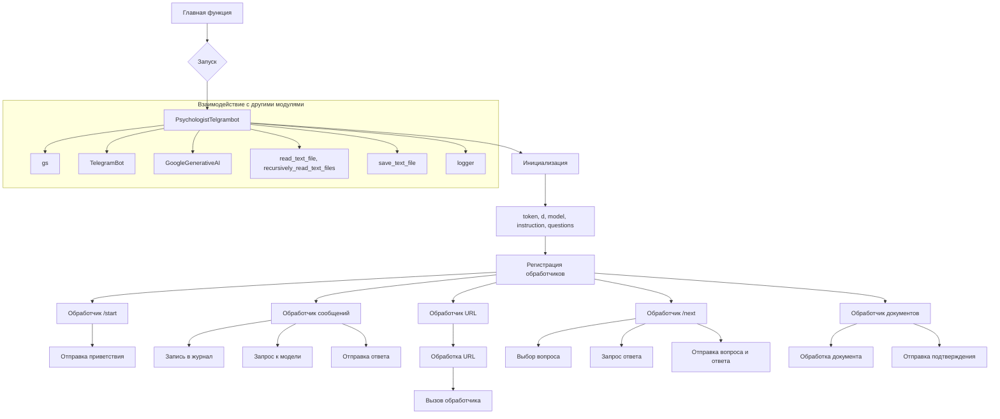

```MD
# <input code>

```python
## \file hypotez/src/endpoints/hypo69/small_talk_bot/bot.py
# -*- coding: utf-8 -*-
#! venv/Scripts/python.exe
#! venv/bin/python/python3.12

"""
.. module: src.endpoints.hypo69.small_talk_bot 
	:platform: Windows, Unix
	:synopsis:

"""


...
""" t.me/hypo69_psychologist_bot_bot's specific bot with customized behavior."""
import header
import asyncio
from pathlib import Path
from typing import Optional
from dataclasses import dataclass, field
import random
from telegram import Update
from telegram.ext import CommandHandler, MessageHandler, filters, CallbackContext

from src import gs
from src.bots.telegram import TelegramBot
from src.webdriver.driver import Driver, Chrome
from src.ai.gemini import GoogleGenerativeAI
from src.utils.file import read_text_file, recursively_read_text_files, save_text_file
from src.utils.url import is_url
from src.logger import logger
```

# <algorithm>

**Шаг 1: Импорт необходимых библиотек.**

*   Импортируются библиотеки `asyncio`, `Path`, `dataclass`, `random`, `telegram`, `telegram.ext`, и др. для работы с Telegram ботом, обработкой данных, и интеграцией с Google Generative AI.
*   Import `gs`, `TelegramBot`, `Driver`, `Chrome`, `GoogleGenerativeAI`, `read_text_file`, `recursively_read_text_files`, `save_text_file` и  `logger` из модулей приложения.

**Шаг 2: Определение класса `PsychologistTelgrambot`.**

*   Класс наследуется от `TelegramBot`.
*   Инициализирует `token`, `d` (драйвер), `model` (Google Generative AI), `system_instruction`, `questions_list`.


**Шаг 3: Инициализация атрибутов.**

*   Присваивает токен для бота, используя переменную `gs.credentials.telegram.hypo69_psychologist_bot`.
*   Инициализирует драйвер, Google Generative AI модель и загружает инструкции и список вопросов.

**Шаг 4: Регистрация обработчиков.**

*   Регистрирует обработчики для команд `/start`, `/help`, текстовых сообщений, голосовых сообщений и документов.


**Шаг 5: Обработчик `/start`.**

*   Отправляет приветственное сообщение пользователю.

**Шаг 6: Обработчик текстовых сообщений (`handle_message`).**

*   Записывает текст сообщения в файл журналов.
*   Использует модель Google Generative AI для получения ответа.
*   Отправляет ответ пользователю.

**Шаг 7: Обработчик URL.**

*   Функция `get_handler_for_url` обрабатывает URL-адреса и определяет обработчик в зависимости от URL.  
*   Функции `handle_suppliers_response` и `handle_onetab_response` обрабатывают соответствующие URL-адреса.

**Шаг 8: Обработчик `/next`.**

*   Возвращает случайный вопрос из списка вопросов.
*   Отправляет вопрос и ответ пользователю.

**Шаг 9: Обработчик документов (`handle_document`).**

*   Обрабатывает загруженные документы и сохраняет их содержимое.


**Шаг 10: Запуск бота.**

*   Создает экземпляр `PsychologistTelgrambot`.
*   Запускает бота в режиме polling.


# <mermaid>


**Описание зависимостей на диаграмме:**

*   `PsychologistTelgrambot` (C) использует классы `TelegramBot` (X), `GoogleGenerativeAI` (Y), и `Driver`, `Chrome`(W).
*   `PsychologistTelgrambot` использует модули `gs` (W), для доступа к конфигурационным данным и различным вспомогательным функциям.  
*   Функции `read_text_file`, `recursively_read_text_files`,  `save_text_file` и `logger` (AA, Z) предоставляют функциональность для работы с файлами и логированием.


# <explanation>

**Импорты:**

*   `header`: Вероятно, содержит дополнительные импорты, необходимые для работы приложения.  Необходимость его наличия зависит от особенностей проекта.
*   `asyncio`: Библиотека для асинхронного программирования в Python.  Необходима для работы с Telegram ботом.
*   `pathlib`: Для работы с путями к файлам.
*   `typing`: Для типов данных.
*   `random`: Для генерации случайных чисел.
*   `telegram`, `telegram.ext`: Библиотеки для создания Telegram ботов.
*   `gs`: Модуль `gs` (вероятно, собственный) предоставляет доступ к глобальным ресурсам, таким как пути к файлам и конфигурационные данные.
*   `TelegramBot`, `Driver`, `Chrome`, `GoogleGenerativeAI`, `read_text_file`, `recursively_read_text_files`, `save_text_file`, `logger`:  Импорты из модулей приложения, используемые для работы бота.

**Классы:**

*   `PsychologistTelgrambot`: Наследуется от `TelegramBot`, реализует специфическую логику для бота, связанного с психологией.  Содержит методы для обработки сообщений, команд и файлов.

**Функции:**

*   `start`, `handle_message`, `handle_suppliers_response`, `handle_onetab_response`, `handle_next_command`, `handle_document`: Функции-обработчики, отвечающие за реакции на команды и сообщения пользователя. 
*   `get_handler_for_url`: Функция для определения обработчика в зависимости от URL-адреса.


**Переменные:**

*   `MODE`: Переменная, вероятно, используется для определения режима работы бота (например, `dev` или `prod`).
*   `token`: Токен для доступа к Telegram боту.
*   `d`, `model`, `system_instruction`, `questions_list`: Атрибуты класса `PsychologistTelgrambot` для хранения данных о драйвере, AI-модели, системе инструкций и списка вопросов.
*   `log_path`: Путь к файлу, где сохраняются логи.


**Возможные ошибки и улучшения:**

*   Отсутствие обработки исключений при загрузке вопросов может привести к падению бота.  (Уже есть в `handle_next_command`)
*   Неясно, как работает взаимодействие с `mexiron`.
*   Отсутствует проверка корректности токенов.
*   Логирование должно быть более подробным.
*   Обработка ошибок в `handle_next_command` и других методах.
*   Обработка неверного ввода и нестандартных ситуаций.
*   Добавление проверки на существование файла, перед загрузкой.


**Взаимосвязи с другими частями проекта:**

Код взаимодействует с `gs` для получения конфигурационных данных, `GoogleGenerativeAI` для обработки запросов к модели, `TelegramBot` для взаимодействия с Telegram API. Вероятно существуют другие зависимости, связанные с модулями `src`, которые не видны в представленном коде.