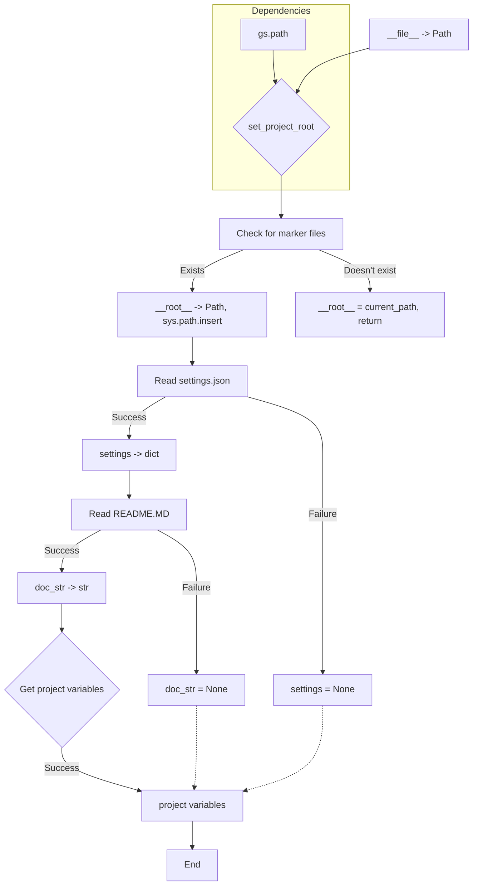

```MD
# <input code>

```python
## \file hypotez/src/endpoints/hypo69/small_talk_bot/header.py
# -*- coding: utf-8 -*-
#! venv/Scripts/python.exe
#! venv/bin/python/python3.12

"""
.. module: src.endpoints.hypo69.small_talk_bot 
	:platform: Windows, Unix
	:synopsis:

"""
MODE = 'dev'

import sys
import json
from packaging.version import Version

from pathlib import Path
def set_project_root(marker_files=('pyproject.toml', 'requirements.txt', '.git')) -> Path:
    """
    Finds the root directory of the project starting from the current file's directory,
    searching upwards and stopping at the first directory containing any of the marker files.

    Args:
        marker_files (tuple): Filenames or directory names to identify the project root.
    
    Returns:
        Path: Path to the root directory if found, otherwise the directory where the script is located.
    """
    __root__:Path
    current_path:Path = Path(__file__).resolve().parent
    __root__ = current_path
    for parent in [current_path] + list(current_path.parents):
        if any((parent / marker).exists() for marker in marker_files):
            __root__ = parent
            break
    if __root__ not in sys.path:
        sys.path.insert(0, str(__root__))
    return __root__


# Get the root directory of the project
__root__ = set_project_root()
"""__root__ (Path): Path to the root directory of the project"""

from src import gs

settings:dict = None
try:
    with open(gs.path.root / 'src' /  'settings.json', 'r') as settings_file:
        settings = json.load(settings_file)
except (FileNotFoundError, json.JSONDecodeError):
    ...

doc_str:str = None
try:
    with open(gs.path.root / 'src' /  'README.MD', 'r') as settings_file:
        doc_str = settings_file.read()
except (FileNotFoundError, json.JSONDecodeError):
    ...


__project_name__ = settings.get("project_name", 'hypotez') if settings  else 'hypotez'
__version__: str = settings.get("version", '')  if settings  else ''
__doc__: str = doc_str if doc_str else ''
__details__: str = ''
__author__: str = settings.get("author", '')  if settings  else ''
__copyright__: str = settings.get("copyrihgnt", '')  if settings  else ''
__cofee__: str = settings.get("cofee", "Treat the developer to a cup of coffee for boosting enthusiasm in development: https://boosty.to/hypo69")  if settings  else "Treat the developer to a cup of coffee for boosting enthusiasm in development: https://boosty.to/hypo69"
```

# <algorithm>

**Шаг 1:** Функция `set_project_root` ищет корневую директорию проекта.

*   **Вход:** Кортеж `marker_files` с файлами, которые указывают на корень проекта.
*   **Выход:** Объект `Path` на корень проекта.
*   **Логика:** Начиная с текущей директории, функция поднимается по родительским директориям, проверяя наличие файлов из `marker_files`. Первая директория, содержащая хотя бы один из этих файлов, считается корнем проекта. Если корень не найден, возвращается текущая директория. Вставляется в `sys.path` для импорта модулей.

**Шаг 2:**  Получение корня проекта (`__root__`).

*   **Вход:** Пустой.
*   **Выход:** Переменная `__root__` типа `Path` с путем к корню проекта.

**Шаг 3:**  Загрузка настроек (`settings`).

*   **Вход:** Путь к `settings.json` в корне проекта.
*   **Выход:** Словарь `settings` с настройками проекта или `None`.
*   **Логика:** Попытка открыть файл `settings.json` и загрузить данные в формате JSON. Обрабатываются исключения `FileNotFoundError` и `json.JSONDecodeError` для предотвращения сбоев.

**Шаг 4:** Загрузка документации (`doc_str`).

*   **Вход:** Путь к `README.MD` в корне проекта.
*   **Выход:** Строка `doc_str` с содержимым файла или `None`.
*   **Логика:** Попытка открыть файл `README.MD` и прочитать его содержимое. Обрабатываются исключения `FileNotFoundError` и `json.JSONDecodeError`.


**Шаг 5:**  Получение переменных проекта.

*   **Вход:** Словарь настроек `settings` и прочитанные данные из `README.MD`.
*   **Выход:** Переменные `__project_name__`, `__version__`, `__doc__`, `__details__`, `__author__`, `__copyright__`, `__cofee__`.
*   **Логика:** Извлекаются значения из `settings` по ключам или используются значения по умолчанию. Значения `__doc__` и др. могут быть взяты из файла `README.MD`.


# <mermaid>



# <explanation>

**Импорты:**

*   `sys`: Модуль для доступа к системным параметрам, в том числе для изменения `sys.path`.
*   `json`: Модуль для работы с файлами в формате JSON.
*   `packaging.version`: Модуль для работы с версиями пакетов.
*   `pathlib`: Модуль для работы с путями к файлам.
*   `src.gs`:  Вероятно, содержит вспомогательные функции или классы для работы с файлами и ресурсами проекта.  Необходимо дополнительное исследование `gs`.  Связь через импорт `from src import gs`.

**Классы:**

Нет определенных классов в данном коде.

**Функции:**

*   `set_project_root(marker_files)`: Ищет корневую директорию проекта.
    *   **Аргументы:** `marker_files` (кортеж строк) — имена файлов, указывающие на корень.
    *   **Возвращаемое значение:** `Path` — путь к корневой директории.
    *   **Пример:** `set_project_root(('pyproject.toml', 'requirements.txt'))`.

**Переменные:**

*   `MODE`: Строковая константа, вероятно, для выбора режима работы (например, 'dev', 'prod').
*   `__root__`: Путь к корневой директории проекта.
*   `settings`: Словарь с настройками проекта (из `settings.json`).
*   `doc_str`: Содержимое файла `README.MD`.
*   `__project_name__`, `__version__`, `__doc__`, `__details__`, `__author__`, `__copyright__`, `__cofee__`:  Переменные, содержащие информацию о проекте, полученные из `settings` или имеющие значения по умолчанию.

**Возможные ошибки и улучшения:**

*   **Обработка ошибок:** Обработка `FileNotFoundError` и `json.JSONDecodeError` важна, но можно добавить более специфичные или информативные сообщения об ошибках.
*   **Типизация:** Используется `typing`, что хорошо.  Можно добавить более подробную типизацию для аргументов и возвращаемых значений функций (например, `marker_files` может быть `List[str]`).
*   **Универсальность:**  Если проект часто перемещается, то лучше использовать более общие способы определения корня (например, с использованием `importlib.resources`).
*   **Чтение настроек:** Чтение `settings.json` с использованием `json.load` может быть более устойчивым, если использовать `json.loads` для декодирования из строки.
*   **Чтение документации:** Вместо чтения всего файла в `doc_str`, можно использовать более эффективное чтение, если требуется только часть данных.

**Цепочка взаимосвязей:**

Данный файл (`header.py`)  инициализирует глобальные переменные, необходимые для работы других частей проекта (например, `small_talk_bot`).  Он получает данные из `src/settings.json` и `src/README.MD`, и определяет путь проекта (`__root__`).  Это предоставляет общую информацию о проекте для дальнейших компонентов.  Следующие части проекта, скорее всего, используют эти переменные для получения информации о проекте.  Для более точного анализа необходима информация о структуре проекта (директории, файлы).