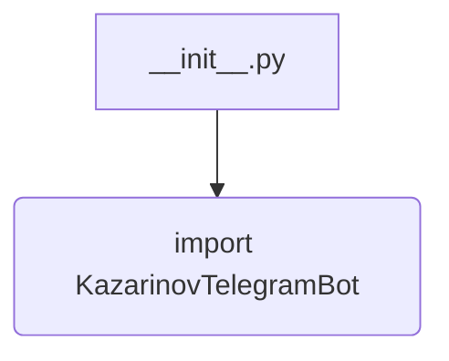
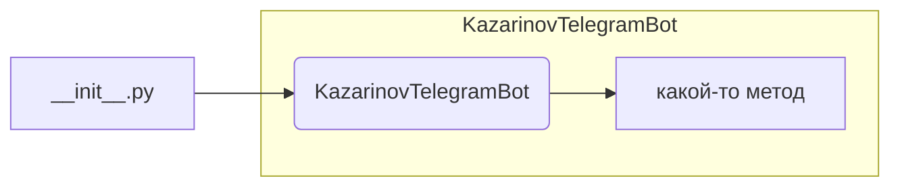

```MD
# Анализ кода hypotez/src/endpoints/kazarinov/__init__.py

## <input code>

```python
## \file hypotez/src/endpoints/kazarinov/__init__.py
# -*- coding: utf-8 -*-\
#! venv/Scripts/python.exe
#! venv/bin/python/python3.12

"""
.. module: src.endpoints.kazarinov 
	:platform: Windows, Unix
	:synopsis:

"""


from .kazarinov_bot import KazarinovTelegramBot
```

## <algorithm>

Этот код является инициализационным файлом для модуля `kazarinov` в пакете `endpoints`.  Он не содержит собственно логики, а лишь импортирует класс `KazarinovTelegramBot` из подмодуля `kazarinov_bot`.  Блок-схема упрощенная, так как импорт не предполагает каких-либо вычислений:



В данном случае, `` - это константа, которая, скорее всего, определяет режим работы приложения (например, девелоперский). Значение не используется непосредственно в текущем файле, но может быть использовано в других частях приложения.

## <mermaid>



Диаграмма показывает импорт класса `KazarinovTelegramBot` из файла `kazarinov_bot.py`, который, скорее всего, находится в том же каталоге (`endpoints/kazarinov`).  Связь — это зависимость импорта.


## <explanation>

**Импорты:**

- `from .kazarinov_bot import KazarinovTelegramBot`:  Импортирует класс `KazarinovTelegramBot` из файла `kazarinov_bot.py`, который, по контексту, находится в том же каталоге (`src/endpoints/kazarinov/kazarinov_bot.py`).  Символ `.` указывает на поиск в текущем пакете. Это стандартный способ организации кода в Python.

**Классы:**

- `KazarinovTelegramBot`:  Этот класс, судя по имени, представляет бота Telegram.  Подробности его реализации находятся в файле `kazarinov_bot.py`.  В текущем файле `__init__.py` просто используется ссылка на него.

**Функции:**

- Нет функций. Этот файл содержит только импорты и константу.

**Переменные:**

- ``:  Строковая константа, скорее всего, для настройки режима работы.  Это переменная, которая хранит строку 'dev' и используется для обозначения режима разработки.

**Возможные ошибки или области для улучшений:**

- Нет конкретных ошибок, но файл может быть улучшен:
    - Добавление документации к переменной `MODE`.
    - Использование именованных констант (например, `DEVELOPMENT_MODE`) вместо строковых литералов для большей ясности.
    - Документация в файле `__init__.py` должна указывать назначение переменной `MODE`.

**Взаимосвязи с другими частями проекта:**

- Этот файл является частью модуля `kazarinov`, который, скорее всего, связан с обработкой взаимодействий с телеграм-ботом.
- Файл `kazarinov_bot.py` содержит реализацию логики бота.
- Вероятно, существуют другие файлы, которые используют `KazarinovTelegramBot`.  Например, скрипт запуска `app.py`.  Это предполагает, что бот используется в более крупном приложении.

**Вывод:**

Файл `__init__.py` служит для инициализации модуля `kazarinov` в пакете `endpoints` и обеспечивает импорт необходимых компонентов, в данном случае, класса `KazarinovTelegramBot`.  Его основная роль - организация импорта и, вероятно, дальнейшего использования класса в других частях проекта.