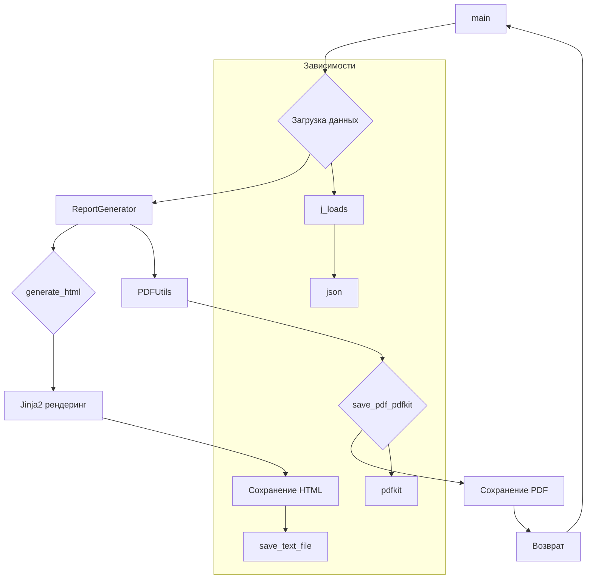

# <input code>

```python
## \file hypotez/src/endpoints/kazarinov/react/pricelist_generator.py
# -*- coding: utf-8 -*-
#! venv/Scripts/python.exe
#! venv/bin/python/python3.12

"""
.. module: src.endpoints.kazarinov.react 
	:platform: Windows, Unix
	:synopsis: Генератор HTML и PDF для мехиронов Казаринова

Описание работы:
- Конструктор `__init__`: Принимает шаблон, базовый путь, метку времени и язык.
- Метод `load_data`: Загружает данные из JSON-файла.
- Метод `generate_html`: Генерирует HTML с использованием Jinja2.
- Метод `save_html`: Сохраняет HTML в файл.
- Метод `generate_pdf`: Преобразует HTML в PDF.
- Метод `create_report`: Запускает полный цикл генерации отчёта.

"""
MODE = 'dev'

#https://dev.to/kboskin/building-web-applications-with-react-and-python-2d8c


import header
from dataclasses import dataclass, field
from src import gs
import json
from pathlib import Path
from jinja2 import Environment, FileSystemLoader
import pdfkit
from src.utils.jjson import j_loads
from src.utils.file import read_text_file, save_text_file    
from src.utils.pdf import PDFUtils
from src.utils.convertors.html import html2pdf
from src.utils.printer import pprint
from src.logger import logger

# config = pdfkit.configuration(wkhtmltopdf= str( gs.path.bin / 'wkhtmltopdf' / 'files' / 'bin' / 'wkhtmltopdf.exe' ) )


@dataclass
class ReportGenerator:
    """
    Класс для генерации HTML- и PDF-отчётов на основе данных из JSON.
    """

    template_path: str  = field(default_factory=lambda: str(gs.path.endpoints / 'kazarinov' / 'react' / 'templates' / 'template.html'))

    env: Environment = field(default_factory=lambda: Environment(loader=FileSystemLoader('.')))

    def generate_html(self, data:dict ) -> str:
        """
        Генерирует HTML-контент на основе шаблона и данных.

        Args:
            lang (str): Язык отчёта.

        Returns:
            str: HTML-контент.
        """
        template_string = Path(self.template_path).read_text(encoding = 'UTF-8')
        template = self.env.from_string(template_string)
        return template.render(**data)


    def create_report(self, data: dict, html_file:str| Path, pdf_file:str |Path) -> None:
        """
        Полный цикл генерации отчёта.

        Args:
            lang (str): Язык отчёта.
        """
        html_content = self.generate_html(data)
        save_text_file(html_content, html_file)
        pdf = PDFUtils()

        if not pdf.save_pdf_pdfkit(html_content,pdf_file):
            logger.error(f"Не скопмилировался PDF")
            ...
        ...


def main(mexiron:str,lang:str) ->bool:
    base_path:Path =  gs.path.external_storage / 'kazarinov' / 'mexironim' / mexiron
    data:dict = j_loads(base_path / 'ru.json')
    html_file:Path =  base_path / f'{mexiron}_{lang}.html'
    pdf_file:Path = base_path / f'{mexiron}_{lang}.pdf'
    r = ReportGenerator()
    r.create_report(data, html_file, pdf_file)

if __name__ == "__main__":
    mexiron:str = '24_12_01_03_18_24_269'
    lang:str = 'ru'
    main(mexiron,lang)

```

# <algorithm>

1. **`main` функция:**
    - Принимает `mexiron` (имя файла) и `lang` (язык).
    - Создаёт пути к файлам `html_file` и `pdf_file`.
    - Загружает данные из JSON файла `ru.json` с помощью `j_loads`.
    - Создаёт экземпляр класса `ReportGenerator`.
    - Вызывает метод `create_report` для генерации отчёта.

2. **`ReportGenerator` класс:**
    - `__init__`: Инициализирует шаблон (`template_path`) и `jinja2` окружение.
    - `generate_html`:
        - Читает шаблон из файла.
        - Использует `jinja2` для рендеринга шаблона с предоставленными данными.
        - Возвращает сгенерированный HTML.
    - `create_report`:
        - Вызывает `generate_html` для получения HTML.
        - Сохраняет HTML в файл (`html_file`).
        - Создаёт экземпляр `PDFUtils`.
        - Вызывает метод `save_pdf_pdfkit` для конвертации HTML в PDF и сохранения в `pdf_file`.
        - Логирует ошибку, если конвертация не удалась.


# <mermaid>



# <explanation>

- **Импорты**: Код импортирует необходимые модули:
    - `header`: Вероятно, модуль для заголовков или настроек.
    - `dataclass`, `field`: Для создания класса `ReportGenerator` с удобными свойствами.
    - `gs`: Модуль, скорее всего, отвечает за доступ к глобальным настройкам или ресурсам.
    - `json`: Для работы с JSON-данными.
    - `Path`: Для работы с файловыми путями.
    - `Environment`, `FileSystemLoader`: Для работы с Jinja2, библиотекой для шаблонов.
    - `pdfkit`: Для конвертации HTML в PDF.
    - `j_loads`: Для загрузки JSON файлов (из модуля `src.utils.jjson`).
    - `read_text_file`, `save_text_file`: Для работы с файлами (из модуля `src.utils.file`).
    - `PDFUtils`: Вероятно, класс для работы с PDF (из модуля `src.utils.pdf`).
    - `html2pdf`: Возможно, модуль для преобразования HTML в PDF (из модуля `src.utils.convertors.html`).
    - `pprint`: Вероятно, для красивого вывода.
    - `logger`: Модуль для логирования.

- **Классы**:
    - `ReportGenerator`: Класс для генерации отчетов.
        - `template_path`: Путь к шаблону HTML.
        - `env`: Объект Jinja2 для работы с шаблоном.
        - `generate_html`: Метод для рендеринга шаблона с данными и возвращает HTML.
        - `create_report`: Метод для полной генерации отчета, который включает в себя рендеринг HTML, сохранение в файл и преобразование в PDF.


- **Функции**:
    - `main`: Точка входа, запускающая генерацию отчета для определенного мехирона и языка.
        - `mexiron`: Имя мехирона.
        - `lang`: Язык отчета.
    - `ReportGenerator.generate_html`: Генерирует HTML на основе шаблона и данных.
    - `ReportGenerator.create_report`: Производит всю работу по генерации отчёта.

- **Переменные**:
    - `data`: Словарь с данными для рендеринга шаблона.
    - `html_file`, `pdf_file`: Пути к файлам HTML и PDF.
    - `base_path`: Базовый путь к файлам мехирона.


- **Возможные ошибки и улучшения**:
    - Обработка исключений при чтении JSON файла.
    - Проверка корректности входных данных (`data`) для предотвращения ошибок в `generate_html`.
    - Использование `try...except` блоков для обработки потенциальных ошибок при работе с файлами, `pdfkit` и другими внешними библиотеками.
    - Дополнительная валидация аргументов методов класса `ReportGenerator`.
    - Документация к методам `create_report` и `generate_html` более детальная.
    - Поддержка разных типов файлов (например, `.pdf`) для более гибкой настройки.


- **Взаимосвязь с другими частями проекта**: Код взаимодействует с:
    - Модулями `src.utils.jjson`, `src.utils.file`, `src.utils.pdf` и `src.utils.convertors.html`.
    - Модулем `src.logger` для логирования.
    - `gs.path`: Для доступа к глобальным конфигурационным путям.