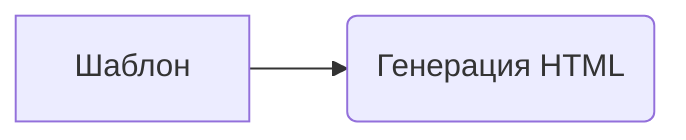

```MD
# Анализ кода шаблона для генерации HTML отчета

## <input code>

```
Шаблон для создания HTML отчета из сценария мехирона
```

## <algorithm>

К сожалению, предоставленный код пуст.  Он представляет собой лишь описание шаблона, а не сам код.  Поэтому невозможно построить блок-схему алгоритма, примеры и диаграмму.  Для анализа алгоритма нужен сам код.


## <mermaid>



**Описание диаграммы:**

Диаграмма показывает простую взаимосвязь: Шаблон используется для генерации HTML-отчета.  Поскольку код отсутствует, эта диаграмма является максимально упрощенной.  Реальная диаграмма будет намного сложнее и отражать весь процесс обработки данных, вычисления и структурирования данных в HTML.


## <explanation>

Без кода невозможно дать подробное объяснение импортов, классов, функций, переменных и возможных ошибок.  Поскольку указан лишь шаблон, нет ни типов данных, ни логики вычислений, ни логики вывода.

**Возможные элементы, которые могли бы быть в реальном коде:**

* **Импорты:** Импорты библиотек для работы с HTML (например, `html.template`), для работы с данными, для работы с  вычислениями.
* **Классы:** Классы для представления данных из сценария, для организации обработки данных, для генерации HTML-разметки, для вывода результата.
* **Функции:** Функции для форматирования данных, для генерации HTML-тегов, для обработки ошибок, для ввода данных из мехирона.
* **Переменные:** Переменные для хранения данных из сценария, для конфигурации параметров генерации отчета, для хранения HTML кода.


**Связь с другими частями проекта (предположительно):**

В реальном проекте, шаблон, скорее всего, будет частью более крупной системы. Он мог бы быть связан с:

* **Сценарием мехирона:** для получения данных.
* **Система управления данными:** для хранения и извлечения данных.
* **Системой отображения:** для вывода HTML-отчета.
* **Функциями обработки:** для преобразовывания данных в удобный для HTML формат.


**Для дальнейшего анализа необходимо предоставить сам код.**