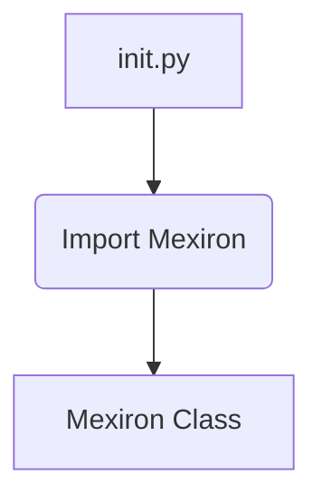
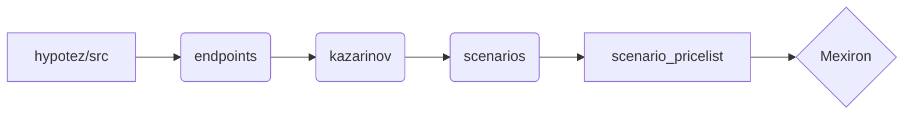

# <input code>

```python
## \file hypotez/src/endpoints/kazarinov/scenarios/__init__.py
# -*- coding: utf-8 -*-\

#! venv/bin/python/python3.12

"""
.. module: src.endpoints.kazarinov.scenarios 
	:platform: Windows, Unix
	:synopsis:

"""


from .scenario_pricelist import Mexiron
```

# <algorithm>

Этот код представляет собой файл инициализации модуля `scenarios` внутри пакета `kazarinov` в `endpoints` проекта `hypotez`.  Алгоритм работы в данном случае прост - он импортирует класс `Mexiron` из модуля `scenario_pricelist`.  Никакого сложного алгоритма или обработки данных в данном файле нет.

**Блок-схема:**



**Пример:**

Если в другом файле (например, `main.py`) требуется использовать класс `Mexiron`, он будет импортирован через `from hypotez.src.endpoints.kazarinov.scenarios import Mexiron`.


# <mermaid>



В данной диаграмме видно, что `hypotez/src/endpoints/kazarinov/scenarios/__init__.py` импортирует класс `Mexiron` из модуля `scenario_pricelist`.  Зависимости находятся вложенно, инициируя импорт классов из подпапок.

# <explanation>

* **Импорты:**
    - `from .scenario_pricelist import Mexiron`: Этот импорт вводит в текущий модуль (`__init__.py`) класс `Mexiron` из модуля `scenario_pricelist` в том же каталоге (`scenarios`).  `.` указывает, что `scenario_pricelist` находится в подпапке с текущим модулем. Это стандартный импорт Python, обеспечивающий доступ к необходимым классам и функциям из других модулей.  Связь со `src` очевидна: `scenario_pricelist` скорее всего содержит реализацию бизнес-логики, относящейся к определённому сценарию ценообразования (возможно, связанному с "Kazarinov").

* **Классы:**
    - `Mexiron`: Этот класс, определенный в `scenario_pricelist.py`, является центральным элементом, описывающим какие-то объекты или данные, связанные со сценарием ценообразования.  Подробности реализации класса скрыты в файле `scenario_pricelist.py`, который этот модуль импортирует.  Полагается, что он содержит необходимые атрибуты и методы для работы с ценами, и эти данные используются в других частях проекта.

* **Функции:**
   - Нет функций в этом файле.  Он только импортирует класс.

* **Переменные:**
    - ``:  Эта переменная, по всей видимости, определяет режим работы приложения ('dev' - режим разработки). Она может использоваться для управления поведением кода в зависимости от фазы разработки (например, включение дополнительных проверок или вывод отладочной информации).

* **Возможные ошибки или области для улучшений:**
    - Нет явной ошибки, но лучше было бы добавить более подробные комментарии о назначении переменной `MODE`.  Возможно, стоило бы использовать константы вместо строк для обозначения режимов.  Также нет описания класса `Mexiron`, из-за чего не ясно назначение класса.  Для лучшего понимания необходимо рассмотреть `scenario_pricelist.py`.

* **Цепочка взаимосвязей с другими частями проекта:**
    - Этот модуль (`__init__.py`) импортирует классы из подпапок, что означает, что сценарии и данные ценообразования (класс `Mexiron`) вероятно используются в других частях приложения, например, в API или в пользовательском интерфейсе.  Для глубокого анализа, следует проверить, где `Mexiron` используется и как взаимодействует с другими частями приложения.