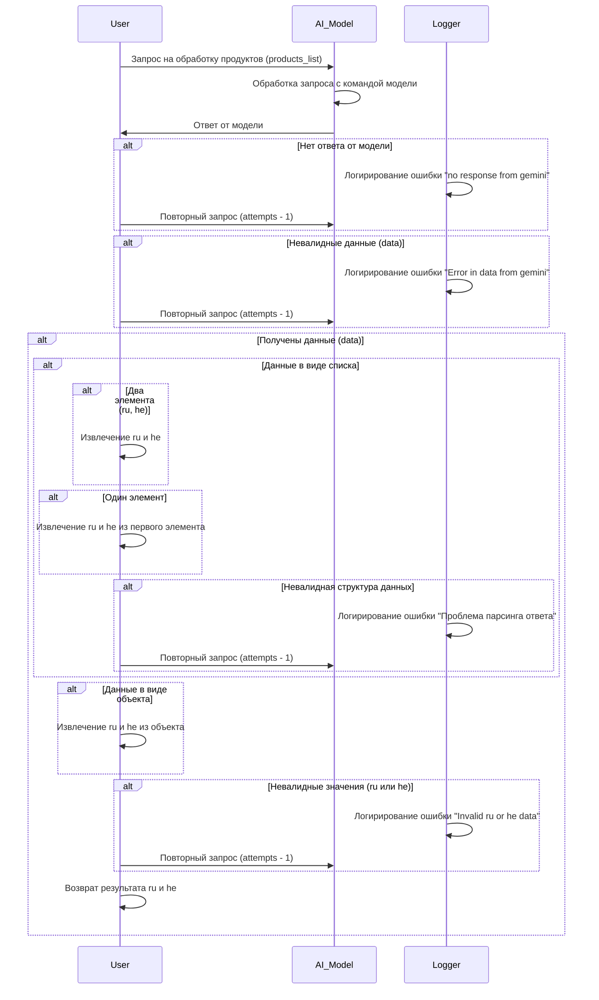

```MD
# Анализ кода

## <input code>



## <algorithm>

Алгоритм описывает обработку запроса на обработку продуктов (products_list). Пошаговая схема:

1. **Запрос пользователя:** Пользователь отправляет запрос `products_list` к модели `AI_Model`.
2. **Обработка модели:** `AI_Model` обрабатывает запрос, взаимодействуя с другой моделью.
3. **Ответ модели:** Модель `AI_Model` возвращает ответ.
4. **Обработка ответа:**
   - **Ошибка:** Если нет ответа (`no response from gemini`) или данные невалидны (`Error in data from gemini`),  запрос повторяется с уменьшением попыток (`attempts - 1`).  Данные о проблемах регистрируются в `Logger`.
   - **Успех:** Если ответ получен и валиден, происходит дальнейшая обработка:
     - **Проверка структуры данных:**  Проверяется, являются ли данные списком или объектом.
     - **Извлечение данных:** Если список, извлекаются значения `ru` и `he` (либо из первого элемента списка, либо из двух отдельных элементов). Если объект - извлекаются из объекта.
     - **Ошибка извлечения:** Если структура данных не соответствует ожидаемой (например, не список или объект, или отсутствуют `ru` и `he`), то регистрируется ошибка (`Проблема парсинга ответа`) и запрос повторяется.
     - **Ошибка значений:** Если значения `ru` или `he` невалидны, то регистрируется ошибка и запрос повторяется.
     - **Возврат результатов:** После успешной обработки данные `ru` и `he` возвращаются пользователю.


## <mermaid>

(Код Mermaid уже представлен в разделе <input code>).

## <explanation>

* **Импорты:**  В данном коде нет импортов, так как он представляет собой блок-схему, а не реализацию кода на конкретном языке. Блок-схема описывает последовательность действий, а не импортирует какие-либо модули.
* **Классы:** Нет классов.
* **Функции:** Нет функций в представленном коде (mermaid-диаграмма).
* **Переменные:**  Переменные представлены в виде имен (например, `products_list`, `attempts`). Это входные и выходные данные для обработки, а их конкретные типы неизвестны.
* **Возможные ошибки или области для улучшений:**

    * **Недостаток деталей:** Блок-схема описывает общий алгоритм, но не детализирует, как именно происходит обработка данных (например, как происходит валидация данных или как они извлекаются).
    * **Отсутствие контекста:** Блок-схема не указывает, где именно происходят эти операции.
    * **Не описан `Logger`:**  Не указано, что происходит при логировании.
    * **Не описаны попытки:** Как счетчик `attempts` обновляется и как происходит проверка предельного количества попыток, неизвестно.
    * **Не указаны типы данных:** Типы данных, ожидаемые от модели (например, JSON, строка), не описаны.

* **Взаимосвязи с другими частями проекта:** Блок-схема описывает взаимодействие между `User`, `AI_Model` и `Logger`. Чтобы понять взаимосвязь с другими частями проекта, необходим контекст. Нужно знать, к какой системе принадлежит `AI_Model` и `Logger`, и какие дополнительные сервисы или данные вовлечены.


**Вывод:** Блок-схема представляет собой хорошее описание общей логики взаимодействия компонентов, но требует большей детализации для понимания полной реализации и взаимосвязей с другими частями проекта.