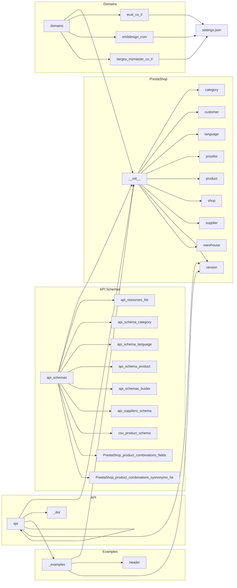

# Анализ кода модуля PrestaShop

## <input code>

```
### Структура каталога

1. **Основной каталог (`PrestaShop`)**:
    - `__init__.py`: Инициализирует модуль.
    - `category.py`: Управляет функциональностью, связанной с категориями.
    - `customer.py`: Управляет функциональностью, связанной с клиентами.
    - `language.py`: Управляет функциональностью, связанной с языками.
    - `pricelist.py`: Управляет функциональностью, связанной со списками цен.
    - `product.py`: Управляет функциональностью, связанной с продуктами.
    - `shop.py`: Управляет функциональностью, связанной с магазинами.
    - `supplier.py`: Управляет функциональностью, связанной с поставщиками.
    - `version.py`: Управляет информацией о версии модуля.
    - `warehouse.py`: Управляет функциональностью, связанной с складами.

2. **Каталог примеров (`_examples`)**:
    - Содержит примеры скриптов и файлы документации, чтобы помочь разработчикам эффективно понять и использовать модуль.
    - `__init__.py`: Инициализирует модуль примеров.
    - `header.py`: Пример скрипта заголовка.
    - `version.py`: Пример скрипта версии.

3. **Каталог API (`api`)**:
    - Содержит файлы, связанные с API PrestaShop.
    - `__init__.py`: Инициализирует модуль API.
    - `_dot`: Содержит файлы DOT для графических представлений.
    - `_examples`: Предоставляет примеры скриптов, демонстрирующие использование API.
    - `api.py`: Содержит основную логику взаимодействия с API PrestaShop.
    - `version.py`: Управляет информацией о версии модуля API.

4. **Каталог схем API (`api_schemas`)**:
    - Содержит файлы JSON-схем и скрипты для управления схемами API.
    - `__init__.py`: Инициализирует модуль схем API.
    - `api_resourses_list.py`: Список доступных ресурсов API.
    - `api_schema_category.json`: JSON-схема для категорий.
    - `api_schema_language.json`: JSON-схема для языков.
    - `api_schema_product.json`: JSON-схема для продуктов.
    - `api_schemas_buider.py`: Скрипт для построения схем API.
    - `api_suppliers_schema.json`: JSON-схема для поставщиков.
    - `csv_product_schema.json`: CSV-схема для продуктов.
    - `PrestaShop_product_combinations_fields.json`: JSON-файл для полей комбинаций продуктов.
    - `PrestaShop_product_combinations_sysnonyms_he.json`: JSON-файл для синонимов комбинаций продуктов на иврите.

5. **Каталог доменов (`domains`)**:
    - Содержит подкаталоги для различных доменов, каждый со своими настройками и конфигурациями.
    - `__init__.py`: Инициализирует модуль доменов.
    - `ecat_co_il`: Настройки для `ecat.co.il`.
        - `__init__.py`: Инициализирует домен `ecat.co.il`.
        - `settings.json`: JSON-файл с настройками для `ecat.co.il`.
    - ... (аналогично для других доменов)


### Ключевые компоненты
... (Описание компонентов)


### Пример использования
... (Пример использования)


### Документация
... (Документация)
```

## <algorithm>

(Блок-схема отсутствует, т.к. код описывает структуру каталогов и не содержит алгоритмической логики.)

## <mermaid>



## <explanation>

Этот код представляет собой описание структуры каталогов и компонентов Python-модуля, взаимодействующего с API PrestaShop.  Он не содержит исполняемого кода, а описывает:

* **Структуру каталогов:**  Разбиение проекта на модули (`PrestaShop`, `_examples`, `api`, `api_schemas`, `domains`), подкаталоги для доменов и т.д.  Это улучшает организацию и модульность проекта.  Важно, что каталог `_examples` содержит полезные примеры.
* **Ключевые компоненты:**  `category.py`, `customer.py`, `product.py` и другие файлы, содержащие логику работы с соответствующими ресурсами PrestaShop API.
* **API:** `api.py` - ключевой файл, отвечающий за взаимодействие с PrestaShop API.
* **API Schemas:** `api_schemas` содержит JSON-схемы для валидации данных, получаемых от API. Это очень важный элемент для работы с API.  Важно, что используются схемы для CSV и различных видов данных.

**Возможные ошибки или области для улучшения:**

* **Отсутствует детальная реализация логики:**  Описание не содержит ни одного примера реальной работы (с применением API).
* **Не указаны зависимости:**  Хотя структура каталогов и компонентов описана, отсутствует информация о зависимости между файлами (например, какие модули импортируются в другие).
* **Отсутствуют пояснения:**  Не указаны типы возвращаемых значений, спецификации используемых данных и алгоритмы работы с ними.

**Цепочка взаимосвязей:**

* Модуль `PrestaShop` содержит другие модули (например, `product.py`, `category.py`).
* Файлы `api_schemas` содержат схемы данных, используемые модулями PrestaShop.
* Модули взаимодействуют с API PrestaShop через `api.py` (не показано в деталях).
* Настройки доменов (например, `ecat.co.il`) влияют на конфигурацию работы модуля.

**В целом:**

Код представляет структуру модуля, но не достаточен для полноценного анализа и понимания логики работы.  Для более детального анализа необходимо изучить реализацию конкретных модулей и функций.