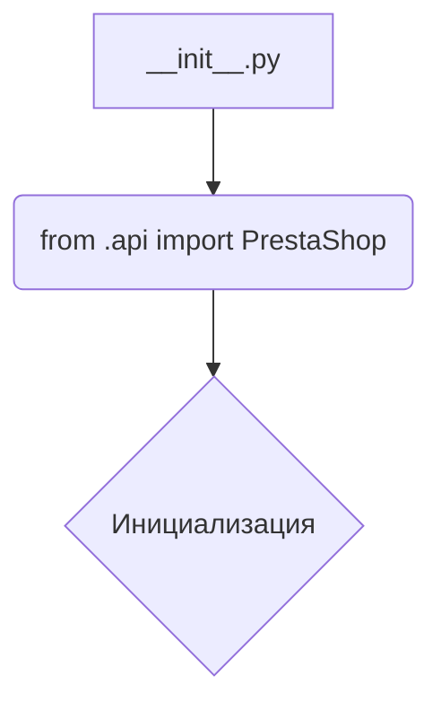
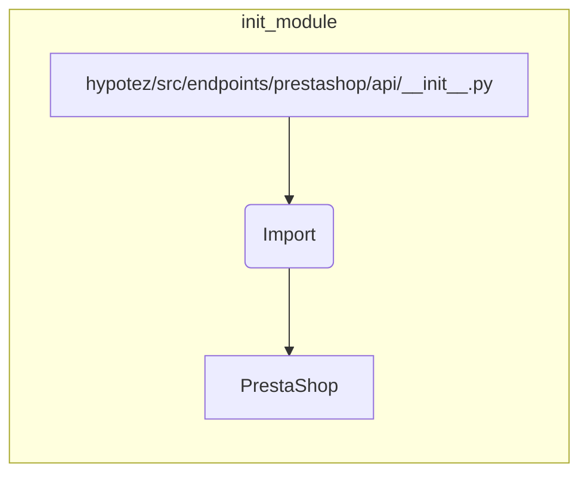

```MD
# Анализ файла hypotez/src/endpoints/prestashop/api/__init__.py

## <input code>

```python
## \file hypotez/src/endpoints/prestashop/api/__init__.py
# -*- coding: utf-8 -*-
#! venv/Scripts/python.exe
#! venv/bin/python/python3.12

"""
.. module: src.endpoints.prestashop.api 
	:platform: Windows, Unix
	:synopsis:

"""


from .api import PrestaShop
```

## <algorithm>

Файл `__init__.py` – это инициализирующий модуль для пакета `prestashop.api`. Алгоритм работы сводится к импорту класса `PrestaShop` из подпапки `api`.  В данном случае логика работы крайне простая.  Блок-схема:



* **Шаг 1:** Модуль `__init__.py` импортирует класс `PrestaShop`.  

**Пример:**

Если в другом модуле нужно будет использовать класс `PrestaShop`, он будет импортирован из текущего файла:

```python
from hypotez.src.endpoints.prestashop.api import PrestaShop
```


## <mermaid>



## <explanation>

### Импорты:

Импорт `from .api import PrestaShop` импортирует класс `PrestaShop` из подпапки `api` того же уровня, что и файл `__init__.py`.  `.` указывает на текущий пакет ( `endpoints/prestashop/api`). Это типичная структура для организации Python-кода, где `__init__.py` файлы используются для инициализации пакетов.

* Связь с другими частями проекта: этот файл является частью архитектуры, организующей модули доступа к API Престашоп. Взаимодействие с другими компонентами (например, контроллерами, сервисами) произойдёт через экземпляры класса `PrestaShop`.


### Классы:

* **`PrestaShop`:**  Этот класс (определен в `hypotez/src/endpoints/prestashop/api/api.py`), скорее всего, представляет взаимодействие с API Престашоп.  Подробная информация о его структуре (методы, атрибуты) не доступна, так как не предоставлен код `api.py`.


### Функции:

В файле `__init__.py` нет определенных функций, только импорт.


### Переменные:

* **``:**  Скорее всего, переменная для определения режима работы приложения (например, «разработка», «производство»).  Влияет на конфигурацию и поведение системы.

### Возможные ошибки или области для улучшений:

* **Недостаток информации о `PrestaShop`:** Без кода `api.py` невозможно понять логику работы класса `PrestaShop`.  Важно знать, какие методы он предоставляет и с какими данными работает.
* **Отсутствие документации:**  Docstrings в файле `__init__.py` неполные.  Должна быть более подробная документация о классе `PrestaShop` и его назначении.
* **Неявные зависимости:**  Предположительно есть зависимости от других библиотек (например, для работы с API PrestaShop), которые не видны в представленном фрагменте.

**Цепочка взаимосвязей:**

`hypotez/src/endpoints/prestashop/api/__init__.py` → `hypotez/src/endpoints/prestashop/api/api.py` (содержит определение класса `PrestaShop`).  Далее взаимодействие  зависит от реализации  `PrestaShop` и может включать использование различных сервисов и контроллеров.