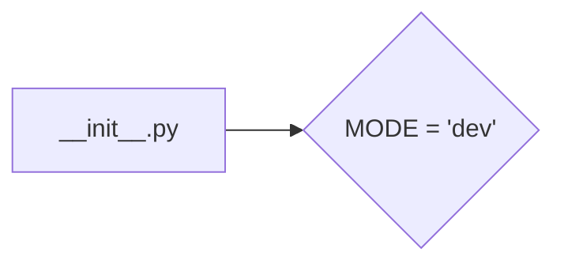

1. **<input code>**

```python
## \file hypotez/src/endpoints/prestashop/domains/emildesign_com/__init__.py
# -*- coding: utf-8 -*-
#! venv/Scripts/python.exe
#! venv/bin/python/python3.12

"""
.. module: src.endpoints.prestashop.domains.emildesign_com 
	:platform: Windows, Unix
	:synopsis:

"""
MODE = 'dev'

"""
	:platform: Windows, Unix
	:synopsis:

"""


"""
	:platform: Windows, Unix
	:synopsis:

"""


"""
  :platform: Windows, Unix

"""
"""
  :platform: Windows, Unix
  :platform: Windows, Unix
  :synopsis:
"""MODE = 'dev'
  
""" module: src.endpoints.prestashop.domains.emildesign_com """


"""    
"""
```

2. **<algorithm>**

Этот файл `__init__.py` — это инициализационный модуль для пакета `emildesign_com` в рамках проекта `hypotez`. Алгоритм его работы тривиален: он определяет глобальную переменную `MODE` со значением 'dev'.  Поскольку нет ни функций, ни классов, ни сложной логики, то пошаговая блок-схема не требуется.  Данные не передаются между функциями или классами.


3. **<mermaid>**



4. **<explanation>**

* **Импорты**:  Файл `__init__.py` не содержит импортов.  Это типичный подход для инициализационных файлов пакетов Python. Импортированные модули обычно загружаются при использовании определенных классов или функций из этого пакета в других частях проекта.


* **Классы**:  В файле нет определений классов.


* **Функции**:  Нет функций.


* **Переменные**:  `MODE`: Глобальная переменная, определяющая режим работы (`dev` в данном случае). Это, вероятно, конфигурационная переменная, используемая в других частях проекта для определения настроек (например, для подключения к тестовым или продуктивным серверам).


* **Возможные ошибки или области для улучшений**:

    * **Недостаток документации**: Комментарии `"""Docstrings"""`  в файле не информативны и не содержат информации о назначении переменной `MODE`. Рекомендуется пояснить, для чего используется переменная `MODE` и как она может влиять на работу системы.
    * **Избыточные комментарии**:  Многочисленные пустые строки и комментарии не несут полезной информации и затрудняют чтение. Достаточно одного четкого описания переменной `MODE` в начале файла.
    * **Неясная цель**:  Без контекста, непонятно, зачем этот файл существует.  Указание назначения переменной `MODE` в контексте проекта значительно повысит эффективность документации.


* **Взаимосвязи с другими частями проекта**:  Переменная `MODE` скорее всего будет использоваться в других модулях проекта для переключения между конфигурациями или режимами работы. Например, для выбора базы данных, API-ключа или других настроек.   Например, файл `src/endpoints/prestashop/domains/emildesign_com/api_calls.py` (если такой файл есть) может использовать значение `MODE` для выбора правильного API-сервера.


**Общий вывод**:

Файл `__init__.py` выполняет простую задачу инициализации — объявляет глобальную переменную. Однако, без дополнительного контекста о проекте `hypotez`  понять полное назначение файла сложно.  Необходима дополнительная информация о том, как эта переменная используется в других частях проекта.