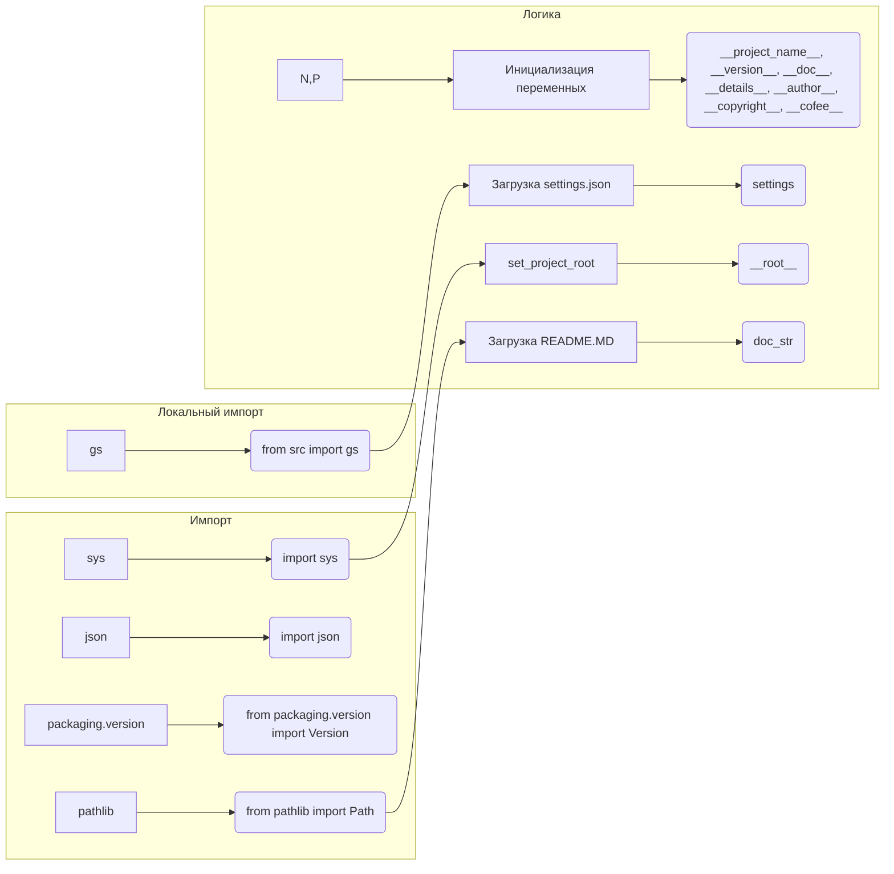

```MD
# Анализ кода hypotez/src/logger/header.py

## <input code>

```python
## \file hypotez/src/logger/header.py
# -*- coding: utf-8 -*-\
#! venv/Scripts/python.exe
#! venv/bin/python/python3.12

"""
module: src.logger 
	:platform: Windows, Unix
	:synopsis: Модуль определяющий корневой путь к проекту. Все импорты строятся относительно этого пути.
    :TODO: В дальнейшем перенести в системную переменную"""
MODE = 'dev'

import sys
import json
from packaging.version import Version

from pathlib import Path
def set_project_root(marker_files=('__root__')) -> Path:
    """
    Finds the root directory of the project starting from the current file's directory,
    searching upwards and stopping at the first directory containing any of the marker files.

    Args:
        marker_files (tuple): Filenames or directory names to identify the project root.
    
    Returns:
        Path: Path to the root directory if found, otherwise the directory where the script is located.
    """
    __root__:Path
    current_path:Path = Path(__file__).resolve().parent
    __root__ = current_path
    for parent in [current_path] + list(current_path.parents):
        if any((parent / marker).exists() for marker in marker_files):
            __root__ = parent
            break
    if __root__ not in sys.path:
        sys.path.insert(0, str(__root__))
    return __root__


# Get the root directory of the project
__root__ = set_project_root()
"""__root__ (Path): Path to the root directory of the project"""

from src import gs

settings:dict = None
try:
    with open(gs.path.root / 'src' /  'settings.json', 'r') as settings_file:
        settings = json.load(settings_file)
except (FileNotFoundError, json.JSONDecodeError):
    ...

doc_str:str = None
try:
    with open(gs.path.root / 'src' /  'README.MD', 'r') as settings_file:
        doc_str = settings_file.read()
except (FileNotFoundError, json.JSONDecodeError):
    ...


__project_name__ = settings.get("project_name", 'hypotez') if settings  else 'hypotez'
__version__: str = settings.get("version", '')  if settings  else ''
__doc__: str = doc_str if doc_str else ''
__details__: str = ''
__author__: str = settings.get("author", '')  if settings  else ''
__copyright__: str = settings.get("copyrihgnt", '')  if settings  else ''
__cofee__: str = settings.get("cofee", "Treat the developer to a cup of coffee for boosting enthusiasm in development: https://boosty.to/hypo69")  if settings  else "Treat the developer to a cup of coffee for boosting enthusiasm in development: https://boosty.to/hypo69"
```

## <algorithm>

**Блок-схема:**

```mermaid
graph TD
    A[Получить текущий файл] --> B{Найти родительские директории};
    B -- Да -> C[Проверить наличие marker_files];
    B -- Нет -> D[Возврат текущей директории];
    C -- Да -> E[Установить __root__];
    C -- Нет -> B;
    E --> F[Добавить __root__ в sys.path];
    F --> G[Возврат __root__];
    D --> G;
    G --> H[Загрузить settings.json];
    H -- Успех -> I[Загрузить README.MD];
    H -- Ошибка -> J[Установить default значение settings];
    I -- Успех -> K[Получить переменные из settings];
    I -- Ошибка -> K[Получить переменные из settings (default)];
    J -- Ошибка -> K[Получить переменные из settings (default)];
    K --> L[Возврат значений];
```

**Пример:**

Предположим, что текущий файл находится в `/home/user/project/hypotez/src/logger/header.py`. Функция `set_project_root` будет искать директории вверх по дереву, проверяя наличие файлов `pyproject.toml`, `requirements.txt`, и `.git`. Если один из этих файлов найден в директории `/home/user/project`, то `__root__` будет установлен на эту директорию, и она будет добавлена в `sys.path`.


## <mermaid>



**Объяснение зависимостей:**

- `sys`: для доступа к системным переменным, в том числе `sys.path`.
- `json`: для работы с файлами JSON.
- `packaging.version`: для работы с версиями пакетов.
- `pathlib`: для работы с файлами и путями.
- `gs`: предположительно, это часть проекта, которая отвечает за работу с файловой системой, и предоставляющая доступ к корневому каталогу проекта (возможно, через `gs.path.root`).

## <explanation>

**Импорты:**
- `sys`: используется для манипулирования системным путем `sys.path`.
- `json`: для сериализации/десериализации данных JSON.
- `packaging.version`: для работы с версиями пакетов (скорее всего, для проверки версий).
- `pathlib`: для работы с файлами и путями, предоставляет удобный интерфейс для работы с файлами и каталогами.

**Классы:**
- Нет явных определений классов.

**Функции:**
- `set_project_root(marker_files)`: находит корневой каталог проекта, начиная с текущего файла и идя вверх по дереву каталогов.  Возвращает `Path` к корню.

**Переменные:**
- `MODE`: строковая переменная, хранящая режим работы (в данном случае, вероятно, `'dev'` или `'prod'`).
- `__root__`: `Path` объект, хранящий корневой путь к проекту.
- `settings`: словарь, содержащий настройки проекта, загружаемый из файла `settings.json`.
- `doc_str`: строка, содержащая текст из файла `README.MD`.
- `__project_name__`, `__version__`, `__doc__`, `__details__`, `__author__`, `__copyright__`, `__cofee__`: строковые переменные, содержащие информацию о проекте, извлечённые из `settings`.


**Возможные ошибки и улучшения:**
- Обработка исключений `FileNotFoundError` и `json.JSONDecodeError` в блоках `try...except` - правильно.
- При отсутствии `settings.json` или проблем с чтением, значения по умолчанию устанавливаются корректно.
- `gs.path.root` требует определения.  Необходимо прояснить, как именно `gs` работает с путями.

**Взаимосвязи с другими частями проекта:**
- `gs`:  имеет сильный доступ к `gs.path.root` и неявно предполагает наличие модуля `gs`.  Без определения `gs` и его внутреннего устройства, сложно определить весь спектр функций и взаимосвязей.

**Дополнительные замечания:**
- Используется пайплайн поиска корня проекта (итерация по родительским директориям).  Эффективность может быть проблемой, если проект глубоко вложен.  Возможно, стоит использовать `os.path.abspath` или другой более эффективный способ.
- Возможно, лучше было бы использовать `pathlib.Path.cwd()` для получения текущей рабочей директории.  В этом случае, можно было бы избежать поиска корневого каталога проекта.

В целом, код написан аккуратно, обрабатывает потенциальные ошибки и делает работу с путями к проекту более удобной.