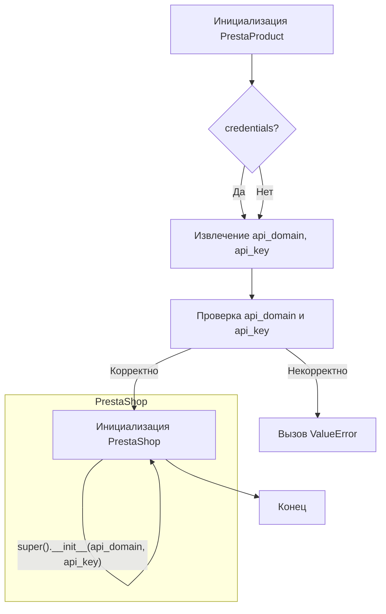

```MD
# <input code>

```python
## \file hypotez/src/endpoints/prestashop/product.py
# -*- coding: utf-8 -*-\
#! venv/Scripts/python.exe
#! venv/bin/python/python3.12

"""
.. module: src.endpoints.prestashop 
	:platform: Windows, Unix
	:synopsis:

"""
MODE = 'dev'

from types import SimpleNamespace
from typing import Optional
import header
from src.logger import logger
from src.utils.printer import pprint
from .api import PrestaShop

class PrestaProduct(PrestaShop):
    """Класс товара из модуля PrestaShop.
    
    Непосредственно выполняет все операции через API.
    
    ------------------------------------
    Methods:
        check(product_reference: str): Проверка наличия товара в БД по product_reference (SKU, MKT).
            Вернет словарь товара, если товар есть, иначе False.
        search(filter: str, value: str): Расширенный поиск в БД по фильтрам.
        get(id_product): Возвращает информацию о товаре по ID.
    """
    
    def __init__(self, 
                 credentials: Optional[dict | SimpleNamespace] = None, 
                 api_domain: Optional[str] = None, 
                 api_key: Optional[str] = None, 
                 *args, **kwards):
        """Инициализация товара PrestaShop.

        Args:
            credentials (Optional[dict | SimpleNamespace], optional): Словарь или объект SimpleNamespace с параметрами `api_domain` и `api_key`. Defaults to None.
            api_domain (Optional[str], optional): Домен API. Defaults to None.
            api_key (Optional[str], optional): Ключ API. Defaults to None.
        """
        
        if credentials is not None:
            api_domain = credentials.get('api_domain', api_domain)
            api_key = credentials.get('api_key', api_key)
        
        if not api_domain or not api_key:
            raise ValueError('Необходимы оба параметра: api_domain и api_key.')
        
        super().__init__(api_domain, api_key, *args, **kwards)
```

# <algorithm>



Пример: Если `credentials` - словарь `{'api_domain': 'example.com', 'api_key': '12345'}`, то `api_domain` и `api_key` будут извлечены из словаря.  Если `credentials` - None, то используются `api_domain` и `api_key`, переданные в конструктор.

# <mermaid>

```mermaid
graph LR
    subgraph PrestaProduct
        PrestaProduct --> PrestaShop;
    end
    PrestaShop --> logger;
    PrestaShop --> pprint;
    PrestaShop --> header;
    PrestaProduct --> check;
    PrestaProduct --> search;
    PrestaProduct --> get;
```

# <explanation>

**Импорты:**

* `from types import SimpleNamespace`: Импортирует класс `SimpleNamespace` для создания объектов, похожих на словари, но с атрибутами. Используется для удобного хранения параметров.
* `from typing import Optional`: Импортирует тип `Optional`, который позволяет указывать, что переменная может иметь значение или быть `None`.
* `import header`: Импортирует файл `header.py`, но его содержимое не показано в предоставленном коде, поэтому определить его назначение невозможно.
* `from src.logger import logger`: Импортирует логгер из пакета `src.logger`, позволяющий записывать логи в файл или консоль.
* `from src.utils.printer import pprint`: Импортирует функцию `pprint` из пакета `src.utils.printer`, которая делает вывод данных в читаемом формате.
* `from .api import PrestaShop`: Импортирует класс `PrestaShop` из файла `api.py` в той же директории (`endpoints/prestashop`).  Это означает, что класс `PrestaProduct` наследуется от класса `PrestaShop`, обеспечивая общие возможности и атрибуты.

**Классы:**

* `PrestaProduct`: Наследуется от `PrestaShop`. Представляет класс товара из PrestaShop API.  Использует API для работы с товарами.  Содержит методы для проверки, поиска и получения информации о товаре.  Необходимо правильно инициализировать его с `api_domain` и `api_key`, либо передав `credentials`.  Использует методы `check`, `search` и `get` для взаимодействия с внешним API.

* `PrestaShop`: (Определен в `api.py`)  Базовый класс, который, вероятно, содержит общие методы для работы с API PrestaShop, например, для отправки запросов.  `PrestaProduct` использует его методы.

**Функции:**

* `__init__`: Конструктор класса `PrestaProduct`. Принимает опциональные аргументы `credentials`, `api_domain`, `api_key`.  Использует `credentials` для получения `api_domain` и `api_key`, если они не переданы напрямую. Валидирует обязательность `api_domain` и `api_key`. Вызывает `super().__init__` для инициализации базового класса `PrestaShop` с полученными параметрами.

**Переменные:**

* `MODE`: Глобальная переменная, вероятно, задающая режим работы (например, `dev` или `prod`).  Её значение не используется в текущем фрагменте кода.
* `credentials`: Словарь или `SimpleNamespace` для хранения параметров API.
* `api_domain`, `api_key`: Параметры для доступа к API PrestaShop.
* `args`, `kwards`: Аргументы и ключевые аргументы, которые передаются в конструктор базового класса.

**Возможные ошибки или улучшения:**

* **Обработка исключений:** Добавьте обработку исключений (например, `try...except`) при вызове методов API для предотвращения аварийных остановок.
* **Документация методов:** Добавьте более подробную документацию к методам `check`, `search`, `get` с описанием возвращаемых типов.
* **Тип данных:** Уточните типы возвращаемых значений методов `check`, `search`, `get` для лучшей читаемости и понимания.

**Взаимосвязи с другими частями проекта:**

Класс `PrestaProduct` использует логгер из `src.logger` и функцию вывода `pprint` из `src.utils.printer`, а также напрямую зависит от класса `PrestaShop` (определённого в `api.py`).  Это указывает на то, что `src.logger`, `src.utils.printer` и `api.py` являются частями одного проекта, где `api.py` предоставляет сервисный функционал, а `PrestaProduct` его использует.

```