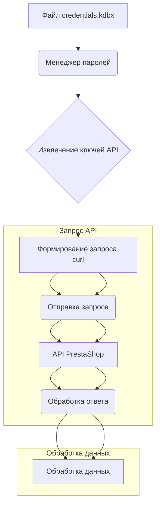

```MD
# Управление сайтами на PrestaShop

## <input code>

```
# Управление сайтами на PrestaShop

Данный `README` файл описывает структуру и способ работы с сайтами на платформе PrestaShop, а также хранение и использование ключей API.

## Сайты

Ваши сайты, работающие на PrestaShop:
1. [e-cat.co.il](https://e-cat.co.il)
2. [emil-design.com](https://emil-design.com)
3. [sergey.mymaster.co.il](https://sergey.mymaster.co.il)

Каждый из этих сайтов использует API для взаимодействия с различными параметрами и функциями.

## Хранение ключей API

Ключи API для каждого сайта хранятся в файле `credentials.kdbx`. Этот файл является защищенной базой данных паролей и содержит следующие данные для каждого сайта:
- URL сайта
- Ключ API
- Дополнительные метаданные (если необходимо)

Для работы с ключами из файла используйте менеджер паролей, поддерживающий формат `.kdbx`, например, [KeePass](https://keepass.info/) или [KeePassXC](https://keepassxc.org/).

## Пример использования API

Чтобы подключиться к API одного из сайтов, следуйте следующему шаблону:

### Запрос данных через API

**Шаблон API-запроса:**
```bash
curl -X GET 'https://<URL_сайта>/api/<endpoint>' \
-H 'Authorization: Basic <base64(API_KEY)>'
```

**Объяснение параметров:**
- `<URL_сайта>` — адрес сайта, например, `e-cat.co.il`.
- `<endpoint>` — конечная точка API (например, `products`, `customers`).
- `<API_KEY>` — ключ API, закодированный в формате Base64.

### Пример вызова API
Для получения списка продуктов на сайте `e-cat.co.il`:
```bash
curl -X GET 'https://e-cat.co.il/api/products' \
-H 'Authorization: Basic <base64(API_KEY)>'
```

## Рекомендации по безопасности

- Никогда не передавайте файл `credentials.kdbx` третьим лицам.
- Убедитесь, что файл находится в защищенном месте, доступном только вам.
- Регулярно обновляйте ключи API и пароли для базы данных.

## Дополнительно

Если у вас возникли вопросы или трудности с подключением, ознакомьтесь с [официальной документацией PrestaShop API](https://devdocs.prestashop.com/), где представлена информация о доступных конечных точках и способах работы с ними.
```

## <algorithm>

Алгоритм работы кода описывает процесс взаимодействия с API PrestaShop.  Нет кода для выполнения, только описание процесса.

1. **Получение ключей API:**  Из файла `credentials.kdbx` (с использованием менеджера паролей) извлекаются URL-адреса сайтов и соответствующие ключи API.
2. **Формирование запроса:** Для каждого сайта формируется запрос `curl` к API PrestaShop (метод GET).  Запрос включает в себя URL сайта, конечную точку (`/api/<endpoint>`) и заголовок `Authorization`, где ключ API закодирован в формате Base64.
3. **Отправка запроса:** `curl` отправляет сформулированный запрос к указанному API.
4. **Обработка ответа:**  Полученный ответ от API обрабатывается и используется в соответствии с логикой приложения.

**Пример:**  Для сайта `e-cat.co.il` и запроса к `products` данные из `credentials.kdbx` используются для создания запроса, который отправляется на `https://e-cat.co.il/api/products`.  Ответ от API (список продуктов) обрабатывается и отображается.

## <mermaid>



**Объяснение диаграммы:**

* `Файл credentials.kdbx` - исходный источник данных.
* `Менеджер паролей` - инструмент для безопасного доступа к данным в файле.
* `Извлечение ключей API` - процесс получения необходимых данных из менеджера паролей.
* `Формирование запроса curl` - формирование запроса к API PrestaShop с использованием полученных данных.
* `Отправка запроса` - отправка запроса на сервер PrestaShop.
* `API PrestaShop` - сервер, к которому отправляется запрос.
* `Обработка ответа` - получение и обработка ответа от сервера.
* `Обработка данных` - дальнейшее использование полученных данных приложением.


## <explanation>

Этот `README` файл описывает процесс взаимодействия с API PrestaShop для управления сайтами.  Код отсутствует, так что анализ ограничен структурой документации и описанием процесса.


* **Импорты:** Нет импортов, так как это текстовый файл документации, не содержащий программного кода.
* **Классы:** Нет классов, поскольку это не код программы.
* **Функции:** Нет функций.
* **Переменные:** Нет переменных.
* **Возможные ошибки/улучшения:** Документ не содержит кода, но предполагает использование безопасного хранения ключей API в `credentials.kdbx`, что правильно.
Рекомендации по безопасности (никогда не передавать `credentials.kdbx` третьим лицам, хранить в безопасном месте) важны.  Также полезно было бы добавить примеры различных конечных точек API PrestaShop для более полного понимания.


**Взаимосвязи с другими частями проекта:**  `credentials.kdbx` содержит информацию о сайтах и API ключах, необходимые для работы с API PrestaShop, что, подразумевается, используется другими частями проекта, которые вызывают API-запросы.