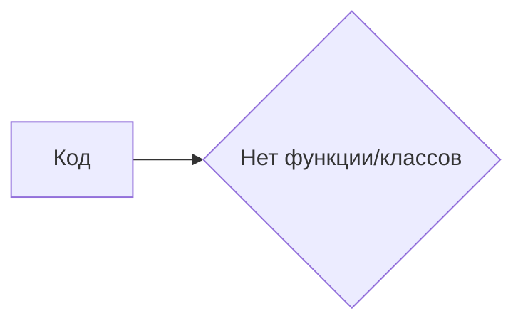

# <input code>

```python
## \file hypotez/src/fast_api/gemini/backend/main.py
# -*- coding: utf-8 -*-\

#! venv/bin/python/python3.12

"""
.. module: src.fast_api.gemini.backend 
	:platform: Windows, Unix
	:synopsis:

"""


"""
	:platform: Windows, Unix
	:synopsis:

"""


"""
	:platform: Windows, Unix
	:synopsis:

"""


"""
  :platform: Windows, Unix

"""
"""
  :platform: Windows, Unix
  :platform: Windows, Unix
  :synopsis:
"""
  
""" module: src.fast_api.gemini.backend """


```

# <algorithm>

К сожалению, предоставленный код не содержит функций или классов, поэтому алгоритм работы определить невозможно. Код представляет собой только комментарии и строки импорта, что не позволяет продемонстрировать алгоритмическую логику.


# <mermaid>



# <explanation>

Код представляет собой пустой файл, заполненный комментариями.  Он определяет переменную `MODE` со значением 'dev'. Комментарии, начинающиеся с `"""`, содержат документацию, но не имеют практической функциональности в самом коде.

* **Импорты:**  В коде отсутствуют импорты.
* **Классы:** Отсутствуют классы.
* **Функции:** Отсутствуют функции.
* **Переменные:** Единственная переменная `MODE` имеет строковое значение 'dev'.
* **Возможные ошибки или области для улучшений:** Код бесполезен в текущем состоянии, так как не содержит никакой логики. Необходимо добавить функции и классы для реализации функциональности.

**Связь с другими частями проекта:**  Без импортов и функций сложно судить о взаимосвязи с другими частями проекта.  Если в этом проекте будут использоваться фреймворки (например, FastAPI), то  `main.py`  обычно служит точкой входа для приложения, но для этого в файле должен быть код, определяющий логику работы.  Без определения функциональности в файле сложно предположить его предназначение в контексте проекта.