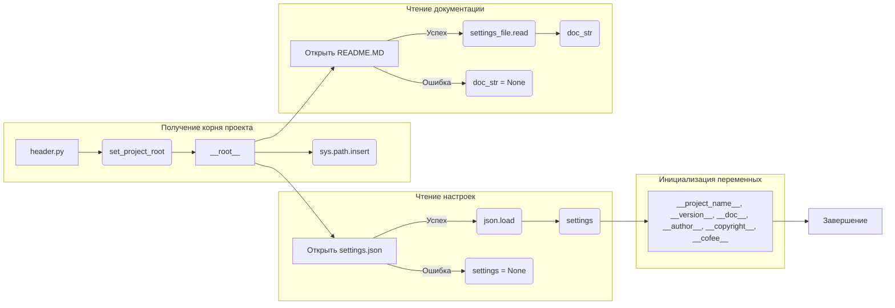

```MD
# Анализ кода файла hypotez/src/fast_api/header.py

## <input code>

```python
## \file hypotez/src/fast_api/header.py
# -*- coding: utf-8 -*-
#! venv/Scripts/python.exe
#! venv/bin/python/python3.12

"""
.. module: src.fast_api 
	:platform: Windows, Unix
	:synopsis:

"""


import sys
import json
from packaging.version import Version

from pathlib import Path
def set_project_root(marker_files=('__root__')) -> Path:
    """
    Finds the root directory of the project starting from the current file's directory,
    searching upwards and stopping at the first directory containing any of the marker files.

    Args:
        marker_files (tuple): Filenames or directory names to identify the project root.
    
    Returns:
        Path: Path to the root directory if found, otherwise the directory where the script is located.
    """
    __root__:Path
    current_path:Path = Path(__file__).resolve().parent
    __root__ = current_path
    for parent in [current_path] + list(current_path.parents):
        if any((parent / marker).exists() for marker in marker_files):
            __root__ = parent
            break
    if __root__ not in sys.path:
        sys.path.insert(0, str(__root__))
    return __root__


# Get the root directory of the project
__root__ = set_project_root()
"""__root__ (Path): Path to the root directory of the project"""


from src import gs

settings:dict = None
try:
    with open(gs.path.root / 'src' / 'settings.json', 'r') as settings_file:
        settings = json.load(settings_file)
except (FileNotFoundError, json.JSONDecodeError):
    ...

doc_str:str = None
try:
    with open(gs.path.root / 'src' / 'README.MD', 'r') as settings_file:
        doc_str = settings_file.read()
except (FileNotFoundError, json.JSONDecodeError):
    ...


__project_name__ = settings.get("project_name", 'hypotez') if settings  else 'hypotez'
__version__: str = settings.get("version", '')  if settings  else ''
__doc__: str = doc_str if doc_str else ''
__details__: str = ''
__author__: str = settings.get("author", '')  if settings  else ''
__copyright__: str = settings.get("copyrihgnt", '')  if settings  else ''
__cofee__: str = settings.get("cofee", "Treat the developer to a cup of coffee for boosting enthusiasm in development: https://boosty.to/hypo69")  if settings  else "Treat the developer to a cup of coffee for boosting enthusiasm in development: https://boosty.to/hypo69"
```

## <algorithm>

```mermaid
graph TD
    A[Начать] --> B{Прочитать файл __file__};
    B -- Да --> C[Получить родительскую директорию];
    B -- Нет --> D[Возврат текущей директории];
    C --> E{Поиск файлов в родительских директориях (pyproject.toml, requirements.txt, .git)};
    E -- Найдено --> F[Установить __root__];
    E -- Не найдено --> G[Перейти к родительской директории];
    F --> H[Добавление __root__ в sys.path];
    F --> I[Возврат __root__];
    G --> B;
    D --> I;
    I --> J[Открыть settings.json];
    J -- Успех --> K[Загрузка настроек];
    J -- Ошибка --> L[Обработка ошибки (settings = None)];
    K --> M[Открыть README.MD];
    M -- Успех --> N[Чтение документации];
    M -- Ошибка --> O[Обработка ошибки (doc_str = None)];
    N --> P[Формирование __project_name__, __version__, __doc__, __author__, __copyright__, __cofee__];
    O --> P;
    P --> Q[Завершить];
```

Примеры:

- Если файл `__file__` находится в директории `/home/user/project/fast_api/header.py`, то `current_path` будет `/home/user/project/fast_api`.
- Алгоритм будет искать `pyproject.toml`, `requirements.txt` или `.git` в `current_path`, `current_path/..`, `current_path/../..` и т.д., пока не найдет директорию, содержащую один из этих файлов. Если поиск упрется в корневую директорию, то возвращается `current_path`.
- После поиска `__root__` добавляется в `sys.path`, чтобы импорты из `src` работали корректно.
- Если `settings.json` не найден или содержит некорректные данные, то `settings` остаётся `None`, что обрабатывается условием `if settings`.

Данные передаются между функциями и переменными путем передачи аргументов (например, `marker_files` в `set_project_root()`) и присваивания значений переменным (`__root__`, `settings`).


## <mermaid>



## <explanation>

**Импорты:**

- `sys`: модуль для доступа к системным переменным, в т.ч. `sys.path` для управления путем поиска модулей.
- `json`: модуль для работы с JSON-данными.
- `packaging.version`: модуль для работы с версиями пакетов.
- `pathlib`: модуль для работы с путями к файлам.

**Классы:**

- Нет явно определенных классов.

**Функции:**

- `set_project_root(marker_files)`: Находит корневой каталог проекта, начиная с текущего файла и ищет файлы-маркеры в родительских каталогах. Возвращает путь к корневому каталогу.
- Аргументы: `marker_files` (кортеж имен файлов, по которым определяется корень).
- Возвращаемое значение: `Path` к корню проекта.

**Переменные:**

- `__root__`: `Path` - путь к корневому каталогу проекта.
- `settings`: `dict` - настройки проекта, загруженные из `settings.json`.
- `doc_str`: `str` - содержимое файла `README.MD`.
- `MODE`: `str` - переменная, хранящая режим работы (в данном случае 'dev').
- `__project_name__`, `__version__`, `__doc__`, `__author__`, `__copyright__`, `__cofee__`: `str` - переменные, полученные из `settings.json`, если файл найден, иначе со значениями по умолчанию.

**Возможные ошибки/улучшения:**

- **Обработка ошибок:** Код обрабатывает `FileNotFoundError` и `json.JSONDecodeError` при чтении файлов `settings.json` и `README.MD`. Это хорошо, но можно добавить более детальную информацию об ошибках (например, вывести сообщение об ошибке в лог).
- **Типизация:** Использование `typing` для явной типизации параметров и возвращаемых значений функции повысило бы читаемость и устойчивость кода к ошибкам.
- **Логирование:** Добавление логирования сделает отладку и анализ поведения программы более удобным.
- **Проверка на существование файлов:** Проверять, что файл существует до вызова `open()` может сэкономить ресурсы и предотвратить исключение.

**Взаимосвязь с другими частями проекта:**

Функция `set_project_root()` и переменная `__root__` важны для определения пути к ресурсам проекта (например, `settings.json`, `README.MD`). В других модулях проекта (например, `src.gs`) используется этот путь для доступа к необходимым файлам.