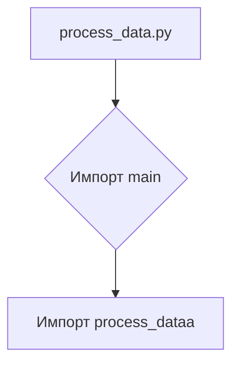
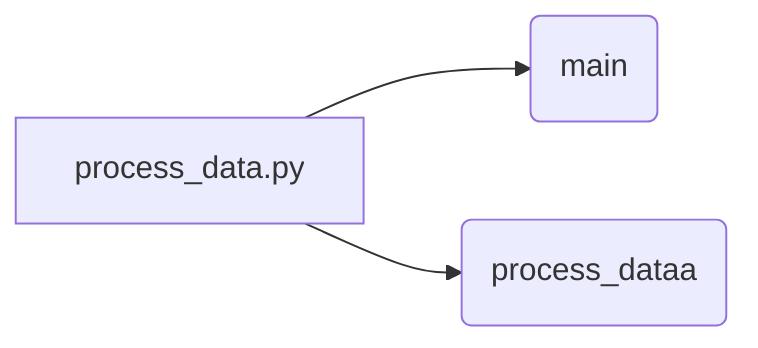

```MD
# Анализ кода process_data.py

## <input code>

```python
## \file hypotez/src/fast_api/html/process_data.py
# -*- coding: utf-8 -*-\

#! venv/bin/python/python3.12

"""
.. module: src.fast_api.html 
	:platform: Windows, Unix
	:synopsis:

"""


"""
	:platform: Windows, Unix
	:synopsis:

"""

"""
	:platform: Windows, Unix
	:synopsis:

"""


"""
  :platform: Windows, Unix

"""
"""
  :platform: Windows, Unix
  :platform: Windows, Unix
  :synopsis:
"""
  
""" module: src.fast_api.html """


""" @namespace src.fast_api.html """
from .. import main
from main import process_dataa
```

## <algorithm>

В данном коде отсутствует логика обработки данных.  Он просто импортирует модули из пакета `main`.  Блок-схема будет очень простой:



Нет данных, которые перемещаются между функциями или классами, так как код не содержит функций, принимающих данные на вход и возвращающих что-либо.

## <mermaid>



**Объяснение диаграммы:**

Диаграмма отображает зависимость `process_data.py` от модуля `main` и функции `process_dataa`.  `main` и `process_dataa`  не определены в представленном фрагменте кода, но предполагается, что они содержат функциональность, которую `process_data.py` использует.


## <explanation>

**Импорты:**

- `from .. import main`: Импортирует модуль `main` из родительского каталога текущей директории (`src/fast_api`).  Два символа `..` указывают на директорию выше директории `src/fast_api/html`.  Это важно для поиска `main.py` в структуре пакета.
- `from main import process_dataa`: Импортирует функцию (предположительно) `process_dataa` из модуля `main`.  Это предполагает, что `main.py` (или другой файл в папке `main`) содержит функцию, которая будет использована в файле `process_data.py`.

**Классы:**

В предоставленном фрагменте кода отсутствуют классы.

**Функции:**

Функции `process_dataa` нет в представленном коде, но по имени предполагается, что она выполняет какую-то обработку данных.

**Переменные:**

- ``: Переменная глобального уровня, вероятно, задаёт режим работы (например, "разработка", "производство").  Это не имеет смысла без контекста.

**Возможные ошибки и улучшения:**

- Отсутствие комментариев к коду затрудняет понимание его назначения и логики.  Нужны комментарии к функциям, переменным и логике.
- Отсутствие обработки данных и логики в `process_data.py`.  Файл `process_data.py` только импортирует функцию `process_dataa`.
- Неясно, что происходит в `main.py` и `process_dataa`, а также как они взаимодействуют друг с другом. Необходимо изучить код `main.py`.
- Ненужные строки документации.  Некоторые строки документации дублированы или не содержат полезной информации.

**Цепочка взаимосвязей:**

```
Project
├── src
│   └── fast_api
│       └── html
│           └── process_data.py (импортирует функции из main)
│       └── main.py (содержит функцию process_dataa)
│           └── ... (другие файлы в main)
└── ... (другие папки и файлы)
```

Взаимодействие между файлами происходит через импорт.  `process_data.py` использует функциональность, содержащуюся в файле `main.py`.  Для того, чтобы оценить всю структуру проекта и взаимосвязи, необходим доступ к полному коду `main.py` и других файлов.