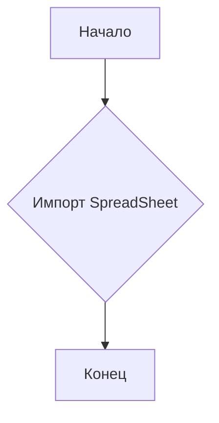
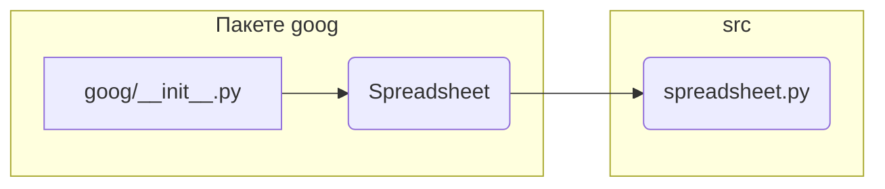

# Анализ файла hypotez/src/goog/__init__.py

## <input code>

```python
## \file hypotez/src/goog/__init__.py
# -*- coding: utf-8 -*-\

#! venv/bin/python/python3.12

"""
.. module: src.goog 
	:platform: Windows, Unix
	:synopsis:

"""


from .spreadsheet import SpreadSheet
```

## <algorithm>

Этот файл является инициализирующим модулем для пакета `goog`.  Он, в основном, импортирует необходимые классы и константы.  Поскольку алгоритм здесь весьма тривиален, блок-схема простая:



Пример: При импорте `SpreadSheet` модуль `goog` получает доступ к классу `Spreadsheet`, определенному в файле `spreadsheet.py` внутри пакета `goog`.


## <mermaid>



**Объяснение к диаграмме:**

Диаграмма показывает, что модуль `goog/__init__.py` импортирует класс `Spreadsheet` из файла `spreadsheet.py`, который, предположительно, находится в подпапке `src`. Это указывает на иерархическую структуру проекта, где модули организованы в пакетах.

## <explanation>

**Импорты:**

- `from .spreadsheet import SpreadSheet`: Этот импорт получает доступ к классу `Spreadsheet`, определённому в файле `spreadsheet.py` внутри текущего пакета `goog`.  `'.'` в импорте означает, что импортируемый модуль находится в том же пакете, что и текущий файл.  Это типичная практика для импорта модулей внутри иерархии пакетов.


**Классы:**

-  Этот файл не содержит определения классов, кроме как при импорте класса `Spreadsheet` из файла `spreadsheet.py` .

**Функции:**

-  Нет определений функций в этом файле.

**Переменные:**

- ``: Это константа, которая, вероятно, задаёт режим работы (например, 'dev', 'prod') и может быть использована в других частях проекта.  Её значение будет доступно в любых модулях, которые импортируют этот модуль.


**Возможные ошибки или улучшения:**

- **Документация:** Документация (`""" """`) в файле `__init__.py` может быть улучшена, чтобы детальнее объяснить назначение пакета и класса `Spreadsheet`.
- **Стиль кода:** Дополнительные проверки на корректность синтаксиса и стилевые соглашения (например, PEP 8) могли бы улучшить читабельность кода.
- **Отсутствие использования переменной MODE:**  В этом текущем виде переменная `MODE` не используется, что может быть нежелательным.


**Взаимосвязи с другими частями проекта:**

Этот файл является частью пакета `goog`, вероятно, связанного с работой с электронными таблицами.  Он  предположительно будет использоваться другими частями проекта, которые работают с данными Google Sheets.  Файл `spreadsheet.py` (если он существует) содержит определение класса `Spreadsheet`, который, вероятно, взаимодействует с API Google Sheets или аналогичной библиотекой.  Этот класс, скорее всего, предоставляет методы для чтения, записи, и манипулирования данными из Google Sheets.